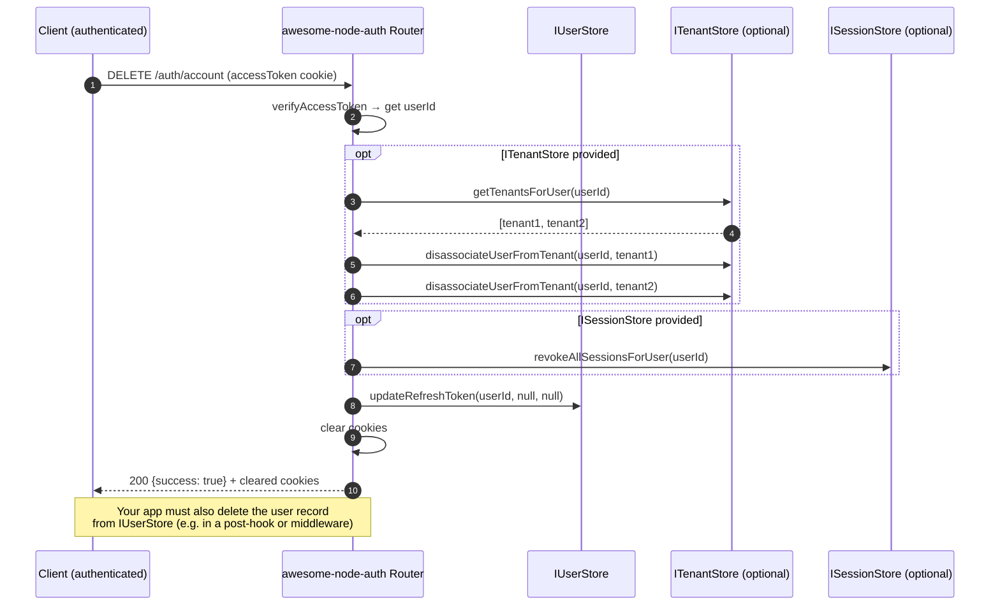

# Account Deletion

Authenticated users can permanently delete their own account using `DELETE /auth/account`. The library clears the user's session and optionally removes tenant memberships if an `ITenantStore` is provided.

---

## Account deletion flow



:::caution User record deletion
`DELETE /auth/account` revokes sessions and disassociates tenants, but **does not call `IUserStore.delete`** — that method is not part of the interface. Add a post-hook or route middleware to delete the user record from your database after the endpoint responds.
:::

---

## Usage

Mount the standard auth router — the endpoint is always available:

```typescript
app.use('/auth', auth.router());
```

### With tenant cleanup

Pass `tenantStore` to also remove the user from all their tenants:

```typescript
app.use('/auth', auth.router({ tenantStore }));
```

### Client-side

```typescript
// Cookie mode
await fetch('/auth/account', {
  method: 'DELETE',
  credentials: 'include',
});

// Bearer mode
await fetch('/auth/account', {
  method: 'DELETE',
  headers: { Authorization: `Bearer ${accessToken}` },
});
```

---

## Endpoint

| Method | Path | Auth | Description |
|--------|------|:---:|-------------|
| `DELETE` | `/auth/account` | ✅ | Revoke session + optional tenant cleanup |

### Post-deletion hook example (Express)

```typescript
// Middleware that deletes the user record after /auth/account responds
app.use((req, res, next) => {
  const originalJson = res.json.bind(res);
  res.json = (body: unknown) => {
    if (req.method === 'DELETE' && req.path === '/account' && (body as any)?.success) {
      const userId = (req as any).user?.sub;
      if (userId) userStore.deleteUser(userId).catch(console.error);
    }
    return originalJson(body);
  };
  next();
});
```

## Related

- [Change email flow](/docs/advanced/change-email) — the other self-service account operation
- [Multi-tenant authentication](/docs/advanced/multi-tenancy) — memberships removed on deletion
- [Session management and token revocation](/docs/advanced/sessions) — clearing sessions on delete
- [Auth API endpoints reference](/docs/api-reference/endpoints) — the DELETE /auth/account route
