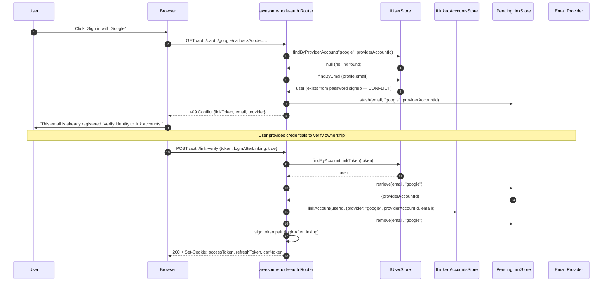
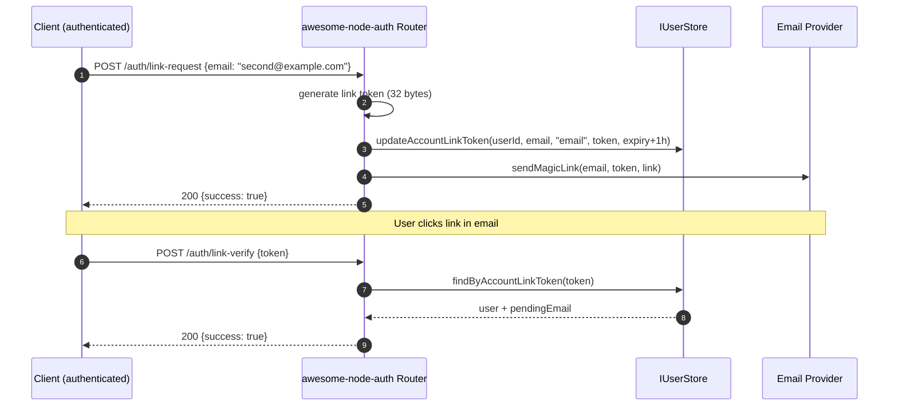

# Account Linking

Account linking lets one user account have **multiple OAuth providers** attached to it — e.g. login with Google *and* GitHub, both resolving to the same user record. awesome-node-auth handles conflict resolution automatically via `IPendingLinkStore`.

---

## OAuth conflict resolution flow



---

## Manual linking flow (authenticated user)




## Step 1 — Implement `ILinkedAccountsStore`

```typescript
import { ILinkedAccountsStore, LinkedAccount } from 'awesome-node-auth';

export class MyLinkedAccountsStore implements ILinkedAccountsStore {
  /** Persist a new provider link for the user. */
  async linkAccount(userId: string, account: Omit<LinkedAccount, 'linkedAt'>): Promise<void> {
    await db('linked_accounts').insert({
      userId,
      provider:          account.provider,
      providerAccountId: account.providerAccountId,
      email:             account.email,
      linkedAt:          new Date(),
    });
  }

  /** Remove a specific provider link. */
  async unlinkAccount(userId: string, provider: string, providerAccountId: string): Promise<void> {
    await db('linked_accounts')
      .where({ userId, provider, providerAccountId })
      .delete();
  }

  /** Return all provider links for the user (used by GET /auth/linked-accounts). */
  async getLinkedAccounts(userId: string): Promise<LinkedAccount[]> {
    return db('linked_accounts').where({ userId }).orderBy('linkedAt', 'asc');
  }

  /** Look up a user by provider + providerAccountId (prevents account-takeover). */
  async findUserByProviderAccount(
    provider: string,
    providerAccountId: string,
  ): Promise<{ userId: string } | null> {
    const row = await db('linked_accounts')
      .where({ provider, providerAccountId })
      .first();
    return row ? { userId: row.userId } : null;
  }
}
```

## Step 2 — Implement `IPendingLinkStore` (conflict resolution)

When an OAuth login collides with an existing email, the conflict is stashed here until the user verifies ownership of the existing account.

```typescript
import { IPendingLinkStore, IPendingLink } from 'awesome-node-auth';

export class MyPendingLinkStore implements IPendingLinkStore {
  async createPendingLink(link: IPendingLink): Promise<void> {
    await db('pending_links').insert(link);
  }

  async getPendingLink(token: string): Promise<IPendingLink | null> {
    return db('pending_links').where({ token }).first() ?? null;
  }

  async deletePendingLink(token: string): Promise<void> {
    await db('pending_links').where({ token }).delete();
  }
}
```

The `IPendingLink` shape:

```typescript
interface IPendingLink {
  token:             string;   // random opaque token sent to the user
  userId:            string;   // existing user whose account is being linked
  provider:          string;
  providerAccountId: string;
  email?:            string;
  expiresAt:         Date;
}
```

## Step 3 — Pass stores to the router

```typescript
import { createAuthRouter } from 'awesome-node-auth';

app.use('/auth', createAuthRouter(userStore, config, {
  linkedAccountsStore,
  pendingLinkStore,
  loginAfterLinking: true,   // issue a session automatically after successful linking
}));
```

## Endpoints

| Method | Path | Auth required | Description |
|--------|------|:---:|-------------|
| `GET` | `/auth/linked-accounts` | ✅ | List all linked providers for the current user |
| `DELETE` | `/auth/linked-accounts/:provider/:providerAccountId` | ✅ | Unlink a specific provider |
| `POST` | `/auth/link-request` | ✅ | Request to link a new email address to the current account |
| `POST` | `/auth/link-verify` | ❌ | Verify a pending link token and complete linking |

### `GET /auth/linked-accounts` — response

```json
[
  {
    "provider": "google",
    "providerAccountId": "1234567890",
    "email": "user@gmail.com",
    "linkedAt": "2024-01-15T10:30:00Z"
  },
  {
    "provider": "github",
    "providerAccountId": "987654",
    "email": "user@github.com",
    "linkedAt": "2024-02-20T14:15:00Z"
  }
]
```

### `POST /auth/link-verify` — body

```json
{
  "token": "<pending-link-token>"
}
```

On success (with `loginAfterLinking: true`), returns a standard token pair and sets HttpOnly cookies.

## Linking a new email explicitly

A logged-in user can add a second email to their account:

```bash
# 1. Request linking — sends a verification email to the new address
POST /auth/link-request
Authorization: Bearer <access-token>
{ "email": "second@example.com" }

# 2. User clicks the link in the email
POST /auth/link-verify
{ "token": "<token-from-email>" }
```

:::info
The magic-link strategy's `onSendMagicLink` callback is reused for the link-request email, so no extra mailer config is needed.
:::

## Conflict auto-detection during OAuth

When a user tries to OAuth-login and the provider email matches an existing local account:

1. The conflict is detected in `findOrCreateUser` inside your OAuth strategy.
2. A `IPendingLink` record is created automatically.
3. The OAuth callback returns a `409 Conflict` with a `linkToken` field.
4. Your frontend prompts the user: *"This email is already registered. Verify your identity to link accounts."*
5. User completes verification → `POST /auth/link-verify` with the `linkToken`.

:::caution
Always implement `findByProviderAccount` in your `IUserStore` to look up users by provider ID rather than email alone. This prevents account-takeover via email spoofing.
:::

## Related

- [OAuth2 social login](/docs/authentication/oauth) — the providers being linked
- [Email verification modes](/docs/advanced/email-verification) — how conflicting emails are resolved
- [Custom JWT claims](/docs/advanced/custom-claims) — expose the linked providers in the token
- [Built-in admin panel](/docs/advanced/admin) — inspect linked identities per user
