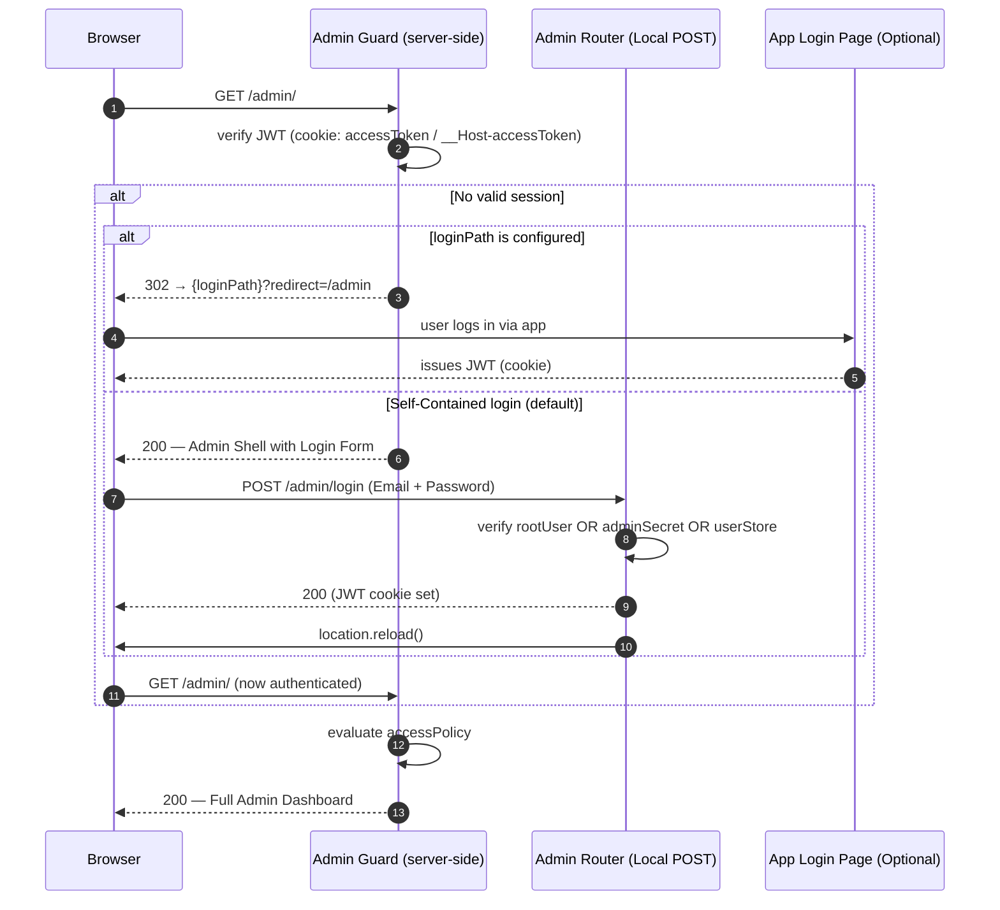
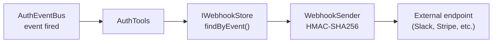
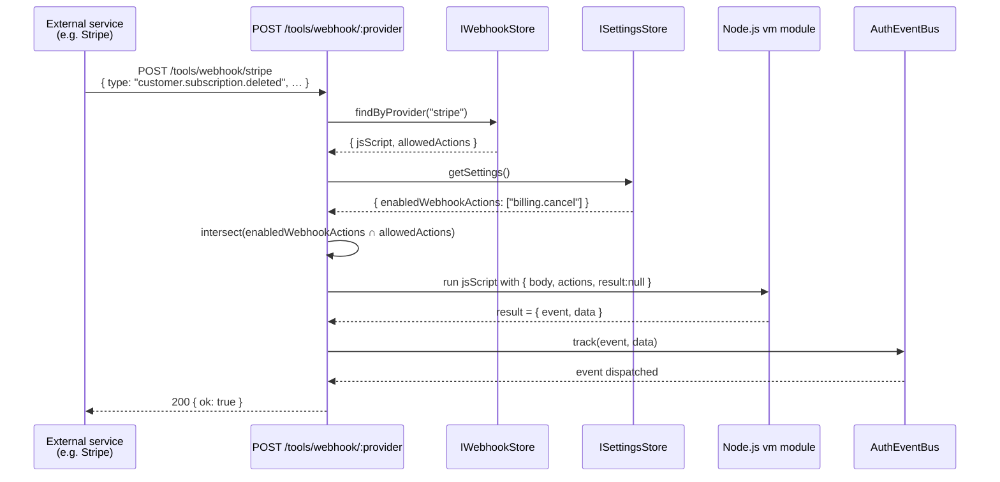

# Admin Panel

`createAdminRouter` mounts a **self-contained admin dashboard** — both a REST API and a built-in vanilla-JS UI — at any path. No external frontend build step required.

<div style={{textAlign:'center',margin:'32px 0'}}>
  
  <p style={{marginTop:'10px',fontSize:'13px',color:'var(--ifm-color-emphasis-500)'}}>
    The built-in Admin Panel — no dependencies, no build step - Control Tab
  </p>
</div>

---

<div style={{textAlign:'center',margin:'32px 0'}}>
  
  <p style={{marginTop:'10px',fontSize:'13px',color:'var(--ifm-color-emphasis-500)'}}>
    The built-in Admin Panel — no dependencies, no build step - Api Keys Tab
  </p>
</div>

---

## Admin authentication flow (v1.8.2+)




## Setup

**Step 1:** Import and mount the admin router.

```typescript
import express from 'express';
import { AuthConfigurator, createAdminRouter } from '@awesome-lang-auth/node';
import type { AdminOptions, AdminAccessPolicy } from '@awesome-lang-auth/node';

const app = express();
app.use(express.json());

const auth = new AuthConfigurator(config, userStore);
app.use(auth.buildAllRouters({
  admin: {
    // Session-based access control (v1.8.0+)
    accessPolicy: 'first-user', // see Access Policy section below
    sessionStore,         // optional — enables Sessions tab
    rbacStore,            // optional — enables Roles & Permissions tab
    tenantStore,          // optional — enables Tenants tab
    userMetadataStore,    // optional — enables Metadata editor per user
    settingsStore,        // optional — enables Control tab (email policy, 2FA policy)
    linkedAccountsStore,  // optional — shows Linked Accounts in user detail
    templateStore,        // optional — enables 📧 Email & UI templates tab
  },
}));

app.listen(3000);
```

**Step 2:** Open the admin UI in your browser.

```
http://localhost:3000/admin/
```

### Authentication Fallback
By default, if you are not authenticated, the Admin UI will serve its own **built-in login form** (Email + Password) that speaks directly to your `/auth/login` endpoint. This allows for a zero-configuration admin panel even in headless or API-only projects.

If you prefer to use your own application's login page, you can configure the `loginPath` option (see below).

## Access Policy

The `accessPolicy` option controls who may access the Admin UI and REST API:

| Policy | Description |
|--------|-------------|
| `'first-user'` | Only the first registered user (lowest-index in `listUsers`) is granted access. Ideal for single-owner setups. |
| `'is-admin-flag'` | Only users with `BaseUser.isAdmin === true` are granted access. |
| `'open'` | No restriction — all authenticated users are granted access. Use only behind a VPN or IP allow-list. |
| `(user, rbacStore?) => boolean` | Custom async predicate — return `true` to grant access. |

### Configuration Options (`AdminOptions`)

| Option | Type | Description |
|--------|------|-------------|
| `accessPolicy` | `AdminAccessPolicy` | **Required.** Defines who can access the panel. |
| `jwtSecret` | `string` | **Required (if not open).** Must match `AuthConfig.accessTokenSecret`. |
| `loginPath` | `string` | *Optional.* Path to redirect unauthenticated browser requests. If omitted, uses the built-in login form. |
| `apiPrefix` | `string` | *Optional.* The base path where the main Auth router is mounted (default: `/auth`). Used to resolve profile links. |
| `cookiePrefix`| `string` | *Optional.* Explicit prefix for auth cookies (e.g., `__Host-` or `__Secure-`). Automatically detected if omitted. |
| `rootUser` | `RootUser` | *Optional.* An emergency `{ email, passwordHash }` (bcrypt) that bypasses the `userStore` for Admin login. |
| `adminSecret`| `string` | *Optional (Legacy).* If set, the login form allows "Bootstrap Mode": leave email blank and log in with just this password. |
| `swagger` | `boolean` | *Optional.* Enable the built-in Swagger UI at `/admin/swagger`. |
| `...stores` | `IStore` | *Optional.* Pass various stores (RBAC, Sessions, etc.) to enable corresponding tabs. |

### Example: custom predicate using RBAC

```typescript
app.use('/admin', createAdminRouter(userStore, {
  accessPolicy: async (user, rbacStore) => {
    if (!rbacStore) return user.isAdmin === true;
    return user.roles.includes('superadmin');
  },
  jwtSecret: process.env.ACCESS_TOKEN_SECRET!,
  rbacStore,
}));
```

## Two login endpoints, two audiences

- `/auth/ui/login` — end-user login
- `/auth/admin/login` — admin panel login

Link customers to `/auth/ui/login`. The admin login form is only for operators managing the dashboard.

:::tip Migration from `adminSecret`
If you are upgrading from v1.7 or earlier, `adminSecret` has been **removed** in v1.8.0. You must switch to `accessPolicy` + `jwtSecret` as shown in the Setup section above. This change enables more granular security and better integration with your application's session system.
:::

:::caution Production security
Mount the admin panel behind a VPN, IP allowlist, or internal-only network in production. The panel has full read/write access to users, sessions, roles and settings.
:::

## Bootstrap & Root Access

Version 1.8.2 introduces two ways to access the Admin UI without having a pre-existing user in your database:

### 1. Root User (Recommended)
Pass a bcrypt-hashed password hash to `AdminOptions.rootUser`. This user is "virtual" — they don't exist in your `IUserStore`, but can log in to the Admin UI to perform initial setup.

```typescript
app.use('/admin', createAdminRouter(userStore, {
  accessPolicy: 'first-user',
  jwtSecret: process.env.ACCESS_TOKEN_SECRET!,
  rootUser: {
    email: 'admin@internal.com',
    passwordHash: '$2a$10$xxxxxxxxxxxxxxxxxxxxxxxxxxxxxx', // bcrypt hash
  }
}));
```

### 2. Bootstrap Mode (Password-only)
If `adminSecret` (legacy) is configured, the built-in login form allows you to **leave the email empty** and log in using only the secret as the password. This is useful for first-time setup in environments where no users have been created yet.

Once logged in, you can create your first "real" admin user and then remove the `adminSecret`.

## Dashboard Tabs

Each tab is activated automatically when you pass the corresponding store:

| Store / Option | Unlocks |
|---|---|
| `sessionStore` | Sessions tab |
| `rbacStore` | Roles & Permissions tab |
| `tenantStore` | Tenants tab |
| `userMetadataStore` | Metadata section in user detail |
| `settingsStore` | ⚙️ Control tab |
| `linkedAccountsStore` | Linked Accounts column |
| `apiKeyStore` | 🔑 API Keys tab |
| `webhookStore` | 🔗 Webhooks tab |
| `templateStore` (on `AuthConfig`) | Email & UI tab |
| `uploadDir` + `uploadBaseUrl` | Logo upload in branding |

| Tab | Required store | Features |
|-----|----------------|----------|
| **Users** | `IUserStore.listUsers` | Paginated user table, search by email, delete users, open Manage panel |
| **Manage** (per-user) | — | View profile, reset password, revoke refresh token, toggle email verification, toggle 2FA |
| **Sessions** | `ISessionStore` | All active sessions across all users; revoke by session handle |
| **Roles & Permissions** | `IRolesPermissionsStore` | List roles, create/delete roles, assign permissions |
| **Tenants** | `ITenantStore` | List tenants, create/delete tenants, manage members |
| **Linked Accounts** | `ILinkedAccountsStore` | View OAuth provider links per user |
| **🔗 Webhooks** | `IWebhookStore` | Manage outgoing webhooks **and** inbound dynamic execution configs |
| **⚙️ Control** | `ISettingsStore` | Toggle email verification mode (`none`/`lazy`/`strict`), 2FA policy, and global webhook action enablement |
| **📧 Email & UI** | `ITemplateStore` | Live editor for email templates (HTML/Text + per-language translations) and UI i18n strings |

## Settings Store

The Control tab lets admins change runtime auth policy. Implement `ISettingsStore`:

```typescript
import { ISettingsStore, AuthSettings } from '@awesome-lang-auth/node';

// Simple in-memory implementation (replace with DB in production)
let settings: Partial<AuthSettings> = {};

const settingsStore: ISettingsStore = {
  async getSettings(): Promise<Partial<AuthSettings>> {
    return { ...settings };
  },
  async updateSettings(patch: Partial<AuthSettings>): Promise<void> {
    Object.assign(settings, patch);
  },
};
```

Then pass it to both `AuthConfigurator` and `createAdminRouter`:

```typescript
const auth = new AuthConfigurator(
  { ...config, settingsStore },
  userStore
);

app.use('/admin', createAdminRouter(userStore, {
  accessPolicy: 'first-user',
  jwtSecret: process.env.ACCESS_TOKEN_SECRET!,
  settingsStore,
}));
```

## REST API Reference

All admin endpoints require a valid JWT access token in `Authorization: Bearer <token>`.

| Method | Path | Description |
|--------|------|-------------|
| `GET` | `/admin/api/users` | List users (paginated, `?offset=0&limit=20&filter=email`) |
| `GET` | `/admin/api/users/:id` | Get user details |
| `DELETE` | `/admin/api/users/:id` | Delete user and all related data |
| `GET` | `/admin/api/users/:id/metadata` | Get user metadata key/value pairs |
| `PUT` | `/admin/api/users/:id/metadata` | Set/update user metadata |
| `GET` | `/admin/api/users/:id/linked-accounts` | List OAuth provider links for user |
| `GET` | `/admin/api/users/:id/roles` | List roles assigned to user |
| `POST` | `/admin/api/users/:id/roles` | Assign a role to user |
| `DELETE` | `/admin/api/users/:id/roles/:role` | Remove a role from user |
| `GET` | `/admin/api/users/:id/tenants` | List tenants the user belongs to |
| `POST` | `/admin/api/2fa-policy` | Batch-enable or disable 2FA for users |
| `GET` | `/admin/api/sessions` | List all active sessions |
| `DELETE` | `/admin/api/sessions/:handle` | Revoke a session by handle |
| `GET` | `/admin/api/roles` | List all roles |
| `POST` | `/admin/api/roles` | Create a new role |
| `DELETE` | `/admin/api/roles/:name` | Delete a role |
| `GET` | `/admin/api/tenants` | List all tenants |
| `POST` | `/admin/api/tenants` | Create a tenant |
| `DELETE` | `/admin/api/tenants/:id` | Delete a tenant |
| `GET` | `/admin/api/tenants/:id/users` | List users in a tenant |
| `POST` | `/admin/api/tenants/:id/users` | Add a user to a tenant |
| `DELETE` | `/admin/api/tenants/:id/users/:userId` | Remove a user from a tenant |
| `GET` | `/admin/api/settings` | Get current auth settings |
| `PUT` | `/admin/api/settings` | Update auth settings |
| `GET` | `/admin/api/templates/mail` | List all mail templates |
| `POST` | `/admin/api/templates/mail` | Create or update a mail template |
| `GET` | `/admin/api/templates/ui` | List all UI translation sets |
| `POST` | `/admin/api/templates/ui` | Create or update UI translations for a page |
| `GET` | `/admin/api/ping` | Health check |

## Customising `listUsers`

The Users tab requires a `listUsers` method on your `IUserStore`. Add it to your implementation:

```typescript
import { IUserStore, BaseUser } from '@awesome-lang-auth/node';

export class MyUserStore implements IUserStore {
  // ... other methods ...

  async listUsers(limit: number, offset: number): Promise<BaseUser[]> {
    const query = db('users');
    return query.offset(offset).limit(limit);
  }
}
```

---

## 🔗 Webhooks tab

The Webhooks tab is enabled by passing an `IWebhookStore` to `createAdminRouter`. It manages **both outgoing and inbound webhooks** — they are fundamentally different in purpose and configuration.

```typescript
app.use('/admin', createAdminRouter(userStore, {
  accessPolicy: 'first-user',
  jwtSecret: process.env.ACCESS_TOKEN_SECRET!,
  webhookStore: myWebhookStore,   // enables the Webhooks tab
  settingsStore: mySettingsStore, // enables the Control tab (for global action toggles)
}));
```

---

### Outgoing webhooks (library → external service)

Outgoing webhooks forward `AuthEventBus` events to external HTTP endpoints as HMAC-signed JSON POSTs.



In the **Webhooks tab** click **+ Register webhook** and fill in:

| Field | Example | Description |
|-------|---------|-------------|
| URL | `https://hooks.slack.com/...` | Destination endpoint |
| Events | `identity.auth.login.success` or `*` | Events that trigger delivery |
| Secret | `whsec_…` | Optional HMAC signing secret |
| Tenant | *(leave empty)* | Scope to a specific tenant, or global |

Outgoing webhooks are delivered with retry and exponential back-off. See the full [Outgoing Webhooks guide](/docs/advanced/webhooks) for payload format and signature verification.

---

### Inbound webhooks — dynamic scripts (external service → library)

Inbound webhooks receive HTTP `POST` calls **from** external services (e.g. Stripe, GitHub, Paddle) and execute a **JavaScript script through Node.js `node:vm`**. The functions the script receives in `actions` are governed by the admin — each action must be explicitly enabled globally (Control tab) **and** assigned to the specific webhook.

:::danger Inbound scripts run with the server's privileges
`node:vm` is not a security mechanism, so the script is **not sandboxed**: it runs with the privileges of the server process and can run arbitrary code on the server. Only fully trusted operators may write a webhook script, whether through the webhook store or this admin console. See [awesome-node-auth#10](https://github.com/awesome-lang-auth/awesome-node-auth/issues/10).
:::



#### Step 1 — Expose service methods as injectable actions

```typescript
import { webhookAction, ActionRegistry } from '@awesome-lang-auth/node';

class BillingService {
  @webhookAction({
    id:          'billing.cancel',
    label:       'Cancel subscription',
    category:    'Billing',
    description: 'Marks a subscription as cancelled in the billing database.',
  })
  async cancel(subscriptionId: string): Promise<void> {
    await db.subscriptions.update({ id: subscriptionId }, { status: 'cancelled' });
  }
}

// Register a bound method — REQUIRED for instance methods
const svc = new BillingService();
ActionRegistry.register({
  id: 'billing.cancel', label: 'Cancel subscription',
  category: 'Billing', description: '',
  fn: svc.cancel.bind(svc),
});
```

#### Step 2 — Globally enable actions (Control tab → Webhook Actions)

The **Control** tab shows every registered `@webhookAction` grouped by category with toggle switches. An action must be enabled here before it can be used by any inbound webhook script.

If an action declares `dependsOn: ['other.action.id']`, its toggle is locked until all dependencies are also enabled.

#### Step 3 — Configure an inbound webhook (Webhooks tab)

Click **+ Register webhook** and switch the type to **Inbound (dynamic)**:

| Field | Example | Description |
|-------|---------|-------------|
| Provider name | `stripe` | Matches `:provider` in `POST /tools/webhook/stripe` |
| Allowed actions | ☑ `billing.cancel` | Subset of globally-enabled actions for this script only |
| JavaScript | see below | Body run through `node:vm` with the server's privileges |

**Example script:**

```js
// Available globals: body (request payload), actions (filtered), result (write to emit an event)
if (body.type === 'customer.subscription.deleted') {
  const subId = body.data.object.id;
  const userId = body.data.object.metadata.userId;

  await actions['billing.cancel'](subId);

  result = {
    event: 'identity.tenant.user.removed',
    data:  { subscriptionId: subId, userId },
  };
}
// If result stays null the webhook is silently acknowledged (HTTP 200, no event emitted)
```

#### Governance rules

| Rule | Behaviour |
|------|-----------|
| Action not in `enabledWebhookActions` | Not passed to the script in `actions`, even if in `allowedActions` |
| Action's `dependsOn` not met | Not passed to the script in `actions` |
| Script throws, or its synchronous part exceeds 5 s | Error logged; HTTP 200 returned (no crash). Asynchronous work is not bounded by the timeout |
| `result` is null | Silently acknowledged; no event emitted |

:::note Action governance is not isolation
Each inbound webhook receives in `actions` only the **intersection** of globally-enabled actions **and** its own `allowedActions` list. This decides which registered actions a script is handed; it does not confine the script, which runs with the server's privileges (see the warning above).
:::

#### Step 4 — Wire stores into the tools router

```typescript
app.use('/tools', createToolsRouter(tools, {
  webhookStore:  myWebhookStore,   // findByProvider() required for inbound
  settingsStore: mySettingsStore,  // reads enabledWebhookActions
}));
```

See the [Webhooks guide → Dynamic inbound execution](/docs/advanced/webhooks#dynamic-inbound-execution) for the full API reference.

---

## Webhook Actions panel (⚙️ Control tab)

When your application registers `@webhookAction`-decorated methods, the **Control** tab shows a **Webhook Actions** sub-panel where you can globally enable or disable each action with a toggle switch.

Actions are grouped by category. If an action declares `dependsOn`, its toggle is disabled until all its dependencies are enabled.

```typescript
import { webhookAction, ActionRegistry } from '@awesome-lang-auth/node';

class BillingService {
  @webhookAction({
    id:          'billing.cancelSubscription',
    label:       'Cancel subscription',
    category:    'Billing',
    description: 'Marks a subscription as cancelled in the billing database.',
  })
  async cancelSubscription(subscriptionId: string): Promise<void> {
    await db.subscriptions.update({ id: subscriptionId }, { status: 'cancelled' });
  }
}

// Register the bound instance so inbound scripts can call it
const billing = new BillingService();
ActionRegistry.register({
  id:          'billing.cancelSubscription',
  label:       'Cancel subscription',
  category:    'Billing',
  description: 'Marks a subscription as cancelled in the billing database.',
  fn:          billing.cancelSubscription.bind(billing),
});
```

Pass both stores to the tools router to enable inbound webhook scripts:

```typescript
app.use('/tools', createToolsRouter(tools, {
  webhookStore:  myWebhookStore,   // provides findByProvider()
  settingsStore: mySettingsStore,  // provides enabledWebhookActions
}));
```

See the [Webhooks](/docs/advanced/webhooks#dynamic-inbound-execution) guide for the full dynamic execution reference.


---

## 📧 Email & UI Templates tab {#email--ui-templates-tab}

The **Email & UI** tab is enabled by passing an `ITemplateStore` to `createAdminRouter`. It provides a full live editor for:

- **Email templates** — HTML body, plain-text body, live preview pane, per-language translation grid, and click-to-insert variable chips
- **UI translations** — per-page `data-i18n` key/value grid used to localise the built-in login/register/forgot-password pages

```typescript
import { MemoryTemplateStore } from '@awesome-lang-auth/node';

const templateStore = new MemoryTemplateStore(); // swap for a DB implementation in production

app.use('/admin', createAdminRouter(userStore, {
  accessPolicy:  'first-user',
  jwtSecret:     process.env.ACCESS_TOKEN_SECRET!,
  templateStore,   // ← enables the 📧 Email & UI tab
}));
```

### Email template editor

The editor shows a two-panel layout: the left panel contains the editable fields and the right panel renders a **live sandboxed preview** of the template as you type.

| Section | Description |
|---------|-------------|
| **HTML Body** | Full HTML with `{{T.key}}` (translation) and `{{VAR}}` (data) placeholders |
| **Text Body** | Plain-text fallback with the same placeholders |
| **Translations** | Per-language tab + key/value grid — add/remove languages and keys without touching JSON |
| **Variable chips** | Each supported `{{VAR}}` and `{{T.key}}` is shown as a clickable chip that inserts at the caret |

**Supported template IDs** (must match exactly what `MailerService` queries):

| Template ID | Sent when |
|-------------|-----------|
| `magic-link` | User requests a passwordless sign-in link |
| `password-reset` | User requests a password reset |
| `verify-email` | User needs to verify their email address |
| `welcome` | User successfully registers |
| `email-changed` | User changes their email address |
| `invitation` | Admin invites a new user |

**Placeholder syntax:**

| Placeholder | Resolved from |
|-------------|---------------|
| `{{VAR}}` | Data variable passed by `MailerService` (e.g. `link`, `token`, `newEmail`) |
| `{{T.key}}` | Translation string for the active language, falling back to `en` |

**Reset to default:** clicking the "Reset to default" button saves empty `baseHtml`/`baseText`, which causes `MailerService` to fall back to the built-in template automatically.

### UI translations editor

The UI translations editor lists all built-in pages derived from the actual HTML source files. Select a page to open a per-language key/value grid pre-populated with every `data-i18n` key defined in that page's HTML.

**Pages and their keys:**

| Page | Description |
|------|-------------|
| `login` | Login page |
| `register` | Registration page |
| `forgot-password` | Forgot-password page |
| `reset-password` | Password-reset page |
| `verify-email` | Email-verification landing page |
| `2fa` | Two-factor authentication page |
| `magic-link` | Magic-link request page |
| `link-verify` | Account-link verification landing |
| `account-conflict` | OAuth account-conflict resolution page |

The complete key list for each page is generated from the HTML source by `npm run extract-i18n` (writes `src/ui/assets/ui-i18n-keys.json`).

The language is resolved from the `?lang=` query parameter on the UI page request. See [Built-in UI → Internationalization (i18n)](/docs/advanced/built-in-ui#internationalization-i18n) for the full flow.

> For the full interface definition see [ITemplateStore API Reference](/docs/api-reference/template-store).
