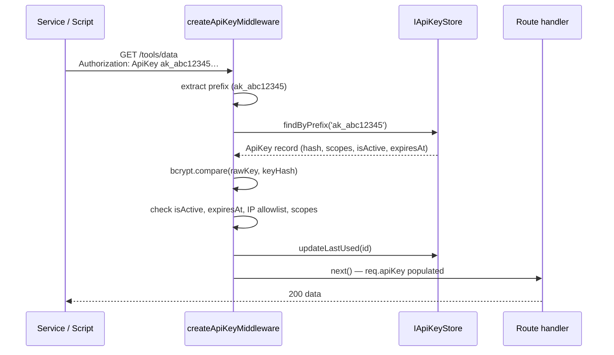

# API Keys / Service Tokens

node-auth provides a complete, zero-dependency API key system for machine-to-machine authentication. Raw keys are never stored — only a bcrypt hash is persisted.

Key format: `ak_<48 hex characters>` (~196 bits of entropy).

---

## Authentication flow



---

## Setup

### 1. Implement `IApiKeyStore`

```typescript
import { IApiKeyStore, ApiKey } from 'awesome-node-auth';

export class MyApiKeyStore implements IApiKeyStore {
  async save(key: ApiKey): Promise<void> {
    await db('api_keys').insert(key);
  }
  async findByPrefix(prefix: string): Promise<ApiKey | null> {
    return db('api_keys').where({ keyPrefix: prefix, isActive: true }).first() ?? null;
  }
  async findById(id: string): Promise<ApiKey | null> {
    return db('api_keys').where({ id }).first() ?? null;
  }
  async revoke(id: string): Promise<void> {
    await db('api_keys').where({ id }).update({ isActive: false });
  }
  async updateLastUsed(id: string): Promise<void> {
    await db('api_keys').where({ id }).update({ lastUsedAt: new Date() });
  }
}
```

### 2. Create a key with `ApiKeyService`

```typescript
import { ApiKeyService } from 'awesome-node-auth';

const apiKeyService = new ApiKeyService();
const { rawKey, record } = await apiKeyService.createKey(apiKeyStore, {
  name: 'stripe-webhook',
  serviceId: 'tenant-abc',
  scopes: ['tools:read', 'webhooks:receive'],
  expiresAt: new Date('2025-12-31'),
  allowedIps: ['203.0.113.0/24'],
});

// rawKey is shown exactly once — store it securely
console.log('Your key (shown once):', rawKey);
```

### 3. Protect routes with `createApiKeyMiddleware`

```typescript
import { createApiKeyMiddleware } from 'awesome-node-auth';

app.use(
  '/tools',
  createApiKeyMiddleware(apiKeyStore, {
    requiredScopes: ['tools:read'],
  }),
);

// Access authenticated context in handlers
app.get('/tools/data', (req, res) => {
  console.log(req.apiKey); // { keyId, keyPrefix, name, serviceId, scopes }
  res.json({ ok: true });
});
```

---

## Accepted header formats

```
Authorization: ApiKey ak_abc123…
X-Api-Key: ak_abc123…
```

Both formats are supported. Use whichever fits your client.

---

## `IApiKeyStore` interface

| Method | Required | Description |
|--------|----------|-------------|
| `save(key)` | ✓ | Persist a newly created key record |
| `findByPrefix(prefix)` | ✓ | Look up an active key by its prefix |
| `findById(id)` | ✓ | Look up a key by ID |
| `revoke(id)` | ✓ | Mark a key inactive |
| `updateLastUsed(id)` | ✓ | Record last-used timestamp |
| `listByServiceId(serviceId)` | optional | Return all keys for a service identity |
| `listAll(limit, offset)` | optional | Paginated admin listing |
| `delete(id)` | optional | Permanently delete (prefer `revoke`) |
| `logUsage(entry)` | optional | Per-key access audit log |

---

## `ApiKeyService` methods

```typescript
class ApiKeyService {
  createKey(store: IApiKeyStore, options: CreateApiKeyOptions): Promise<CreatedApiKey>;
  verifyKey(rawKey: string, hash: string): Promise<boolean>;
  extractPrefix(rawKey: string): string;
}

interface CreateApiKeyOptions {
  name: string;
  serviceId?: string;
  scopes?: string[];
  allowedIps?: string[];
  expiresAt?: Date;
  saltRounds?: number;   // default: 10
}

interface CreatedApiKey {
  rawKey: string;      // plaintext key — never stored, shown once
  record: ApiKey;      // persisted record (hash, prefix, metadata)
}
```

---

## `ApiKeyStrategyOptions`

```typescript
interface ApiKeyStrategyOptions {
  requiredScopes?: string[];   // all listed scopes must be present
  checkIp?: boolean;           // enforce allowedIps (default: true)
  onSuccess?: (context: ApiKeyContext) => void | Promise<void>;
}
```

## Related

- [Bearer token mode](/docs/advanced/bearer-token) — the other non-cookie credential
- [Role-based access control (RBAC)](/docs/advanced/roles-permissions) — scope what a key may do
- [Built-in admin panel](/docs/advanced/admin) — issue and revoke keys from the dashboard
- [Authentication telemetry and audit trail](/docs/advanced/telemetry) — record machine-to-machine calls
