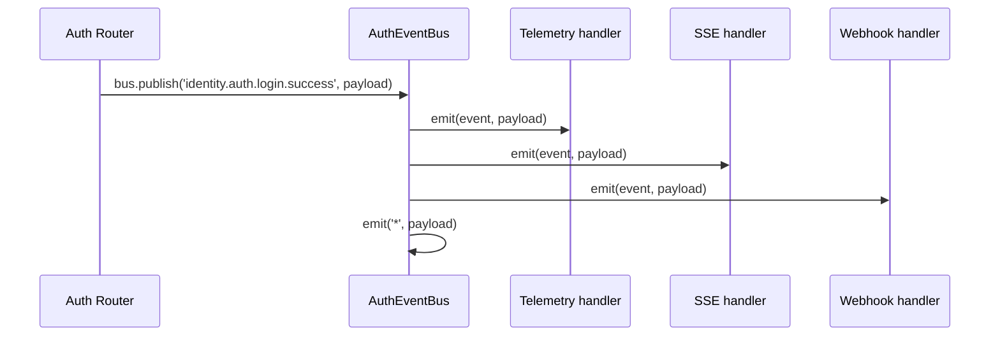

# AuthEventBus & Event Names

`AuthEventBus` is the central event backbone of the tools system. It extends Node's built-in `EventEmitter` and emits standardised `AuthEventPayload` objects so that downstream handlers — telemetry, SSE, webhooks, analytics — can react without coupling to each other.

---

## Architecture



---

## Setup

```typescript
import { AuthEventBus } from '@awesome-lang-auth/node';

const bus = new AuthEventBus();
```

Pass `bus` to `AuthConfigurator` to have the auth router publish events automatically:

```typescript
import { AuthConfigurator } from '@awesome-lang-auth/node';

const auth = new AuthConfigurator(config, userStore, { eventBus: bus });
app.use('/auth', auth.router());
```

---

## Publishing events

```typescript
import { AuthEventBus, AuthEventNames } from '@awesome-lang-auth/node';

bus.publish(AuthEventNames.AUTH_LOGIN_SUCCESS, {
  userId: 'user-123',
  tenantId: 'tenant-abc',
  ip: '203.0.113.1',
  userAgent: req.headers['user-agent'],
  data: { method: 'local' },
});
```

---

## Subscribing to events

```typescript
// Specific event
bus.onEvent(AuthEventNames.AUTH_LOGIN_FAILED, (payload) => {
  console.warn('Failed login', payload.userId, payload.ip);
});

// All events via wildcard
bus.onEvent('*', (payload) => {
  metricsCounter.inc({ event: payload.event });
});

// Remove a listener
bus.offEvent(AuthEventNames.AUTH_LOGOUT, myHandler);
```

---

## Event payload

```typescript
interface AuthEventPayload {
  event: string;        // e.g. 'identity.auth.login.success'
  timestamp: string;    // ISO 8601
  data?: unknown;
  userId?: string;
  tenantId?: string;
  sessionId?: string;
  correlationId?: string;
  ip?: string;
  userAgent?: string;
}
```

---

## Full event catalogue (`AuthEventNames`)

| Constant | Event name |
|----------|------------|
| `USER_CREATED` | `identity.user.created` |
| `USER_DELETED` | `identity.user.deleted` |
| `USER_EMAIL_VERIFIED` | `identity.user.email.verified` |
| `USER_PASSWORD_CHANGED` | `identity.user.password.changed` |
| `USER_2FA_ENABLED` | `identity.user.2fa.enabled` |
| `USER_2FA_DISABLED` | `identity.user.2fa.disabled` |
| `USER_LINKED` | `identity.user.linked` |
| `USER_UNLINKED` | `identity.user.unlinked` |
| `SESSION_CREATED` | `identity.session.created` |
| `SESSION_REVOKED` | `identity.session.revoked` |
| `SESSION_EXPIRED` | `identity.session.expired` |
| `SESSION_ROTATED` | `identity.session.rotated` |
| `AUTH_LOGIN_SUCCESS` | `identity.auth.login.success` |
| `AUTH_LOGIN_FAILED` | `identity.auth.login.failed` |
| `AUTH_LOGOUT` | `identity.auth.logout` |
| `AUTH_OAUTH_SUCCESS` | `identity.auth.oauth.success` |
| `AUTH_OAUTH_CONFLICT` | `identity.auth.oauth.conflict` |
| `TENANT_CREATED` | `identity.tenant.created` |
| `TENANT_DELETED` | `identity.tenant.deleted` |
| `TENANT_USER_ADDED` | `identity.tenant.user.added` |
| `TENANT_USER_REMOVED` | `identity.tenant.user.removed` |
| `ROLE_ASSIGNED` | `identity.role.assigned` |
| `ROLE_REVOKED` | `identity.role.revoked` |
| `PERMISSION_GRANTED` | `identity.permission.granted` |
| `PERMISSION_REVOKED` | `identity.permission.revoked` |

---

## API reference

```typescript
class AuthEventBus extends EventEmitter {
  publish(eventName: string, payload: Partial<AuthEventPayload>): void;
  onEvent(eventName: string, handler: (payload: AuthEventPayload) => void): this;
  offEvent(eventName: string, handler: (payload: AuthEventPayload) => void): this;
}
```

## Related

- [AuthTools: telemetry, SSE and webhooks](/docs/advanced/auth-tools) — the entry point that wires the bus
- [Outgoing and inbound webhooks](/docs/advanced/webhooks) — forward bus events to other systems
- [Authentication telemetry and audit trail](/docs/advanced/telemetry) — persist bus events for auditing
- [Server-Sent Events (SSE)](/docs/advanced/sse) — push bus events to the browser
