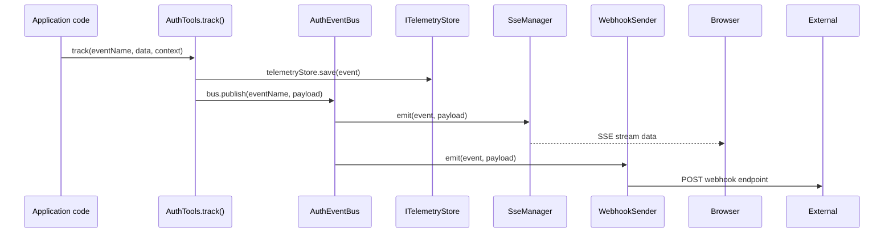

# AuthTools

`AuthTools` is the unified entry point for the event-driven tools system. It wires `AuthEventBus` to three optional capabilities:

- **Telemetry** — persist every tracked event via `ITelemetryStore`
- **SSE** — stream events to connected browser/server clients in real time
- **Webhooks** — forward events to external HTTP endpoints with HMAC signing, or execute dynamic inbound scripts when external providers call you

> See the dedicated [Webhooks](./webhooks.md) page for full details on both outgoing and inbound webhook configurations, including the `@webhookAction` decorator.

All capabilities are opt-in. Unused features have zero runtime overhead.

---

## Quick start

```typescript
import { AuthTools, AuthEventBus, createToolsRouter } from 'awesome-node-auth';

const bus = new AuthEventBus();

const tools = new AuthTools(bus, {
  telemetryStore: myTelemetryStore,    // optional
  webhookStore:   myWebhookStore,      // optional
  sse:            true,                // optional — enables GET /tools/stream
  sseDistributor: myDistributor,       // optional — custom notify() transport wins over internal SSE broadcaster
  sseOptions: { heartbeatIntervalMs: 15_000 },
  webhookVersion: '1',
});

// Mount the tools HTTP router
app.use('/tools', createToolsRouter(tools, {
  authMiddleware: auth.middleware(),
}));
```

---

## Tracking events

`tools.track()` persists an event to the telemetry store (if configured) **and** publishes it on the bus, which triggers any attached SSE streams and webhook deliveries.

```typescript
await tools.track('identity.auth.login.success', { method: 'local' }, {
  userId: 'user-123',
  tenantId: 'tenant-abc',
  sessionId: 'sess-xyz',
  ip: req.ip,
  userAgent: req.headers['user-agent'],
});
```

---

## Sending notifications

`tools.notify()` pushes a real-time event to SSE subscribers and, optionally, sends the notification via **email** or **SMS** (v1.8.0+).

```typescript
// SSE only (default — backward-compatible)
await tools.notify('user:user-123', { message: 'New login from Paris' }, {
  type: 'security-alert',
  userId: 'user-123',
  tenantId: 'tenant-abc',
});

// Email + SSE (requires userStore and emailConfig in AuthToolsOptions)
await tools.notify('user:user-123', { message: 'Your subscription expires in 3 days' }, {
  channels: ['sse', 'email'],
  userId: 'user-123',
  emailSubject: 'Subscription expiring soon',
});

// SMS only
await tools.notify('user:user-123', 'SMS text', {
  channels: ['sms'],
  userId: 'user-123',
});
```

To enable email and SMS channels, pass the corresponding config when creating `AuthTools`:

```typescript
const tools = new AuthTools(bus, {
  sse: true,
  userStore,                                    // needed to look up email / phone
  emailConfig: {
    endpoint: process.env.MAILER_ENDPOINT!,
    apiKey:   process.env.MAILER_KEY!,
    from:     'no-reply@example.com',
  },
  smsConfig: {
    endpoint: process.env.SMS_ENDPOINT!,
    apiKey:   process.env.SMS_KEY!,
    username: process.env.SMS_USERNAME!,
    password: process.env.SMS_PASSWORD!,
  },
});
```

Topics supported out of the box (SSE channel):

| Topic pattern | Description |
|---------------|-------------|
| `global` | Broadcast to all connections |
| `tenant:{tenantId}` | All connections in a tenant |
| `user:{userId}` | A single user |
| `session:{sessionId}` | A single session |
| `custom:{namespace}` | Application-defined channel |

---

## Full event flow



---

## `AuthToolsOptions`

```typescript
interface AuthToolsOptions {
  telemetryStore?: ITelemetryStore;
  webhookStore?: IWebhookStore;
  sse?: boolean;                             // default: false
  sseDistributor?: ISseDistributor;          // optional custom notify() distributor
  sseOptions?: { heartbeatIntervalMs?: number; distributor?: ISseDistributor; deduplicate?: boolean };
  webhookVersion?: string;                   // default: '1'
  userStore?: IUserStore;                    // v1.8.0 — required for email/SMS notify channels
  emailConfig?: EmailNotificationConfig;     // v1.8.0 — enables 'email' channel in notify()
  smsConfig?: SmsNotificationConfig;         // v1.8.0 — enables 'sms' channel in notify()
}
```

---

## `AuthTools` API

```typescript
class AuthTools {
  constructor(bus: AuthEventBus, options?: AuthToolsOptions);

  track(eventName: string, data?: unknown, options?: TrackOptions): Promise<void>;
  notify(target: string, data?: unknown, options?: NotifyOptions): void;

  get sseManager(): SseManager | undefined;
  get eventBus(): AuthEventBus;
}
```
