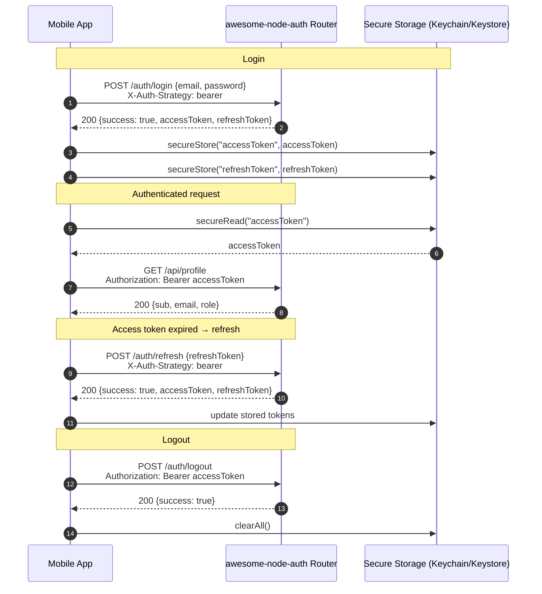

# Bearer Token Mode (Native / Mobile Clients)

By default, awesome-node-auth delivers tokens via **HttpOnly cookies** (recommended for web apps).  
For **native mobile clients** (iOS, Android, Flutter, React Native) that cannot use browser cookies, opt into bearer-token delivery by sending `X-Auth-Strategy: bearer`.

:::info Web apps
If you are building a web application (Angular, Next.js, React, Vue…), **do not use bearer mode**. Use `withCredentials: true` and let the browser manage cookies. See the [Angular](/docs/frameworks/angular), [Next.js](/docs/frameworks/nextjs), or [Express](/docs/frameworks/express) guides.
:::

---

## Bearer token flow (mobile client)



---

## Opting into bearer mode

Add `X-Auth-Strategy: bearer` to every request that issues tokens:

| Endpoint | With bearer header: response includes |
|----------|---------------------------------------|
| `POST /auth/login` | `{accessToken, refreshToken}` in body |
| `POST /auth/refresh` | `{accessToken, refreshToken}` in body |
| `POST /auth/2fa/verify` | `{accessToken, refreshToken}` in body |
| `POST /auth/magic-link/verify` | `{accessToken, refreshToken}` in body |
| `POST /auth/sms/verify` | `{accessToken, refreshToken}` in body |

---

## Login and token storage

```typescript
const res = await fetch('/auth/login', {
  method: 'POST',
  headers: {
    'Content-Type': 'application/json',
    'X-Auth-Strategy': 'bearer',   // ← opts into bearer mode
  },
  body: JSON.stringify({ email, password }),
});

const { accessToken, refreshToken } = await res.json();
// Store securely — use Keychain (iOS), Keystore/EncryptedSharedPreferences (Android),
// flutter_secure_storage (Flutter). Never use localStorage on web.
```

## Authenticated requests

```typescript
async function authFetch(url: string, options: RequestInit = {}) {
  const res = await fetch(url, {
    ...options,
    headers: {
      'Content-Type': 'application/json',
      Authorization: `Bearer ${currentAccessToken}`,
      ...options.headers,
    },
  });

  if (res.status === 401) {
    const refreshed = await refreshAccessToken();
    if (refreshed) return authFetch(url, options);  // retry once
    redirectToLogin();
  }
  return res;
}
```

## Refreshing the access token

```typescript
async function refreshAccessToken(): Promise<boolean> {
  try {
    const res = await fetch('/auth/refresh', {
      method: 'POST',
      headers: {
        'Content-Type': 'application/json',
        'X-Auth-Strategy': 'bearer',
      },
      body: JSON.stringify({ refreshToken: storedRefreshToken }),
    });
    if (!res.ok) return false;
    const { accessToken, refreshToken } = await res.json();
    currentAccessToken = accessToken;
    storedRefreshToken = refreshToken;
    return true;
  } catch {
    return false;
  }
}
```

## Protecting server routes

The `auth.middleware()` accepts both bearer tokens and cookies automatically:

```typescript
app.get('/api/profile', auth.middleware(), (req, res) => {
  res.json(req.user);   // decoded JWT payload
});
```

## Token payload shape

```typescript
interface AccessTokenPayload {
  sub:   string;   // user ID
  email: string;
  role?: string;
  loginProvider?: string;
  isEmailVerified?: boolean;
  isTotpEnabled?: boolean;
  iat:   number;
  exp:   number;
  // …any custom claims from buildTokenPayload
}
```

## Security checklist

- ✅ Access token in **platform secure storage** (Keychain / Keystore / flutter_secure_storage)
- ✅ Refresh token also in secure storage — refresh on every app launch
- ✅ Always send `X-Auth-Strategy: bearer` on login and refresh endpoints
- ✅ HTTPS in production
- ✅ Short access token TTL (15 min default)
- ✅ Retry once on 401 using the stored refresh token, then redirect to login
- ✅ On logout, call `POST /auth/logout` (with `Authorization: Bearer <token>`) to invalidate server-side
