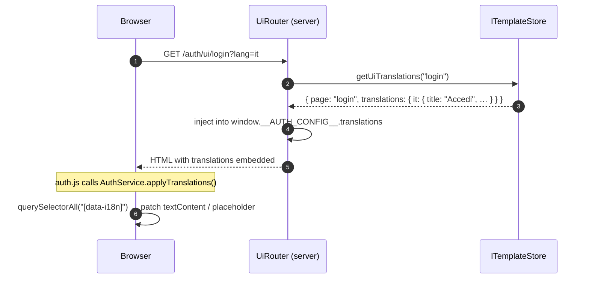

# Built-in UI — Activation & CSS Customization

`awesome-node-auth` ships a **zero-dependency, server-rendered HTML UI** for all authentication flows. No React, no bundler, no build step required — the server injects your theme and configuration at request time.

---

## Pages included

| Page | Path | Description |
|------|------|-------------|
| Login | `{apiPrefix}/ui/login` | Email/password + OAuth + magic link + SMS |
| Register | `{apiPrefix}/ui/register` | New account form (only when `onRegister` is set) |
| Forgot Password | `{apiPrefix}/ui/forgot-password` | Password reset request form |
| Reset Password | `{apiPrefix}/ui/reset-password` | New password form (via email token) |
| Magic Link | `{apiPrefix}/ui/magic-link` | Passwordless email login |
| Verify Email | `{apiPrefix}/ui/verify-email` | Email verification landing page |
| 2FA Challenge | `{apiPrefix}/ui/2fa` | TOTP / SMS one-time password entry |
| Link Verify | `{apiPrefix}/ui/link-verify` | OAuth account-linking confirmation |
| Account Conflict | `{apiPrefix}/ui/account-conflict` | OAuth provider/email conflict resolution |

---

## Step 1 — Install the UI router

`buildUiRouter` is separate from the auth API router. Mount both under the same prefix:

```typescript
import express from 'express';
import { AuthConfigurator, buildUiRouter } from '@awesome-lang-auth/node';
import { MyUserStore } from './my-user-store';

const app = express();
app.use(express.json());

const config: AuthConfig = {
  // ... JWT secrets & expiry
  ui: { loginUrl: '/auth/ui/login' }
};

const userStore = new MyUserStore();
const auth = new AuthConfigurator(config, userStore);

const routerOptions = {
  // onRegister, oauthStrategies, etc.
};

// 1. Mount the REST API router
app.use('/auth', auth.router(routerOptions));

// 2. Mount the UI router at the same prefix + /ui
app.use(
  '/auth/ui',
  buildUiRouter({
    authConfig:     config,
    routerOptions:  routerOptions,  // enables register/OAuth flags
    apiPrefix:      '/auth',
  })
);

app.listen(3000, () => console.log('Running on http://localhost:3000'));
```

The built-in UI is now available at:
- **`http://localhost:3000/auth/ui/login`**
- **`http://localhost:3000/auth/ui/register`**
- etc.

---

## Step 2 — Configure `AuthConfig.ui`

All UI settings live under `authConfig.ui`. Every option is optional.

```typescript
const auth = new AuthConfigurator(
  {
    // ... JWT secrets & expiry ...
    ui: {
      loginUrl:    '/auth/ui/login',
      registerUrl: '/auth/ui/register',  // default
      siteName:    'My App',
      customLogo:  'https://cdn.example.com/logo.png',
      primaryColor:   '#6366f1',  // indigo
      secondaryColor: '#64748b',
      bgColor:     '#f0f4ff',
      cardBg:      '#ffffff',
      bgImage:     'https://cdn.example.com/bg.jpg',
      // Raw CSS injected into every page — override any rule or variable
      customCss: `
        :root { --primary-color: #6366f1; }
        .auth-container { border-radius: 20px; }
      `,
    },
  },
  userStore
);
```

### `AuthConfig.ui` options

| Option | Type | Default | Description |
|--------|------|---------|-------------|
| `loginUrl` | `string` | `{apiPrefix}/ui/login` | Login page URL (used for redirects) |
| `registerUrl` | `string` | `{apiPrefix}/ui/register` | Register page URL |
| `siteName` | `string` | `'Awesome Node Auth'` | Page title and `<h1>` heading |
| `customLogo` | `string` | — | URL of a logo image (displayed above the form) |
| `primaryColor` | `string` | `#4a90d9` | Main brand colour (buttons, headings, focus rings) |
| `secondaryColor` | `string` | `#6c757d` | Secondary colour (OAuth buttons, dividers) |
| `bgColor` | `string` | `#f8fafc` | Page background colour |
| `bgImage` | `string` | — | Page background image URL (full-cover) |
| `cardBg` | `string` | `#ffffff` | Form/card background colour |
| `customCss` | `string` | — | Raw CSS injected into every page `<style>` tag |

---

## Step 3 — Dynamic settings via `ISettingsStore`

For **real-time** theme changes without restarting the server (e.g. from an admin panel), implement `ISettingsStore` and pass it to `buildUiRouter`:

```typescript
import { ISettingsStore } from '@awesome-lang-auth/node';

class MongoSettingsStore implements ISettingsStore {
  async getSettings() {
    const doc = await db.collection('settings').findOne({ key: 'ui' });
    return doc ?? {};
  }
  async updateSettings(settings: Partial<AuthSettings>) {
    await db.collection('settings').updateOne(
      { key: 'ui' },
      { $set: { ...settings, key: 'ui' } },
      { upsert: true }
    );
  }
}

app.use('/auth/ui', buildUiRouter({
  authConfig:    config,
  apiPrefix:     '/auth',
  settingsStore: new MongoSettingsStore(),
}));
```

Settings in the store **override** `authConfig.ui`. The built-in admin router's UI settings tab writes to the same `ISettingsStore`, so changes made in the admin panel appear instantly.

---

## Step 4 — Custom logo uploads

To let admins upload a custom logo, pass an `uploadDir` to `buildUiRouter`. Uploaded files are served at `{apiPrefix}/ui/assets/uploads/`:

```typescript
import path from 'path';

app.use('/auth/ui', buildUiRouter({
  authConfig: config,
  apiPrefix:  '/auth',
  uploadDir:  path.resolve(__dirname, 'uploads/logo'),
}));

// Then set logoUrl to the uploaded path:
// logoUrl: '/auth/ui/assets/uploads/logo.png'
```

---

## CSS customization reference

### How theming works

The UI is styled with CSS custom properties (variables) defined in `:root`. When you set `primaryColor`, `bgColor`, etc. in `AuthConfig.ui` or `ISettingsStore`, the server renders an inline `<style>` block that overrides these variables **before** the stylesheet loads — eliminating any flash of unstyled content.

The `customCss` string is appended after the variable block, letting you override individual rules.

### Full CSS variable reference

```css
:root {
  /* ── Colours ─────────────────────────────────────────── */
  --primary-color:        #4a90d9;  /* buttons, headings, focus rings */
  --primary-color-hover:  #357abd;  /* button hover state */
  --secondary-color:      #6c757d;  /* OAuth buttons, dividers */
  --secondary-color-hover:#5a6268;  /* OAuth button hover */
  --bg-color:             #f8fafc;  /* page background */
  --bg-image:             none;     /* background image (url("…")) */
  --card-bg:              #ffffff;  /* form card background */
  --text-color:           #1e293b;  /* primary text */
  --text-muted:           #64748b;  /* secondary/label text */
  --error-color:          #ef4444;  /* error alerts */
  --success-color:        #22c55e;  /* success alerts */
  --border-color:         #e2e8f0;  /* input borders, dividers */
  --input-focus:          #4a90d9;  /* input focus ring (same as primary by default) */
}
```

### Overriding variables only — the minimal approach

```typescript
ui: {
  primaryColor: '#6366f1',  // only changes --primary-color + --input-focus
}
```

### Full CSS override via `customCss`

```typescript
ui: {
  customCss: `
    /* Override variables */
    :root {
      --primary-color:        #8b5cf6;
      --primary-color-hover:  #7c3aed;
      --bg-color:             #0f0f13;
      --card-bg:              #1a1a2e;
      --text-color:           #e2e8f0;
      --text-muted:           #94a3b8;
      --border-color:         #334155;
    }

    /* Override component rules */
    .auth-container {
      border-radius: 20px;
      box-shadow: 0 25px 50px rgba(0, 0, 0, 0.5);
    }

    h1 { font-size: 28px; }
    h2 { font-size: 14px; letter-spacing: 0.1em; text-transform: uppercase; }

    button[type="submit"] {
      border-radius: 8px;
      letter-spacing: 0.05em;
    }

    input {
      background: var(--card-bg);
      color: var(--text-color);
    }
  `,
}
```

### Dark mode example

```typescript
ui: {
  bgColor:     '#0f172a',
  cardBg:      '#1e293b',
  customCss: `
    :root {
      --bg-color:     #0f172a;
      --card-bg:      #1e293b;
      --text-color:   #f1f5f9;
      --text-muted:   #94a3b8;
      --border-color: #334155;
    }
    input { background: #0f172a; color: #f1f5f9; }
    label { color: #cbd5e1; }
  `,
}
```

### CSS class reference

| Selector | Element | Notes |
|----------|---------|-------|
| `.auth-container` | Form card | Controls max-width (400px default), padding, border-radius |
| `.logo` | Logo `` | Hidden if no `logoUrl` is set |
| `.site-name` | `<h1>` | Site name heading (set via `siteName`) |
| `h2` | Sub-heading | "Login", "Register", etc. |
| `.alert` | Alert box | Base styles |
| `.alert-error` | Error alert | Red background |
| `.alert-success` | Success alert | Green background |
| `.form-group` | Field container | `<label>` + `<input>` wrapper |
| `input` | All form inputs | Includes email, password, OTP fields |
| `button[type="submit"]` | Primary action button | Coloured by `--primary-color` |
| `.btn-social` | OAuth buttons | Google, GitHub |
| `.divider` | "or" separator | Between form and OAuth buttons |
| `.footer-links` | Bottom link area | "Forgot password?", "Sign up" |

---

## Step 5 — Custom assets directory

For complete control, replace all built-in HTML pages with your own by pointing `uiAssetsDir` at a local directory. Your directory must contain the same file names as the built-in pages.

```typescript
app.use('/auth/ui', buildUiRouter({
  authConfig:   config,
  apiPrefix:    '/auth',
  uiAssetsDir:  path.resolve(__dirname, 'my-custom-ui'),
}));
```

Your HTML files still benefit from server-side config injection (`window.__AUTH_CONFIG__`, CSS variables) as long as they contain a `</head>` tag.

---

## How `auth.js` activates automatically

Each built-in HTML page includes `<script src="auth.js">`, which:

1. Reads `window.__AUTH_CONFIG__` (injected by the server at render time — zero extra fetch)
2. Intercepts all `fetch()` calls to add `credentials: 'include'` and `X-CSRF-Token`
3. Handles 401/403 responses with transparent token refresh
4. Exposes `window.AwesomeNodeAuth` for optional custom scripting

> See [Browser Client (`auth.js`)](/docs/advanced/browser-client) for the full `window.AwesomeNodeAuth` API.

---

## Enabling features dynamically

The UI hides/shows features based on which strategies and handlers are configured:

| Feature | Shown when |
|---------|-----------|
| Register link | `routerOptions.onRegister` is set |
| Forgot password | `authConfig.email.sendPasswordReset` or `.mailer` is set |
| Magic link | `authConfig.email.sendMagicLink` or `.mailer` is set |
| Google OAuth | `authConfig.oauth.google` is set |
| GitHub OAuth | `authConfig.oauth.github` is set |
| 2FA page | `authConfig.twoFactor` is set |
| Verify email | `authConfig.email.mailer` is set and `emailVerificationMode !== 'none'` |

Pass `routerOptions` to `buildUiRouter` so these flags are computed correctly:

```typescript
const config: AuthConfig = { /* … */ };
const auth = new AuthConfigurator(config, userStore);

const routerOpts = {
  onRegister: async (data) => { /* … */ },
  // …
};

app.use('/auth', auth.router(routerOpts));
app.use('/auth/ui', buildUiRouter({ authConfig: config, routerOptions: routerOpts, apiPrefix: '/auth' }));
```

---

## Redirecting after login

`awesome-node-auth` redirects to `AuthConfig.ui.loginUrl` when an unauthenticated user hits a protected route. After a successful login the default redirect target is `/` (the home page).

Customize both with `AwesomeNodeAuth.init()` in your own JS:

```html
<script src="/auth/ui/assets/auth.js"></script>
<script>
  AwesomeNodeAuth.init({ homeUrl: '/dashboard' });
</script>
```

Or server-side, via the `window.__AUTH_CONFIG__` injection — the `homeUrl` can be baked in by `buildUiRouter` at render time if you extend `getUiConfig`.

---

## Headless Mode — using `auth.js` without the UI pages

When embedding `awesome-node-auth` into an **existing SPA or documentation site** (e.g. Docusaurus, Next.js, Nuxt) you may want the client-side `auth.js` library (token refresh, session-expiry hooks) without the server-side HTML login / register pages.

Enable **headless mode** by setting `ui.headless: true` in your `AuthConfig`:

```typescript
const config: AuthConfig = {
  // ...
  ui: {
    headless: true,
    loginUrl: '/auth/ui/login', // optional — ignored when headless
  },
};
```

### What changes in headless mode

| Feature | Normal mode | Headless mode (`ui.headless: true`) |
|---------|-------------|-------------------------------------|
| `GET /auth/ui/login` | Returns HTML login page | Returns `404` |
| `GET /auth/ui/register` | Returns HTML register page | Returns `404` |
| `GET /auth/ui/auth.js` | Served ✅ | Served ✅ |
| `GET /auth/ui/auth.css` | Served ✅ | Served ✅ |
| `GET /auth/ui/config` | `{ headless: false, … }` | `{ headless: true, … }` |
| `window.location` redirects | Active | **Disabled** — no-op handlers installed |

### Loading `auth.js` in a Docusaurus / SPA site

Mount the router in headless mode on your backend, then load `auth.js` from your frontend:

```html
<!-- Load before your SPA bundle so the singleton is available immediately -->
<script src="/auth/ui/auth.js"></script>
<script>
  // headless: true → installs no-op lifecycle handlers so auth.js never
  // redirects window.location away from your SPA pages
  AwesomeNodeAuth.init({
    apiPrefix: '/auth',
    headless: true,
  });
</script>
```

`auth.js` automatically detects the `headless: true` flag from the `/auth/ui/config` response and suppresses all window navigation. You can still register your own handlers:

```javascript
AwesomeNodeAuth.onSessionExpired(() => {
  // show a custom "session expired" toast in your SPA
  myToastService.show('Your session expired — please log in again.');
});
```

### Cross-domain setup (API on a separate origin)

When the wiki / SPA is served from a different origin than the auth API, pass the full origin via `apiPrefix`:

```typescript
// docusaurus.config.ts — inject auth.js from the API server
headTags: [
  {
    tagName: 'script',
    attributes: { src: 'https://api.myapp.com/auth/ui/auth.js' },
  },
  {
    tagName: 'script',
    attributes: {},
    innerHTML: `
      if (window.AwesomeNodeAuth) {
        window.AwesomeNodeAuth.init({
          apiPrefix: 'https://api.myapp.com/auth',
          headless: true,
        });
      }
    `,
  },
],
```

---

## Angular / Next.js — do I need the built-in UI?

| Client | Recommendation |
|--------|---------------|
| **Vanilla JS / jQuery / plain HTML** | Use the built-in UI — zero setup |
| **Next.js / Nuxt / SvelteKit** | Built-in UI works; or build your own pages and call the REST API |
| **Angular** | Use the dedicated **[ng-awesome-node-auth](/docs/frameworks/ng-awesome-node-auth)** library — it provides Guards, Interceptors, and a typed `AuthService`; `auth.js` is **not needed** in Angular projects |

---

:::tip Production checklist
- Set `cookieOptions.secure: true` so `__Host-` / `__Secure-` cookie prefixes are applied (cookie-tossing protection)
- Set `csrf: { enabled: true }` when your frontend makes state-changing requests
- Use `ISettingsStore` if you want runtime theme changes without server restarts
- Pass `uploadDir` to accept logo uploads from the admin panel
:::

---

## Internationalization (i18n)

The built-in UI supports **per-page text overrides** via `ITemplateStore`. When a `templateStore` is configured and a `UiTranslation` entry exists for the current page, the UI router injects the translations into `window.__AUTH_CONFIG__.translations` at render time — no extra HTTP request needed.

### How it works



### Activating i18n

Pass a `templateStore` to `buildUiRouter`:

```typescript
import { buildUiRouter, MemoryTemplateStore } from '@awesome-lang-auth/node';

const templateStore = new MemoryTemplateStore();

// Pre-populate translations (or load from DB at startup)
await templateStore.updateUiTranslations('login', {
  en: { title: 'Sign in', emailPlaceholder: 'Email address', submitBtn: 'Log in', forgotLink: 'Forgot password?' },
  it: { title: 'Accedi', emailPlaceholder: 'Indirizzo email', submitBtn: 'Entra', forgotLink: 'Password dimenticata?' },
});

app.use('/auth/ui', buildUiRouter({
  authConfig,
  apiPrefix:     '/auth',
  templateStore,             // ← enables i18n injection
}));
```

The language is resolved from the `?lang=` query parameter first, then from `email.mailer.defaultLang`, and finally falls back to `'en'`.

### The `data-i18n` attribute

Every translatable element in the built-in HTML pages carries a `data-i18n` attribute:

```html
<h2 data-i18n="title">Sign in</h2>
<input type="email" data-i18n="emailPlaceholder" placeholder="Email address" />
<button type="submit" data-i18n="submitBtn">Log in</button>
<a href="/auth/forgot-password" data-i18n="forgotLink">Forgot password?</a>
```

On page load `auth.js` calls `AuthService.applyTranslations()`, which:

1. Reads `window.__AUTH_CONFIG__.translations` (flat `{ key: value }` map for the current language)
2. Iterates every `[data-i18n]` element
3. Sets `.textContent` for regular elements or `.placeholder` for `<input>` / `<textarea>`

The built-in text remains in place as the default — it is only replaced when a matching translation key exists.

### Page identifiers

Each UI page maps to a translation entry by its path segment. Use this identifier as the first argument to `templateStore.updateUiTranslations()`:

| Page | `UiTranslation.page` | Example call |
|------|----------------------|--------------|
| Login | `login` | `updateUiTranslations('login', { … })` |
| Register | `register` | `updateUiTranslations('register', { … })` |
| Forgot Password | `forgot-password` | `updateUiTranslations('forgot-password', { … })` |
| Reset Password | `reset-password` | `updateUiTranslations('reset-password', { … })` |
| Magic Link | `magic-link` | `updateUiTranslations('magic-link', { … })` |
| Verify Email | `verify-email` | `updateUiTranslations('verify-email', { … })` |
| 2FA Challenge | `2fa` | `updateUiTranslations('2fa', { … })` |
| Link Verify | `link-verify` | `updateUiTranslations('link-verify', { … })` |
| Account Conflict | `account-conflict` | `updateUiTranslations('account-conflict', { … })` |

### Managing translations via the Admin UI

Pass the same `templateStore` to `createAdminRouter` to edit translations live through the **📧 Email & UI** tab:

```typescript
app.use('/admin', createAdminRouter(userStore, {
  accessPolicy: 'first-user',
  jwtSecret: process.env.ACCESS_TOKEN_SECRET!,
  templateStore,
}));
```

> See [Admin Panel → Email & UI tab](/docs/advanced/admin#email--ui-templates-tab) and [ITemplateStore API Reference](/docs/api-reference/template-store).
