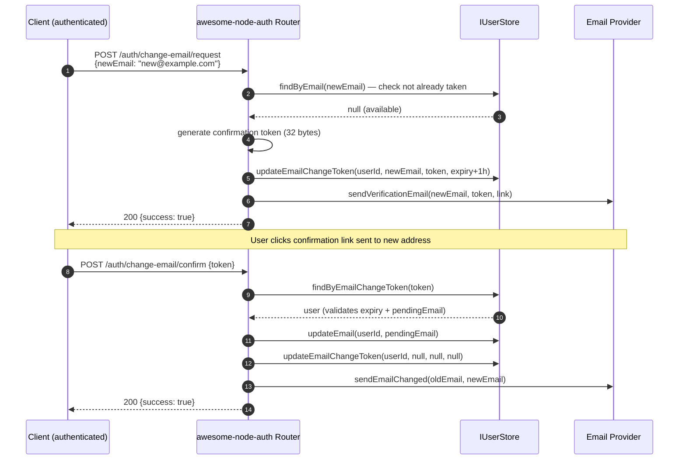

# Change Email Flow

Authenticated users can change their email address through a two-step verification flow. The new address must be confirmed by clicking a link sent to it before the change takes effect.

---

## Change email flow



---

## Implement IUserStore methods

```typescript
// Required for the change-email flow
async updateEmailChangeToken(
  userId: string,
  pendingEmail: string | null,
  token: string | null,
  expiry: Date | null,
): Promise<void> { /* … */ }

async updateEmail(userId: string, newEmail: string): Promise<void> { /* … */ }

async findByEmailChangeToken(token: string): Promise<BaseUser | null> { /* … */ }
```

---

## Configuration

```typescript
const auth = new AuthConfigurator({
  email: {
    siteUrl: 'https://yourapp.com',
    mailer: { /* … see Mailer guide */ },
    // Optional override: custom notification email
    sendEmailChanged: async (oldEmail, newEmail, lang) => {
      await myMailer.send({ to: oldEmail, subject: 'Email updated', html: `Your email is now ${newEmail}` });
    },
  },
}, userStore);
```

---

## Endpoints

| Method | Path | Auth | Description |
|--------|------|:---:|-------------|
| `POST` | `/auth/change-email/request` | ✅ | Request email change — sends confirmation to new address |
| `POST` | `/auth/change-email/confirm` | — | Confirm with token → update email in store |

### `POST /auth/change-email/request`

```json
{ "newEmail": "new@example.com" }
```

Response `200`:
```json
{ "success": true }
```

Errors:
- `409` — email already registered by another user
- `400` — newEmail missing or invalid

### `POST /auth/change-email/confirm`

```json
{ "token": "<token-from-email>" }
```

Response `200`:
```json
{ "success": true }
```

Errors:
- `400` — token missing, expired, or already used

## Related

- [Email verification modes](/docs/advanced/email-verification) — the verification machinery reused here
- [Built-in HTTP mailer](/docs/advanced/mailer) — how the confirmation email is sent
- [Self-service account deletion](/docs/advanced/account-deletion) — the other self-service operation
- [Auth API endpoints reference](/docs/api-reference/endpoints) — the change-email routes
