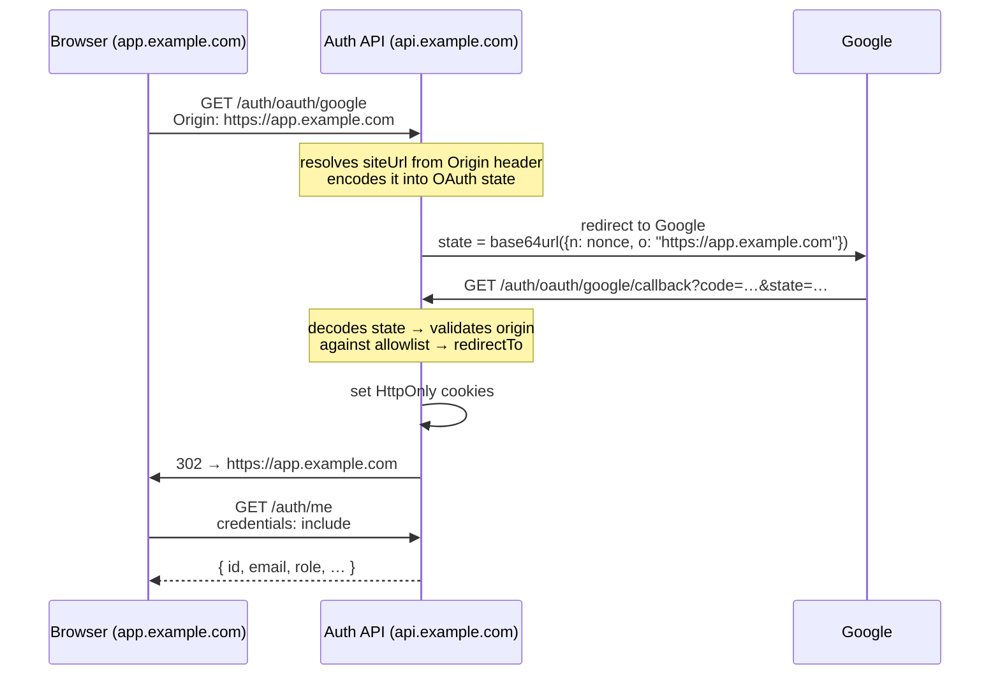

# CORS & Dynamic Caller Resolution

When your authentication backend lives on a different domain than your
front-end (e.g. wiki on `https://app.example.com`, API on
`https://api.example.com`) you need two things to work correctly:

1. **CORS headers** — so the browser allows cross-origin `fetch` requests with
   `credentials: 'include'`.
2. **Dynamic `siteUrl`** — so the post-OAuth redirect and all email links point
   back to the exact front-end origin that started the flow.

Both are configured through the same two options and work with a shared
**allowlist** of trusted origins, preventing open-redirect attacks.

---

## The problem: cross-origin cookies

After a successful OAuth login, awesome-node-auth sets HttpOnly cookies and redirects
the browser to your front-end.  When your front-end JavaScript later calls
`/auth/me` (or any other auth endpoint) it must include those cookies.  Browsers
only send cookies on cross-origin `fetch` requests when **all three** conditions
are met:

| Requirement | Setting |
|-------------|---------|
| Cookie `SameSite` | `None` |
| Cookie `Secure` | `true` (HTTPS required) |
| `fetch` call | `credentials: 'include'` |
| Server response | `Access-Control-Allow-Origin: <exact origin>` + `Access-Control-Allow-Credentials: true` |

node-auth handles the server-side requirements; you only need to configure the
allowed origins.

---

## Configuration

### 1. Enable CORS in the auth router

Pass the `cors` option to `RouterOptions`:

```typescript
import express from 'express';
import { AuthConfigurator } from 'awesome-node-auth';
import { MyUserStore } from './my-user-store';

const app = express();
app.use(express.json());

const auth = new AuthConfigurator(
  {
    accessTokenSecret:  process.env.ACCESS_TOKEN_SECRET!,
    refreshTokenSecret: process.env.REFRESH_TOKEN_SECRET!,
    cookieOptions: {
      secure:   true,          // required for sameSite: 'none'
      sameSite: 'none',        // required for cross-origin cookies
    },
    email: {
      // Array of allowed front-end origins.
      // The router dynamically picks the one matching the request Origin header.
      // The first entry is the default used for email links (magic link, reset, etc.).
      siteUrl: [
        'https://app.example.com',
        'https://admin.example.com',
      ],
    },
  },
  new MyUserStore()
);

app.use('/auth', auth.router({
  cors: {
    origins: [
      'https://app.example.com',
      'https://admin.example.com',
    ],
  },
  // ... other options
}));
```

:::tip Single origin
When you only have one front-end domain you can still use a string:

```typescript
email: { siteUrl: 'https://app.example.com' }
```

But passing `cors.origins` is still recommended so the auth router
handles preflight `OPTIONS` requests automatically.
:::

---

### 2. Cookie settings for production

Cross-origin cookies require `Secure: true` which in turn requires HTTPS.
Adjust `cookieOptions` based on the environment:

```typescript
cookieOptions: {
  secure:   process.env.NODE_ENV === 'production',   // HTTPS only
  sameSite: process.env.NODE_ENV === 'production' ? 'none' : 'lax',
},
```

In **development** with a local proxy (API and front-end on the same origin via
`/api` proxy) `sameSite: 'lax'` is fine. In **production** with separate
domains use `sameSite: 'none'` + `secure: true`.

:::tip Automatic detection in the MCP server
The MCP server detects cross-domain deployments automatically: when `CORS_ORIGINS` is set (even in development, e.g. `localhost:3000` talking to a remote server) it switches to `sameSite: 'none'` + `secure: true`. No manual `cookieOptions` override is needed in that scenario.
:::

---

### 3. Front-end fetch calls

Your front-end must include credentials on every request to the auth API:

```typescript
const res = await fetch('https://api.example.com/auth/me', {
  credentials: 'include',   // sends cookies cross-origin
  headers: { 'Content-Type': 'application/json' },
});
```

---

## How dynamic `siteUrl` works

### For OAuth flows

When a user clicks "Sign in with Google" on `https://app.example.com`:



The resolved redirect URL is embedded in the OAuth `state` parameter during
the initiation request.  On the callback the library decodes the state,
**validates** the origin against the allowlist, and uses it as the redirect
target.  An origin that is not in the allowlist is silently ignored and the
default (`siteUrl[0]`) is used instead, preventing open-redirect attacks.

### For email links

For magic links, password-reset links, email-verification links, and similar
email-based flows the **first entry** in the `siteUrl` array (or the string
itself) is always used as the base URL.  These flows are initiated by a form
submission, not a browser navigation, so the request `Origin` is not a
reliable indicator of the target UI.

If you need to support email links for multiple front-ends you can:
- Set `siteUrl[0]` to your primary front-end URL.
- Route from the primary front-end to the secondary one if needed.

---

## `email.siteUrl` — string vs. array

| Type | Behaviour |
|------|-----------|
| `string` (`'https://app.example.com'`) | Used as-is for all email links and OAuth redirects. |
| `string[]` (`['https://app.com', 'https://admin.app.com']`) | OAuth redirects are resolved dynamically from the request `Origin`/`Referer` header; email links use the first entry. |

---

## `RouterOptions.cors`

| Field | Type | Description |
|-------|------|-------------|
| `cors.origins` | `string[]` | Explicit list of allowed front-end origins. When set, the auth router adds `Access-Control-*` headers and handles `OPTIONS` preflight automatically. |

The `cors.origins` list is **merged** with the `email.siteUrl` array when
building the dynamic redirect allowlist, so you only need to specify each
origin once if you set both.

---

## MCP server example

The awesome-node-auth MCP server uses environment variables to configure both CORS and
dynamic siteUrl:

```env
# .env
CORS_ORIGINS=https://wiki.example.com,https://app.example.com
SITE_URL=https://wiki.example.com   # optional: explicit default (used for email links)
```

```typescript
// In http-server.ts (already configured in the MCP server)
const allowedSiteUrls = [SITE_URL, ...CORS_ORIGINS].filter(Boolean);

const authConfig: AuthConfig = {
  cookieOptions: {
    // When CORS_ORIGINS are configured (i.e. cross-domain deployment)
    // the server automatically switches to SameSite=None + Secure=true so that
    // HttpOnly cookies are sent from the remote SPA to this server.
    secure:   IS_PRODUCTION || CORS_ORIGINS.length > 0,
    sameSite: (IS_PRODUCTION || CORS_ORIGINS.length > 0) ? 'none' : 'lax',
  },
  email: { siteUrl: allowedSiteUrls },
  // ...
};

app.use('/auth', auth.router({
  cors: { origins: CORS_ORIGINS },
  // ...
}));
```

After OAuth login the browser is automatically redirected back to the wiki
origin that initiated the flow, and subsequent cross-origin `fetch` calls from
the wiki to the API include the auth cookies correctly.

---

## Security considerations

- **Open-redirect protection**: The library never redirects to an origin that
  is not in the configured allowlist.  If an attacker tampers with the OAuth
  `state` parameter to insert a different URL, it is silently discarded.
- **CSRF**: 
  - If your API and front-end share the **same parent domain** (e.g., `api.example.com` and `app.example.com`), you can use `sameSite: 'lax'` and enable `csrf: { enabled: true }`.
  - If they are on **completely different domains** (e.g., `api.com` and `app.com`), you must use `sameSite: 'none'` + `secure: true`. In this case, you **must disable** `csrf` (`enabled: false`) because the double-submit JS pattern cannot read cookies across different domains. You will rely on strict CORS origins for protection.
  See [CSRF Protection](/docs/advanced/csrf).
- **`sameSite: 'none'`** only works over HTTPS.  Never deploy with
  `sameSite: 'none'` and `secure: false` in production.
