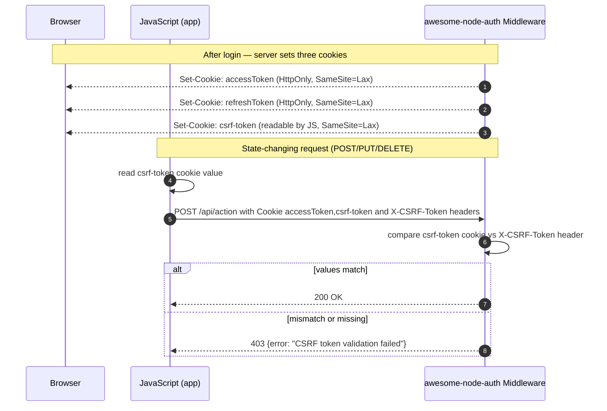

# CSRF Protection

node-auth supports the **double-submit cookie pattern** for CSRF protection.

---

## CSRF double-submit flow



:::info Why this works
An attacker can force the victim's browser to send cookies (CSRF), but cannot read the `csrf-token` cookie value from a different origin due to the Same-Origin Policy. So they cannot set the `X-CSRF-Token` header — the request fails.
:::

---

## Enable CSRF

```typescript
const config: AuthConfig = {
  accessTokenSecret: '…',
  refreshTokenSecret: '…',
  accessTokenExpiresIn: '15m',
  refreshTokenExpiresIn: '7d',
  csrf: {
    enabled: true,
  },
};
```

## Client-Side

### Vanilla JS / Fetch

```typescript
/**
 * Read the CSRF token from cookies.
 * awesome-node-auth v1.3+ applies cookie-tossing protection: when `secure` is
 * enabled the cookie is named `__Host-csrf-token` (or `__Secure-csrf-token`).
 * Check all three names in priority order to handle dev and production.
 */
function getCsrfToken(): string {
  const get = (name: string) =>
    document.cookie
      .split('; ')
      .find((row) => row.startsWith(`${name}=`))
      ?.split('=')[1] ?? '';
  return get('__Host-csrf-token') || get('__Secure-csrf-token') || get('csrf-token');
}

await fetch('/auth/logout', {
  method: 'POST',
  headers: { 'X-CSRF-Token': getCsrfToken() },
  credentials: 'include',
});
```

### Angular — handled automatically

The `authInterceptor` in the Angular demo reads the CSRF cookie (checking `__Host-csrf-token`, `__Secure-csrf-token`, and `csrf-token` in priority order) and adds `X-CSRF-Token` automatically on every `POST`/`PUT`/`PATCH`/`DELETE`. See [Angular Integration](/docs/frameworks/angular).

### Next.js — handled manually

```typescript
// Read the CSRF token, checking prefixed variants first (awesome-node-auth v1.3+)
const csrfToken =
  document.cookie.match(/(?:^|;\s*)__Host-csrf-token=([^;]+)/)?.[1] ??
  document.cookie.match(/(?:^|;\s*)__Secure-csrf-token=([^;]+)/)?.[1] ??
  document.cookie.match(/(?:^|;\s*)csrf-token=([^;]+)/)?.[1] ?? '';
await fetch('/api/auth/logout', {
  method: 'POST',
  headers: { 'X-CSRF-Token': csrfToken },
  credentials: 'include',
});
```

## Cookie details

| Cookie | HttpOnly | Readable by JS | Prefix (`Secure: true`) | Purpose |
|--------|:--------:|:--------------:|:-----------------------:|---------|
| `accessToken` | ✅ | ❌ | `__Host-` / `__Secure-` | Authenticate API requests |
| `refreshToken` | ✅ | ❌ | `__Host-` / `__Secure-` | Obtain new access tokens |
| `csrf-token` | ❌ | ✅ | `__Host-` / `__Secure-` | CSRF double-submit value |

### Cookie Prefixes (`__Host-` & `__Secure-`)

When `cookieOptions.secure` is enabled, the library automatically applies prefixes to improve security:

- **`__Host-`**: Applied if `Path` is `/` and no `Domain` is specified. This is the most secure option as it prevents any subdomain from overwriting the cookie (Cookie Tossing).
- **`__Secure-`**: Applied if the conditions for `__Host-` are not met but `Secure` is true.

> **`__Host-` and `Path=/`**: The browser specification ([RFC 6265bis](https://datatracker.ietf.org/doc/html/draft-ietf-httpbis-rfc6265bis)) requires that a `__Host-` cookie **must** have `Path=/`, no `Domain`, and `Secure=true`. The library enforces this automatically: even though the `refreshToken` cookie is normally scoped to `{apiPrefix}/refresh`, when the `__Host-` prefix is applied the path is silently overridden to `/`. This ensures the browser actually stores the cookie rather than silently discarding it. The server-side middleware still validates the token only on the `/refresh` endpoint, so there is no functional security regression.

The built-in client utilities (`auth.js` and `ng-awesome-node-auth`) automatically detect these prefixes. If you are using a custom client, ensure you check for all possible names in order of specificity:

```javascript
const csrfToken = 
  getCookie('__Host-csrf-token') || 
  getCookie('__Secure-csrf-token') || 
  getCookie('csrf-token');
```

The `csrf-token` cookie has the **same expiry** as the `accessToken` cookie (default 15 min) and is regenerated on every token refresh.
