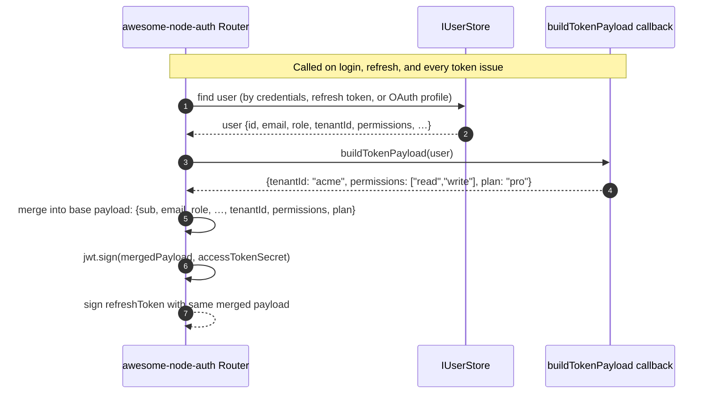

# Custom JWT Claims (`buildTokenPayload`)

By default, awesome-node-auth embeds these standard claims in every JWT:

```json
{
  "sub": "userId",
  "email": "user@example.com",
  "role": "user",
  "loginProvider": "local",
  "isEmailVerified": true,
  "isTotpEnabled": false,
  "iat": 1700000000,
  "exp": 1700000900
}
```

Use `buildTokenPayload` in `AuthConfig` to merge additional custom claims — tenant IDs, permissions, plan tier, feature flags, or any project-specific data — into **every issued token pair**.

---

## Flow



---

## Configuration

```typescript
import { AuthConfigurator, BaseUser } from 'awesome-node-auth';

// Extend BaseUser with your project-specific fields
interface AppUser extends BaseUser {
  tenantId?: string;
  plan?:     'free' | 'pro' | 'enterprise';
}

const auth = new AuthConfigurator({
  accessTokenSecret:  process.env.ACCESS_TOKEN_SECRET!,
  refreshTokenSecret: process.env.REFRESH_TOKEN_SECRET!,
  accessTokenExpiresIn:  '15m',
  refreshTokenExpiresIn: '7d',

  buildTokenPayload: (user: AppUser) => ({
    tenantId:    user.tenantId,
    plan:        user.plan,
  }),
}, userStore);
```

The returned object is **merged on top** of the standard claims. You cannot override `sub`, `email`, `role`, `iat`, or `exp`.

---

## Reading custom claims server-side

After `auth.middleware()` runs, custom claims are available on `req.user`:

```typescript
app.get('/api/data', auth.middleware(), (req, res) => {
  const { sub, email, tenantId, plan } = req.user as any;
  res.json({ tenantId, plan });
});
```

---

## Reading custom claims client-side (NestJS example)

```typescript
// @CurrentUser() injects req.user which includes all JWT claims
@Get('profile')
@UseGuards(JwtAuthGuard)
getProfile(@CurrentUser() user: { sub: string; email: string; tenantId: string; plan: string }) {
  return user;
}
```

---

## Async buildTokenPayload (loading RBAC from DB)

`buildTokenPayload` can be async. Use it to load permissions at token-issue time:

```typescript
buildTokenPayload: async (user) => {
  const permissions = await rbacStore.getPermissionsForUser(user.id);
  const roles       = await rbacStore.getRolesForUser(user.id);
  return { permissions, roles };
},
```

:::caution Token size
JWT tokens are sent in every request (as cookies). Keep custom claims small — embed IDs and flags, not full objects. A token exceeding ~4 KB may be rejected by some cookie jars.
:::

---

## Common patterns

### Multi-tenant ID

```typescript
buildTokenPayload: (user) => ({ tenantId: user.tenantId }),
```

### Role + permissions

```typescript
buildTokenPayload: async (user) => ({
  permissions: await rbacStore.getPermissionsForUser(user.id),
}),
```

### Feature flags

```typescript
buildTokenPayload: (user) => ({
  features: {
    analytics: user.plan === 'pro' || user.plan === 'enterprise',
    export:    user.plan === 'enterprise',
  },
}),
```

## Related

- [Role-based access control (RBAC)](/docs/advanced/roles-permissions) — the roles you may want in the token
- [Multi-tenant authentication](/docs/advanced/multi-tenancy) — put the tenant id in every claim set
- [Identity provider mode](/docs/advanced/idp-mode) — claims consumed by downstream resource servers
- [Session management and token revocation](/docs/advanced/sessions) — when claims are refreshed
