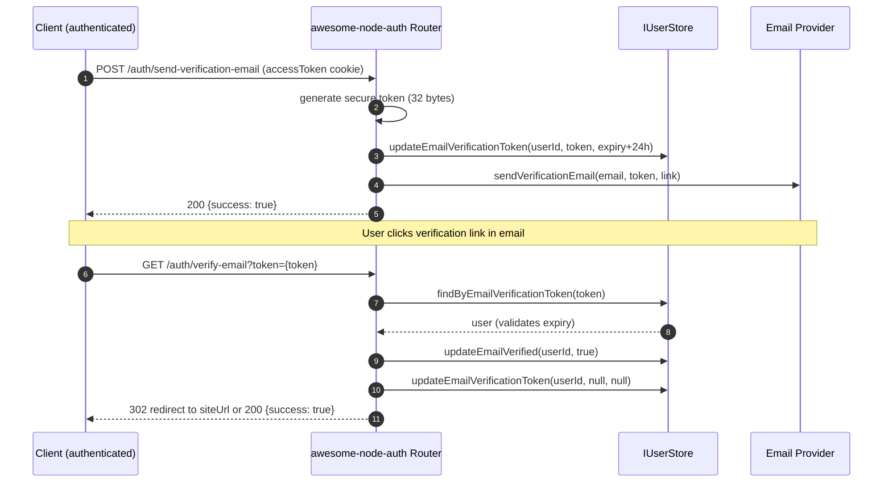

# Email Verification

node-auth supports three email-verification enforcement modes:

| Mode | Behaviour |
|------|-----------|
| `'none'` | Email verification is never required (default) |
| `'lazy'` | User may log in until `emailVerificationDeadline` is reached, then login is blocked |
| `'strict'` | Login is blocked immediately if `isEmailVerified !== true` |

---

## Verification flow



---

## Configuration

```typescript
const auth = new AuthConfigurator({
  accessTokenSecret:  process.env.ACCESS_TOKEN_SECRET!,
  refreshTokenSecret: process.env.REFRESH_TOKEN_SECRET!,

  emailVerificationMode: 'lazy',   // 'none' | 'lazy' | 'strict'

  email: {
    siteUrl: 'https://yourapp.com',   // used to build the verification link
    mailer: { /* … see Mailer guide */ },
    // or use the callback override:
    // sendVerificationEmail: async (to, token, link) => { … }
  },
}, userStore);
```

### Lazy mode: set `emailVerificationDeadline`

In `'lazy'` mode users can log in for a grace period. Set the deadline when creating the user:

```typescript
onRegister: async (data) => {
  const gracePeriodDays = 7;
  const deadline = new Date();
  deadline.setDate(deadline.getDate() + gracePeriodDays);

  return userStore.create({
    email: data.email as string,
    password: await passwordService.hash(data.password as string),
    emailVerificationDeadline: deadline,
  });
},
```

After `emailVerificationDeadline`, `POST /auth/login` returns:

```json
{ "error": "Email verification required", "code": "EMAIL_NOT_VERIFIED" }
```

---

## Implement IUserStore methods

```typescript
// Required for email verification
async updateEmailVerificationToken(userId, token, expiry) { /* … */ }
async updateEmailVerified(userId, isVerified) { /* … */ }
async findByEmailVerificationToken(token) { /* … */ }
```

---

## Endpoints

| Method | Path | Auth | Description |
|--------|------|:---:|-------------|
| `POST` | `/auth/send-verification-email` | ✅ | Generate token + send verification email |
| `GET` | `/auth/verify-email?token={token}` | — | Verify token → mark email as verified |

---

## GET /auth/verify-email redirect

When `email.siteUrl` is configured, the verify endpoint redirects to:

```
{siteUrl}/email-verified?success=true
```

or on failure:

```
{siteUrl}/email-verified?error=INVALID_TOKEN
```

If `siteUrl` is not set, it returns a JSON response `{ "success": true }`.

## Related

- [Built-in HTTP mailer](/docs/advanced/mailer) — how verification emails are delivered
- [Passwordless magic link login](/docs/authentication/magic-link) — logging in also verifies the address
- [Change email flow](/docs/advanced/change-email) — re-verification after an address change
- [Built-in auth UI](/docs/advanced/built-in-ui) — the pages users land on from the email
