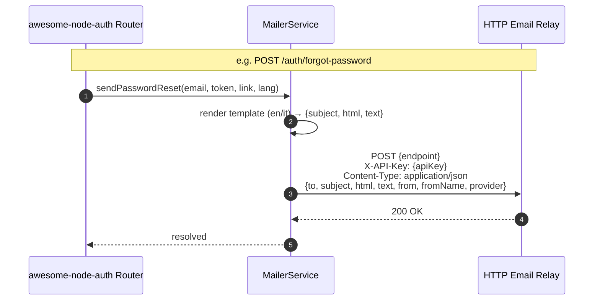

# Built-in HTTP Mailer

node-auth ships a **built-in HTTP mailer transport** (`MailerService`) that sends transactional emails by posting JSON payloads to any HTTP email relay — Mailgun, SendGrid, Brevo, Postmark, or a custom gateway.

No SMTP setup needed. Point it at your relay's endpoint, set an API key, and every auth email (password reset, magic link, welcome, email verification, email-changed notification) is sent automatically using built-in bilingual (🇬🇧 English / 🇮🇹 Italian) templates.

---

## How it works



---

## Configuration

```typescript
import { AuthConfigurator } from 'awesome-node-auth';

const auth = new AuthConfigurator({
  accessTokenSecret:  process.env.ACCESS_TOKEN_SECRET!,
  refreshTokenSecret: process.env.REFRESH_TOKEN_SECRET!,

  email: {
    // Single URL (classic, works as before)
    siteUrl: 'https://yourapp.com',

    // — OR — array of allowed front-end origins (dynamic mode).
    // For email links the FIRST entry is used as the base URL.
    // For OAuth redirects the URL is resolved dynamically from the request
    // Origin/Referer header (see CORS & Dynamic siteUrl guide).
    // siteUrl: ['https://app.example.com', 'https://admin.example.com'],

    mailer: {
      endpoint:    process.env.MAILER_ENDPOINT!,   // e.g. https://api.brevo.com/v3/smtp/email
      apiKey:      process.env.MAILER_API_KEY!,
      from:        'no-reply@yourapp.com',
      fromName:    'Your App',             // optional sender display name
      provider:    'brevo',                // optional — forwarded to the relay as-is
      defaultLang: 'en',                   // 'en' (default) | 'it'
    },
  },
}, userStore);
```

### MailerConfig reference

| Field | Type | Required | Description |
|-------|------|:--------:|-------------|
| `endpoint` | `string` | ✅ | Full URL of the HTTP relay (`POST` target) |
| `apiKey` | `string` | ✅ | Sent as `X-API-Key` header |
| `from` | `string` | ✅ | Sender email address |
| `fromName` | `string` | ❌ | Sender display name |
| `provider` | `string` | ❌ | Forwarded to relay as `provider` field |
| `defaultLang` | `'en' \| 'it'` | ❌ | Default template language (default: `'en'`) |

---

## Request body sent to the relay

```json
{
  "to":       "user@example.com",
  "subject":  "Reset your password",
  "html":     "<p>Click <a href=\"…\">here</a> to reset…</p>",
  "text":     "Click here to reset: https://…",
  "from":     "no-reply@yourapp.com",
  "fromName": "Your App",
  "provider": "brevo"
}
```

The relay receives a standard `POST` with `Content-Type: application/json` and `X-API-Key` header. Adapt to your provider's format in the relay if needed.

---

## Per-request language override

Users can request a specific email language by including `emailLang` in the request body:

```bash
curl -X POST /auth/forgot-password \
  -H 'Content-Type: application/json' \
  -d '{"email":"user@example.com","emailLang":"it"}'
```

Supported values: `'en'`, `'it'`.

---

## Built-in email templates

| Trigger | Method | Template (en) | Template (it) |
|---------|--------|---------------|---------------|
| `POST /auth/forgot-password` | `sendPasswordReset` | "Reset your password" | "Reimposta la tua password" |
| `POST /auth/magic-link/send` | `sendMagicLink` | "Your magic sign-in link" | "Il tuo link di accesso" |
| `POST /auth/register` | `sendWelcome` | "Welcome! Your account has been created" | "Benvenuto! Il tuo account è stato creato" |
| `POST /auth/send-verification-email` | `sendVerificationEmail` | "Verify your email address" | "Verifica il tuo indirizzo email" |
| `POST /auth/change-email/confirm` | `sendEmailChanged` | "Your email address has been updated" | "Il tuo indirizzo email è stato aggiornato" |

---

## Custom callback overrides

If you prefer to send emails yourself (e.g. with a custom template engine), use the callback overrides in `AuthConfig.email`. Callbacks always take priority over the `mailer` transport:

```typescript
const auth = new AuthConfigurator({
  email: {
    siteUrl: 'https://yourapp.com',

    // Override: custom password-reset email
    sendPasswordReset: async (to, token, link, lang) => {
      await myMailer.send({
        to,
        subject: 'Reset your password',
        html: myTemplateEngine.render('password-reset', { link, lang }),
      });
    },

    // Override: custom magic-link email
    sendMagicLink: async (to, token, link, lang) => {
      await myMailer.send({ to, subject: 'Your login link', html: `<a href="${link}">Sign in</a>` });
    },

    // Override: welcome email (e.g. after admin creates user via admin panel)
    sendWelcome: async (to, data, lang) => {
      await myMailer.send({ to, subject: 'Welcome', html: myTemplateEngine.render('welcome', data) });
    },

    // Override: email verification
    sendVerificationEmail: async (to, token, link, lang) => {
      await myMailer.send({ to, subject: 'Verify your email', html: `<a href="${link}">Verify</a>` });
    },

    // Override: email-changed notification
    sendEmailChanged: async (to, newEmail, lang) => {
      await myMailer.send({ to, subject: 'Email updated', html: `Your email is now ${newEmail}` });
    },
  },
}, userStore);
```

---

## Using MailerService standalone

The `MailerService` class is exported and can be used directly in your own services:

```typescript
import { MailerService } from 'awesome-node-auth';

const mailer = new MailerService({
  endpoint:    'https://api.brevo.com/v3/smtp/email',
  apiKey:      process.env.MAILER_API_KEY!,
  from:        'no-reply@yourapp.com',
  defaultLang: 'it',
});

// Send individual emails
await mailer.sendPasswordReset('user@example.com', token, 'https://app.com/reset?token=…');
await mailer.sendMagicLink('user@example.com', token, 'https://app.com/verify?token=…');
await mailer.sendWelcome('user@example.com', { loginUrl: 'https://app.com/login' });
await mailer.sendVerificationEmail('user@example.com', token, 'https://app.com/verify-email?token=…');
await mailer.sendEmailChanged('old@example.com', 'new@example.com');
```


---

## Dynamic `siteUrl` for email links

The `siteUrl` field accepts either a single string or an **array of strings**.
When you have multiple front-end origins (e.g. a public app and an admin panel)
pass an array — the **first entry** is used as the base URL for all email links.

```typescript
email: {
  // First entry is used for all email links (magic link, password reset, etc.)
  siteUrl: ["https://app.example.com", "https://admin.example.com"],
  mailer: { /* … */ },
}
```

For OAuth post-login redirects the URL is resolved **dynamically** from the
`Origin` / `Referer` request header and validated against the same array.
See [CORS & Dynamic siteUrl](/docs/advanced/cors) for the complete guide.

---

## Dynamic templates with `ITemplateStore`

Instead of using the hardcoded bilingual templates, you can override any or all of them at runtime by passing an `ITemplateStore` to `AuthConfigurator`.

When a `templateStore` is provided and a template exists in the store for the requested `templateId`, it is used in place of the built-in fallback. If no custom template is found, the built-in template is used transparently.

### Setup

```typescript
import { AuthConfigurator, MemoryTemplateStore } from 'awesome-node-auth';
import type { ITemplateStore } from 'awesome-node-auth';

// Use the built-in in-memory store (good for development / testing)
const templateStore: ITemplateStore = new MemoryTemplateStore();

const auth = new AuthConfigurator(
  {
    accessTokenSecret:  process.env.ACCESS_TOKEN_SECRET!,
    refreshTokenSecret: process.env.REFRESH_TOKEN_SECRET!,
    email: {
      siteUrl: 'https://yourapp.com',
      mailer: { endpoint: process.env.MAILER_ENDPOINT!, apiKey: process.env.MAILER_API_KEY!, from: 'noreply@yourapp.com' },
    },
    templateStore,    // ← inject here
  },
  userStore,
);

// Pre-populate a template at startup (or load from DB in production)
await templateStore.updateMailTemplate('magic-link', {
  baseHtml: `<p>{{T.greeting}}</p><p><a href="{{URL}}">{{T.cta}}</a></p>`,
  baseText: `{{T.greeting}}\n{{T.cta}}: {{URL}}`,
  translations: {
    en: { subject: 'Your magic sign-in link', greeting: 'Hello!', cta: 'Click here to sign in' },
    it: { subject: 'Il tuo link di accesso', greeting: 'Ciao!', cta: 'Clicca qui per accedere' },
  },
});
```

Pass the same `templateStore` instance to `createAdminRouter` to manage templates through the Admin UI:

```typescript
app.use('/admin', createAdminRouter(userStore, {
  accessPolicy: 'first-user',
  jwtSecret: process.env.ACCESS_TOKEN_SECRET!,
  templateStore,   // ← enables the 📧 Email & UI tab
}));
```

---

### Template interpolation syntax

Templates support two interpolation families:

| Syntax | Resolves to | Example |
|--------|-------------|---------|
| `{{T.key}}` | Translation string for the current language | `{{T.subject}}` → `"Reset your password"` |
| `{{KEY}}` | Data variable injected by the sending method | `{{URL}}` → `"https://app.com/reset?token=…"` |

**Available data variables per template ID:**

| Template ID | Data variables |
|-------------|----------------|
| `password-reset` | `{{URL}}` (reset link) |
| `magic-link` | `{{URL}}` (magic link) |
| `welcome` | `{{loginUrl}}` (login page URL) |
| `verify-email` | `{{URL}}` (verification link) |
| `email-changed` | `{{newEmail}}` (new email address) |

Missing variables or translation keys are rendered as `[key]` so you can spot gaps quickly during development.

---

### Implementing a production `ITemplateStore`

For production, implement `ITemplateStore` against your database (the interface is the same regardless of DB):

```typescript
import type { ITemplateStore, MailTemplate, UiTranslation } from 'awesome-node-auth';

export class MongoTemplateStore implements ITemplateStore {
  constructor(private readonly db: Db) {}

  async getMailTemplate(id: string): Promise<MailTemplate | null> {
    return this.db.collection<MailTemplate>('mail_templates').findOne({ id }) ?? null;
  }
  async listMailTemplates(): Promise<MailTemplate[]> {
    return this.db.collection<MailTemplate>('mail_templates').find().toArray();
  }
  async updateMailTemplate(id: string, tpl: Partial<MailTemplate>): Promise<void> {
    await this.db.collection('mail_templates').updateOne(
      { id },
      { $set: { ...tpl, id } },
      { upsert: true },
    );
  }
  async getUiTranslations(page: string): Promise<UiTranslation | null> {
    return this.db.collection<UiTranslation>('ui_translations').findOne({ page }) ?? null;
  }
  async listUiTranslations(): Promise<UiTranslation[]> {
    return this.db.collection<UiTranslation>('ui_translations').find().toArray();
  }
  async updateUiTranslations(page: string, translations: Record<string, Record<string, string>>): Promise<void> {
    await this.db.collection('ui_translations').updateOne(
      { page },
      { $set: { page, translations } },
      { upsert: true },
    );
  }
}
```

> See [ITemplateStore API Reference](/docs/api-reference/template-store) for the complete interface definition.
