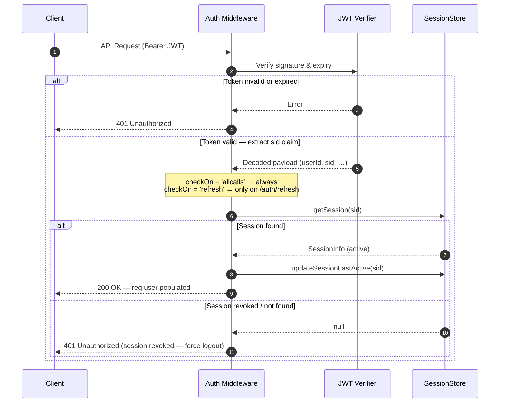

# Session Management

By default, **awesome-node-auth** uses stateless JWTs. While this is highly scalable, it means that revoking a user's session from the environment does not take effect until the current Access Token expires.

To enable real-time session control and multi-device management, you can configure an `ISessionStore`.

---

## 1. Enabling Stateful Sessions

To enable session tracking, you must provide an implementation of `ISessionStore` when creating the auth router:

```ts
const auth = new AuthConfigurator(config, userStore);

app.use(auth.router({
  sessionStore: mySessionStore // Your ISessionStore implementation
}));
```

## 2. Validation Modes

You can control how strictly the library verifies sessions via the `session` configuration block in your `AuthConfig`:

```ts
const config: AuthConfig = {
  // ...
  session: {
    /**
     * 'refresh': Check session validity only when issuing a new Access Token. (Default)
     * 'allcalls': Check session validity on every single API request.
     * 'none': Track sessions in the store but do not perform any validity checks.
     */
    checkOn: 'refresh'
  }
};
```

### `checkOn: 'refresh'` (Hybrid Mode)
This is the **recommended** setting for most applications.
- **Performance**: High. 99% of requests are stateless and fast.
- **Security**: Good. A revoked session will be blocked at the next refresh.
- **Behavior**: When a session is deleted from the store, the user can continue using their current token until it expires, but they will be logged out upon the next refresh attempt.

### `checkOn: 'allcalls'` (Full Stateful)
Use this for high-security environments where instant revocation is required.
- **Performance**: Lower. Every request requires a call to the `sessionStore`.
- **Security**: Maximum. A revoked session is killed instantly for all subsequent API calls.
- **Requirement**: **Highly recommended to use a low-latency store (Redis or In-Memory)** for this mode to avoid API performance degradation.

### `checkOn: 'none'` (Tracking Only)
Use this if you want visibility in the Admin UI without any performance overhead or enforcement.
- **Performance**: Same as stateless. No database lookups are performed during authentication.
- **Security**: Stateless. Revoking a session in the Admin UI has no effect until the tokens naturally expire.
- **Behavior**: Sessions are recorded in the `ISessionStore` on login, and `lastActiveAt` is updated in the middleware, allowing you to audit active users without blocking them.

### How session validation works — sequence diagram

The diagram below illustrates what happens on every API request when a `sessionStore` is configured. The exact behaviour depends on the `checkOn` setting: with `'allcalls'` the store is consulted on every request; with `'refresh'` only when a new Access Token is issued.



> **Key insight:** With `checkOn: 'refresh'` the `SessionStore` lookup only runs during token rotation (typically every 15 minutes), making the hot path completely stateless and Redis-free. With `checkOn: 'allcalls'` every request touches the store — use a low-latency backend (Redis or in-process `Map`) to keep overhead under 1 ms.

---

## 3. High Performance Patterns

Because `awesome-node-auth` uses interfaces for storage, you can mix-and-match technologies to optimize for speed and reliability:

| Storage Layer | Recommended Backend | Rationale |
| :--- | :--- | :--- |
| **Users & Accounts** | MongoDB / MySQL / Postgres | Persistence and data integrity for credentials. |
| **Sessions** | **Redis** / **In-Memory** | High-speed read/write for session lookups. |

### Example: In-Memory Sessions
If you have a single server and want maximum speed with zero database overhead for session checks, implement `ISessionStore` using a `Map`:

```typescript
import { ISessionStore, SessionInfo } from 'awesome-node-auth';
import crypto from 'node:crypto';

class InMemorySessionStore implements ISessionStore {
  private sessions = new Map<string, SessionInfo>();

  async createSession(info: Omit<SessionInfo, 'sessionHandle'>): Promise<SessionInfo> {
    const sessionHandle = crypto.randomUUID();
    const session = { sessionHandle, ...info };
    this.sessions.set(sessionHandle, session);
    return session;
  }
  async getSession(handle: string) { return this.sessions.get(handle) ?? null; }
  async getSessionsForUser(userId: string) { return [...this.sessions.values()].filter(s => s.userId === userId); }
  async updateSessionLastActive(handle: string) { const s = this.sessions.get(handle); if (s) s.lastActiveAt = new Date(); }
  async revokeSession(handle: string) { this.sessions.delete(handle); }
  async revokeAllSessionsForUser(userId: string) { for (const [h, s] of this.sessions) if (s.userId === userId) this.sessions.delete(h); }
}

const sessionStore = new InMemorySessionStore();

app.use(auth.router({ sessionStore }));
app.use('/api', auth.middleware({ sessionStore }), apiRouter);
```

---

## 4. User-Facing Session Endpoints

When a `sessionStore` is provided the auth router automatically mounts two endpoints that let **logged-in users** inspect and revoke their own devices — no admin access required.

### `GET /auth/sessions` — list own sessions

Returns the list of active sessions for the currently authenticated user (scoped to the `userId` in their JWT).

```http
GET /auth/sessions
Authorization: Bearer <access_token>   (or cookie)
```

**Response `200 OK`:**

```json
[
  {
    "sessionHandle": "sess_abc123",
    "userAgent": "Mozilla/5.0 (Macintosh; Intel Mac OS X…) Safari/537.36",
    "ipAddress": "203.0.113.42",
    "createdAt": "2026-03-18T10:00:00.000Z",
    "lastActiveAt": "2026-03-18T14:30:00.000Z"
  }
]
```

### `DELETE /auth/sessions/:handle` — revoke a session

Revokes one specific session by its handle. The requesting user can only revoke their own sessions; attempts to revoke another user's handle are rejected with `403`.

```http
DELETE /auth/sessions/sess_abc123
Authorization: Bearer <access_token>   (or cookie)
```

**Response `204 No Content`** on success.

**Error responses:**

| Status | Meaning |
|--------|---------|
| `401` | Not authenticated |
| `403` | Handle belongs to a different user |
| `404` | Session handle not found |

### Revoking your own current session

Calling `DELETE /auth/sessions/<currentHandle>` is equivalent to a targeted logout. The JWT remains valid until it expires — call `POST /auth/logout` in addition to also clear the cookie/refresh token.

### `POST /auth/sessions/cleanup` (cron helper)

Deletes expired sessions from the store. Wire it up to a periodic job:

```typescript
// Node-cron example — run every day at 03:00
import cron from 'node-cron';
cron.schedule('0 3 * * *', async () => {
  await fetch('http://localhost:3000/auth/sessions/cleanup', { method: 'POST' });
});
```

This endpoint is only mounted when `sessionStore` is provided **and** `ISessionStore.deleteExpiredSessions` is implemented.

---

## 5. Admin Panel Integration

When a `sessionStore` is provided, the **Admin Dashboard** automatically unlocks the **Sessions** view. 

Administrators can audit active sessions (User Agent, IP, Last Activity) and **Revoke** any session instantly. If `checkOn: 'allcalls'` is enabled, the user is disconnected immediately. If `checkOn: 'refresh'` is used, they are disconnected at their next token rotation.

---

## 6. Advanced Strategies: Hybrid Caching (L1/L2/L3)

For high-traffic applications, a single database can become a bottleneck when `checkOn: 'allcalls'` is active — every authenticated request translates to a store lookup. A layered caching strategy solves this with no security trade-offs.

| Layer | Technology | Latency | Scope |
| :--- | :--- | :--- | :--- |
| **L1** | In-Process `Map` (short TTL) | < 0.1 ms | Single instance |
| **L2** | Redis | < 1 ms | All instances |
| **L3** | Database (Postgres/MySQL/Mongo) | 1–20 ms | Persistent store |

### Pattern: Write-Through Redis + Database (L2 + L3)

This strategy gives you **persistence** (database) and **speed** (Redis). Use it as a drop-in `ISessionStore` when deploying with `checkOn: 'allcalls'` and multiple server instances.

```typescript
import type { ISessionStore, SessionInfo } from 'awesome-node-auth';
import type { Redis } from 'ioredis';
import type { Knex } from 'knex';

const SESSION_TTL_SECONDS = 60 * 60 * 24 * 7; // 7 days — match refreshTokenExpiresIn

class HybridSessionStore implements ISessionStore {
  constructor(private redis: Redis, private db: Knex) {}

  async getSession(handle: string): Promise<SessionInfo | null> {
    // 1. L2: fast Redis read
    const cached = await this.redis.get(`sess:${handle}`);
    if (cached) return JSON.parse(cached) as SessionInfo;

    // 2. L3: fallback to database
    const row = await this.db('sessions').where({ session_handle: handle }).first();
    if (!row) return null;

    // Re-warm the cache for subsequent calls
    await this.redis.setex(`sess:${handle}`, SESSION_TTL_SECONDS, JSON.stringify(row));
    return row as SessionInfo;
  }

  async createSession(info: Omit<SessionInfo, 'sessionHandle'>): Promise<SessionInfo> {
    const sessionHandle = crypto.randomUUID();
    const session: SessionInfo = { sessionHandle, ...info };
    // Write-through: persist to both layers atomically
    await this.db('sessions').insert({ session_handle: sessionHandle, ...info });
    await this.redis.setex(`sess:${sessionHandle}`, SESSION_TTL_SECONDS, JSON.stringify(session));
    return session;
  }

  async revokeSession(handle: string): Promise<void> {
    // Remove from both layers simultaneously
    await Promise.all([
      this.redis.del(`sess:${handle}`),
      this.db('sessions').where({ session_handle: handle }).delete(),
    ]);
  }

  async revokeAllSessionsForUser(userId: string): Promise<void> {
    const rows = await this.db('sessions').where({ user_id: userId }).select('session_handle');
    await Promise.all([
      ...rows.map((r: { session_handle: string }) => this.redis.del(`sess:${r.session_handle}`)),
      this.db('sessions').where({ user_id: userId }).delete(),
    ]);
  }

  async getSessionsForUser(userId: string): Promise<SessionInfo[]> {
    return this.db('sessions').where({ user_id: userId }) as Promise<SessionInfo[]>;
  }

  async updateSessionLastActive(handle: string): Promise<void> {
    const now = new Date();
    await Promise.all([
      this.db('sessions').where({ session_handle: handle }).update({ last_active_at: now }),
      this.redis.setex(`sess:${handle}:active`, 30, now.toISOString()), // lightweight Redis key
    ]);
  }
}
```

### Pattern: L1 In-Process Cache (ultra-low latency)

:::tip Use this with `checkOn: 'allcalls'`
If a single Node.js process handles all requests (or if you can tolerate up to 5 seconds of stale data for revocation), add an in-process **L1 cache** on top of the L2/L3 store to avoid any network round-trip for the vast majority of reads.
:::

```typescript
class L1CachedSessionStore implements ISessionStore {
  private l1 = new Map<string, { session: SessionInfo; expiresAt: number }>();
  private readonly L1_TTL_MS = 5_000; // 5-second TTL: balances speed vs revocation latency

  constructor(private inner: ISessionStore) {}

  async getSession(handle: string): Promise<SessionInfo | null> {
    const hit = this.l1.get(handle);
    if (hit && hit.expiresAt > Date.now()) return hit.session;
    const session = await this.inner.getSession(handle);
    if (session) this.l1.set(handle, { session, expiresAt: Date.now() + this.L1_TTL_MS });
    else this.l1.delete(handle);
    return session;
  }

  async revokeSession(handle: string): Promise<void> {
    this.l1.delete(handle); // Invalidate L1 immediately
    await this.inner.revokeSession(handle);
  }

  // Delegate all other methods to the inner store
  createSession(info: Omit<SessionInfo, 'sessionHandle'>) { return this.inner.createSession(info); }
  getSessionsForUser(userId: string, tenantId?: string) { return this.inner.getSessionsForUser(userId, tenantId); }
  updateSessionLastActive(handle: string) { return this.inner.updateSessionLastActive(handle); }
  revokeAllSessionsForUser(userId: string, tenantId?: string) { return this.inner.revokeAllSessionsForUser(userId, tenantId); }
  getAllSessions?(limit: number, offset: number) { return this.inner.getAllSessions!(limit, offset); }
  deleteExpiredSessions?() { return this.inner.deleteExpiredSessions!(); }
}

// Usage: wrap any store with the L1 cache decorator
const sessionStore = new L1CachedSessionStore(new HybridSessionStore(redis, db));

app.use(auth.router({ sessionStore }));
app.use('/api', auth.middleware({ sessionStore }), apiRouter);
```

## Related

- [Bearer token mode](/docs/advanced/bearer-token) — sessions for native and mobile clients
- [CSRF protection](/docs/advanced/csrf) — protecting cookie-based sessions
- [Built-in admin panel](/docs/advanced/admin) — list and kill sessions from the dashboard
- [Email and password authentication](/docs/authentication/local) — where a session begins
