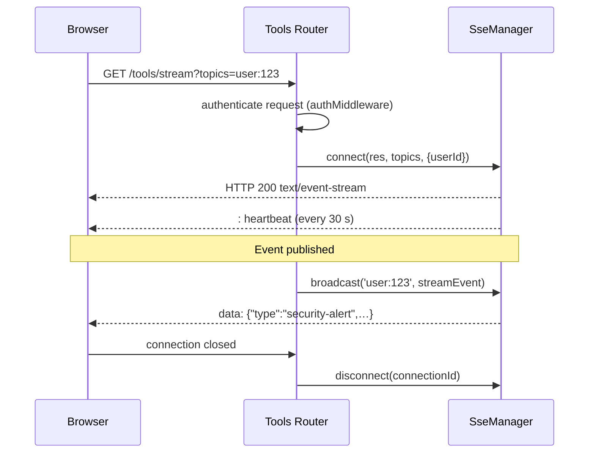

# Server-Sent Events (SSE)

`SseManager` maintains a registry of open HTTP streams and broadcasts `StreamEvent` objects to all clients subscribed to a matching topic. The server controls which topics a connection may receive — clients cannot self-declare channels.

---

## Connection lifecycle



---

## Setup

Enable SSE when creating `AuthTools`:

```typescript
const tools = new AuthTools(bus, { sse: true });
```

Mount the tools router (exposes `GET /tools/stream`):

```typescript
app.use('/tools', createToolsRouter(tools, {
  authMiddleware: auth.middleware(),
}));
```


---

## SseManager Configuration

When enabling SSE, you can pass options to customize its behavior:

```typescript
const tools = new AuthTools(bus, { 
  sse: {
    heartbeatIntervalMs: 30000,
    deduplicate: true, // Prevents multiple delivery of the same event ID
  }
});
```

### Options

| Option | Type | Default | Description |
|--------|------|---------|-------------|
| `heartbeatIntervalMs` | `number` | `30000` | Interval between keep-alive heartbeats. Set to `0` to disable. |
| `deduplicate` | `boolean` | `true` | When `true`, the manager prevents sending the same event ID twice to the same connection. Useful when a user is subscribed to multiple topics that receive the same broadcast. |
| `distributor` | `ISseDistributor` | `undefined` | Required for cross-instance synchronization in scaled environments. |

---

## 1. Setup in your Backend

First, ensure SSE is enabled when creating your `AuthTools` instance, and that the tools router is mounted with your auth middleware.

```typescript
import express from 'express';
import { AuthConfigurator, AuthTools, createToolsRouter } from 'awesome-node-auth';

const app = express();
app.use(express.json());

// Initialize core auth
const auth = new AuthConfigurator(config, userStore);
app.use('/auth', auth.router());

// Enable SSE in the tools configuration
const tools = new AuthTools(bus, { sse: true });

// Mount the tools router, protected by auth.middleware()
app.use('/tools', createToolsRouter(tools, {
  authMiddleware: auth.middleware(),
}));

// Now you can broadcast events from anywhere in your app:
app.post('/api/messages', auth.middleware(), (req, res) => {
  const { recipientId, text } = req.body;
  
  // 🎯 Broadcast a custom event to a specific user via topic
  tools.sseManager?.broadcast(`user:${recipientId}`, {
    type: 'new_message',
    data: { 
      from: req.user.id, 
      text 
    }
  });

  res.sendStatus(200);
});
```

---

## 2. Connecting from the Frontend

When a user logs in, they can connect to the `/tools/stream` endpoint.
Because the router is protected by `auth.middleware()`, the user will **only** receive events that match their own `user:{id}`, their `tenant:{id}`, or `global` topics.

### Vanilla JavaScript Example

```javascript
// The topics query param tells the server which channels you want to listen to.
// The server will verify you have permission to access them.
const currentUserId = '123';
const evtSource = new EventSource(`/tools/stream?topics=user:${currentUserId}`, { 
  withCredentials: true 
});

// Listen for a specific event type (matches the `type` field in broadcast)
evtSource.addEventListener('new_message', (event) => {
  const payload = JSON.parse(event.data);
  console.log(`New message from ${payload.rawData.from}: ${payload.rawData.text}`);
});

// The library automatically sends ping events every 30s to keep the connection alive
evtSource.addEventListener('ping', () => {
  console.debug('SSE connection is alive');
});

// Handle errors and reconnections
evtSource.onerror = (err) => {
  console.error("SSE Error:", err);
  // Browsers automatically try to reconnect EventSources, 
  // but you can call evtSource.close() to stop it.
};
```

### React Example

A practical way to consume SSE in a React application using a custom hook:

```tsx
import { useEffect, useState } from 'react';

export function useMessages(userId: string) {
  const [messages, setMessages] = useState([]);

  useEffect(() => {
    if (!userId) return;

    const evtSource = new EventSource(`http://api.myapp.com/tools/stream?topics=user:${userId}`, {
      withCredentials: true, // Crucial if you use cookie-based auth
    });

    evtSource.addEventListener('new_message', (event) => {
      const payload = JSON.parse(event.data);
      setMessages((prev) => [...prev, payload.rawData]);
    });

    return () => {
      evtSource.close(); // Cleanup when unmounting
    };
  }, [userId]);

  return messages;
}

// Usage in a component:
function ChatApp({ currentUser }) {
  const messages = useMessages(currentUser.id);
  
  return (
    <ul>
      {messages.map((msg, i) => <li key={i}>{msg.text}</li>)}
    </ul>
  );
}
```

---

## Proxy Configuration (Nginx / Traefik / Apache) ⚠️

If your Node.js application is running behind a reverse proxy, you must ensure the proxy doesn't buffer the `/tools/stream` endpoint. Otherwise, the proxy will hold onto the events and not send them to the client in real-time.

### Nginx

Nginx buffers HTTP responses by default. You must explicitly disable it for the SSE endpoint.

**Example Nginx config:**

```nginx
location /tools/stream {
    proxy_pass http://localhost:3000;
    
    # Required for SSE: disable buffering and caching
    proxy_http_version 1.1;
    proxy_set_header Connection '';
    proxy_buffering off;
    proxy_cache off;
    chunked_transfer_encoding off;
    
    # Keep idle connections open longer
    proxy_read_timeout 24h;
}
```

### Traefik

Traefik natively supports SSE (Server-Sent Events) out of the box and does **not** buffer responses by default. In most setups, **no explicit configuration is needed**.

However, keep these two things in mind:
1. Ensure you haven't globally applied a [`Buffering` middleware](https://doc.traefik.io/traefik/middlewares/http/buffering/) to the router serving `node-auth`.
2. If your SSE connections are dropping prematurely, check if you have an aggressive `readTimeout` set on your Traefik entrypoints or transport configurations.

---

## Topic hierarchy

The server enforces topic access — restrict which topics each user/connection may subscribe to via `authMiddleware`.

| Topic | Description |
|-------|-------------|
| `global` | All connected clients |
| `tenant:{tenantId}` | All clients in a specific tenant |
| `tenant:{tenantId}:role:{role}` | All clients in a tenant with a specific role |
| `tenant:{tenantId}:group:{groupId}` | All clients in a tenant group |
| `user:{userId}` | A specific user |
| `session:{sessionId}` | A specific session |
| `custom:{namespace}` | Any custom namespace |

---

## StreamEvent structure

```typescript
interface StreamEvent<T = unknown> {
  id: string;           // auto-generated UUID
  type: string;         // event type name
  timestamp: string;    // ISO 8601
  topic: string;        // channel this was published to
  data: T;              // the data passed to broadcast (renamed to `rawData` in wire format)
  userId?: string;
  tenantId?: string;
  metadata?: Record<string, unknown>;
}
```

> [!NOTE]
> When the event is serialized to the client over the wire, the `data` field is renamed to `rawData` in the JSON payload to avoid namespace collisions with the event metadata.

---

---

## `SseManager` API

When `sse: true` is passed to `AuthTools`, the manager is available at `tools.sseManager`:

```typescript
class SseManager {
  readonly heartbeatIntervalMs: number;
  readonly deduplicate: boolean;

  connect(
    res: Response,
    topics: string[],
    meta?: { userId?: string; tenantId?: string },
  ): string;  // returns connectionId

  disconnect(connectionId: string): void;

  broadcast<T = unknown>(
    topic: string,
    event: Omit<StreamEvent<T>, 'id' | 'timestamp' | 'topic'> & { id?: string; timestamp?: string },
  ): void;

  get connectionCount(): number;
}
```

## Related

- [Scaling SSE across instances with Redis](/docs/advanced/sse-scaling) — SSE beyond a single process
- [@sseNotify real-time decorator](/docs/advanced/sse-notify-decorator) — emit events without transport code
- [AuthTools: telemetry, SSE and webhooks](/docs/advanced/auth-tools) — the entry point that enables SSE
- [Outgoing and inbound webhooks](/docs/advanced/webhooks) — the server-to-server counterpart
