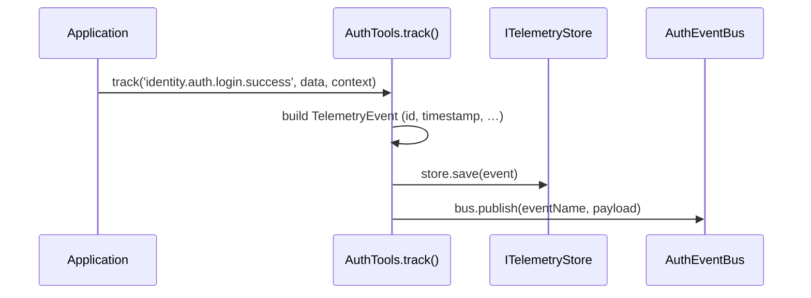

# Telemetry

node-auth's telemetry system persists every identity event to any store you provide. When `ITelemetryStore` is omitted, events still flow through `AuthEventBus` (and fire webhooks/SSE), they just aren't stored.

---

## Event persistence flow



---

## Setup

### 1. Implement `ITelemetryStore`

```typescript
import { ITelemetryStore, TelemetryEvent, TelemetryFilter } from 'awesome-node-auth';

export class MyTelemetryStore implements ITelemetryStore {
  async save(event: TelemetryEvent): Promise<void> {
    await db('telemetry').insert(event);
  }

  async query(filter: TelemetryFilter): Promise<TelemetryEvent[]> {
    let q = db('telemetry');
    if (filter.event)     q = q.where('event', filter.event);
    if (filter.userId)    q = q.where('userId', filter.userId);
    if (filter.tenantId)  q = q.where('tenantId', filter.tenantId);
    if (filter.from)      q = q.where('timestamp', '>=', filter.from.toISOString());
    if (filter.to)        q = q.where('timestamp', '<=', filter.to.toISOString());
    return q.limit(filter.limit ?? 100).offset(filter.offset ?? 0);
  }
}
```

### 2. Pass the store to `AuthTools`

```typescript
const tools = new AuthTools(bus, { telemetryStore: myTelemetryStore });
```

### 3. Track events

Events are tracked automatically when the auth router uses the same `bus`. You can also track custom events manually:

```typescript
await tools.track('identity.user.password.changed', { method: 'reset-link' }, {
  userId: 'user-123',
  tenantId: 'tenant-abc',
  ip: req.ip,
});
```

---

## Query endpoint

When `ITelemetryStore.query` is implemented and `telemetryStore` is passed to `createToolsRouter`, the `GET /tools/telemetry` endpoint is automatically enabled:

```
GET /tools/telemetry?event=identity.auth.login.success&userId=user-123&limit=50
```

---

## `TelemetryEvent` structure

```typescript
interface TelemetryEvent {
  id: string;           // auto-generated UUID
  event: string;        // e.g. 'identity.auth.login.success'
  timestamp: string;    // ISO 8601
  data?: unknown;
  userId?: string;
  tenantId?: string;
  sessionId?: string;
  correlationId?: string;
  ip?: string;
  userAgent?: string;
}
```

---

## `TelemetryFilter` options

```typescript
interface TelemetryFilter {
  event?: string;
  userId?: string;
  tenantId?: string;
  sessionId?: string;
  from?: Date;
  to?: Date;
  limit?: number;    // default: 100
  offset?: number;   // default: 0
}
```

---

## `ITelemetryStore` interface

| Method | Required | Description |
|--------|----------|-------------|
| `save(event)` | ✓ | Persist a telemetry event |
| `query(filter)` | optional | Enable `GET /tools/telemetry` query endpoint |

## Related

- [AuthEventBus event names](/docs/advanced/auth-event-bus) — the events telemetry persists
- [AuthTools: telemetry, SSE and webhooks](/docs/advanced/auth-tools) — enabling the telemetry store
- [Outgoing and inbound webhooks](/docs/advanced/webhooks) — ship the same events elsewhere
- [Built-in admin panel](/docs/advanced/admin) — browse the audit trail
