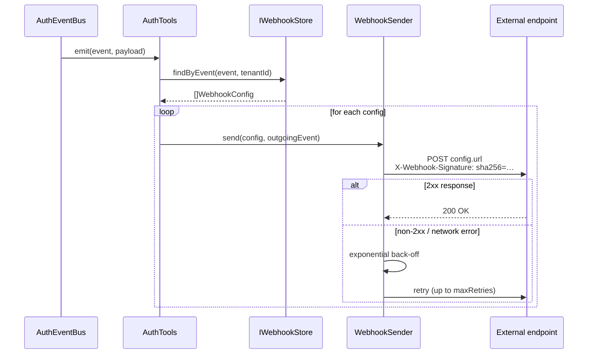
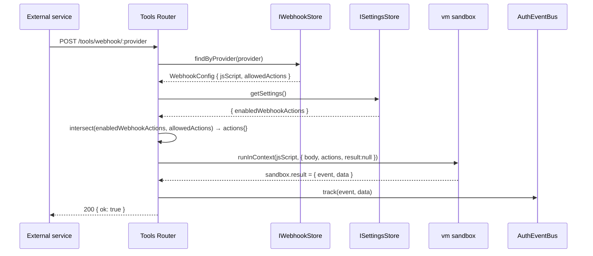

# Webhooks

node-auth supports two complementary webhook directions:

| Direction | Purpose | Config |
|-----------|---------|--------|
| **Outgoing** | Library fires → external service | `IWebhookStore` + `WebhookSender` |
| **Inbound (dynamic)** | External service fires → library executes script | `IWebhookStore.findByProvider` + vm sandbox |

Both are managed from the **Admin Panel → Webhooks tab**.

---

## Outgoing webhooks

node-auth can forward any `AuthEventBus` event to external HTTP endpoints as a signed JSON POST. Delivery is performed by `WebhookSender` with optional HMAC-SHA256 signing and configurable exponential back-off retry.

---

## Delivery flow



---

## Setup

### 1. Implement `IWebhookStore`

```typescript
import { IWebhookStore, WebhookConfig } from 'awesome-node-auth';

export class MyWebhookStore implements IWebhookStore {
  async findByEvent(event: string, tenantId?: string): Promise<WebhookConfig[]> {
    return db('webhooks')
      .where('isActive', true)
      .where((q) =>
        q.where('tenantId', tenantId ?? null).orWhereNull('tenantId'),
      )
      .where((q) =>
        q.whereJsonContains('events', event).orWhereJsonContains('events', '*'),
      );
  }
}
```

### 2. Pass the store to `AuthTools`

```typescript
const tools = new AuthTools(bus, { webhookStore: myWebhookStore });
```

Webhooks are now dispatched automatically whenever `tools.track()` is called.

---

## Webhook payload

```json
{
  "event": "identity.auth.login.success",
  "version": "1",
  "timestamp": "2024-11-15T10:23:45.678Z",
  "data": { "method": "oauth", "provider": "google" },
  "metadata": {
    "userId": "user-123",
    "tenantId": "tenant-abc",
    "correlationId": "req-xyz"
  }
}
```

---

## Verifying signatures

Every outgoing request includes an `X-Webhook-Signature: sha256=<hex>` header. Verify it on the receiving server using the shared secret:

```typescript
import { WebhookSender } from 'awesome-node-auth';

const sender = new WebhookSender();

app.post('/webhooks/awesome-node-auth', express.raw({ type: 'application/json' }), (req, res) => {
  const signature = req.headers['x-webhook-signature'] as string;
  const isValid = sender.verify(req.body.toString(), process.env.WEBHOOK_SECRET!, signature);
  if (!isValid) return res.status(401).json({ error: 'Invalid signature' });

  const event = JSON.parse(req.body.toString());
  console.log('Received event:', event.event);
  res.sendStatus(200);
});
```

---

## `WebhookConfig` fields

| Field | Type | Required | Description |
|-------|------|----------|-------------|
| `id` | `string` | ✓ | Unique registration ID |
| `url` | `string` | ✓ | Endpoint URL |
| `events` | `string[]` | ✓ | Event names (or `['*']` for all) |
| `secret` | `string` | — | HMAC signing secret |
| `isActive` | `boolean` | — | Default `true` |
| `tenantId` | `string` | — | Scope to a tenant; omit for global |
| `maxRetries` | `number` | — | Default `3` |
| `retryDelayMs` | `number` | — | Initial delay in ms; default `1000` |

---

## Request headers

| Header | Description |
|--------|-------------|
| `X-Webhook-Event` | Event name |
| `X-Webhook-Delivery` | UUID per delivery attempt |
| `X-Webhook-Timestamp` | ISO 8601 timestamp |
| `X-Webhook-Signature` | `sha256=<hmac-hex>` (when secret is set) |

---

## Dynamic inbound execution {#dynamic-inbound-execution}

Beyond the static `onWebhook` callback, the tools router supports a **governance-driven execution model** where:

1. Developers expose service methods as injectable actions with `@webhookAction`.
2. Administrators globally enable/disable actions in the **Control → Webhook Actions** panel.
3. Each inbound webhook config in the **Webhooks** tab is assigned a `jsScript` + an `allowedActions` subset.
4. When `POST /tools/webhook/:provider` fires, the script runs in a Node.js `vm` sandbox with only the intersection of globally-enabled **and** per-webhook-allowed actions.

### Execution flow



### 1. Register actions with `@webhookAction`

```typescript
import { webhookAction, ActionRegistry } from 'awesome-node-auth';

class SubscriptionService {
  @webhookAction({
    id:          'subscription.cancel',
    label:       'Cancel subscription',
    category:    'Billing',
    description: 'Marks a subscription as cancelled.',
  })
  async cancel(subscriptionId: string): Promise<void> {
    await db.subscriptions.update({ id: subscriptionId }, { status: 'cancelled' });
  }

  @webhookAction({
    id:          'subscription.notifyUser',
    label:       'Notify user',
    category:    'Billing',
    description: 'Sends cancellation email to the user.',
    dependsOn:   ['subscription.cancel'],   // only available when cancel is also enabled
  })
  async notifyUser(userId: string): Promise<void> {
    await mailer.send({ to: userId, subject: 'Subscription cancelled', template: 'sub-cancelled' });
  }
}

// Bind the instance so the vm sandbox can call it
const svc = new SubscriptionService();
ActionRegistry.register({ id: 'subscription.cancel',     label: 'Cancel subscription', category: 'Billing', description: '', fn: svc.cancel.bind(svc) });
ActionRegistry.register({ id: 'subscription.notifyUser', label: 'Notify user',          category: 'Billing', description: '', dependsOn: ['subscription.cancel'], fn: svc.notifyUser.bind(svc) });
```

### 2. Wire stores into the tools router

```typescript
app.use('/tools', createToolsRouter(tools, {
  webhookStore:  myWebhookStore,   // must implement findByProvider()
  settingsStore: mySettingsStore,  // reads enabledWebhookActions
}));
```

### 3. Create an inbound webhook config via the Admin UI

In the **Webhooks** tab click **+ Register webhook**, switch to **Inbound (dynamic)** and fill in:

| Field | Example | Description |
|-------|---------|-------------|
| Provider name | `stripe` | Matches `:provider` in `POST /tools/webhook/stripe` |
| Events | `*` | (optional) event filter |
| Allowed actions | ☑ Cancel subscription | Subset of globally-enabled actions |
| JavaScript | see below | Script body executed in the vm sandbox |

**Example script:**

```js
// Available globals: body (request payload), actions (filtered functions)
// Set result to emit an internal event, or leave null to silently ack.

if (body.type === 'customer.subscription.deleted') {
  const subId = body.data.object.id;
  const userId = body.data.object.metadata.userId;

  await actions['subscription.cancel'](subId);
  await actions['subscription.notifyUser'](userId);

  result = {
    event: 'identity.tenant.user.removed',
    data:  { subscriptionId: subId, userId },
  };
}
```

### 4. Governance rules

| Rule | Behaviour |
|------|-----------|
| Action not in `enabledWebhookActions` | Excluded from sandbox even if in `allowedActions` |
| Action's `dependsOn` not enabled | Excluded from sandbox |
| Script throws at runtime | Error logged, HTTP 200 returned (no crash) |
| Script exceeds 5 s timeout | Error logged, HTTP 200 returned |
| `result` not set / null | Webhook silently acknowledged, no event emitted |

### `WebhookConfig` new fields

| Field | Type | Description |
|-------|------|-------------|
| `provider` | `string` | Inbound provider name (matches `:provider` param) |
| `allowedActions` | `string[]` | Action IDs permitted for this webhook's sandbox |
| `jsScript` | `string` | JS body executed inside the vm sandbox |

### `IWebhookStore` new method

```typescript
/** Find the inbound webhook config for a given provider name. */
findByProvider?(provider: string): Promise<WebhookConfig | null>;
```

### `AuthSettings` new field

```typescript
/** Globally enabled action IDs (toggled in the Admin UI → Control tab). */
enabledWebhookActions?: string[];
```

### `ToolsRouterOptions` new options

```typescript
/** Provides findByProvider() for dynamic inbound webhook lookup. */
webhookStore?: IWebhookStore;

/** Reads enabledWebhookActions for the vm sandbox. */
settingsStore?: ISettingsStore;
```

## Related

- [AuthEventBus event names](/docs/advanced/auth-event-bus) — the events that trigger webhooks
- [AuthTools: telemetry, SSE and webhooks](/docs/advanced/auth-tools) — enabling webhook delivery
- [Server-Sent Events (SSE)](/docs/advanced/sse) — the browser-facing counterpart
- [Authentication telemetry and audit trail](/docs/advanced/telemetry) — auditing what was sent
