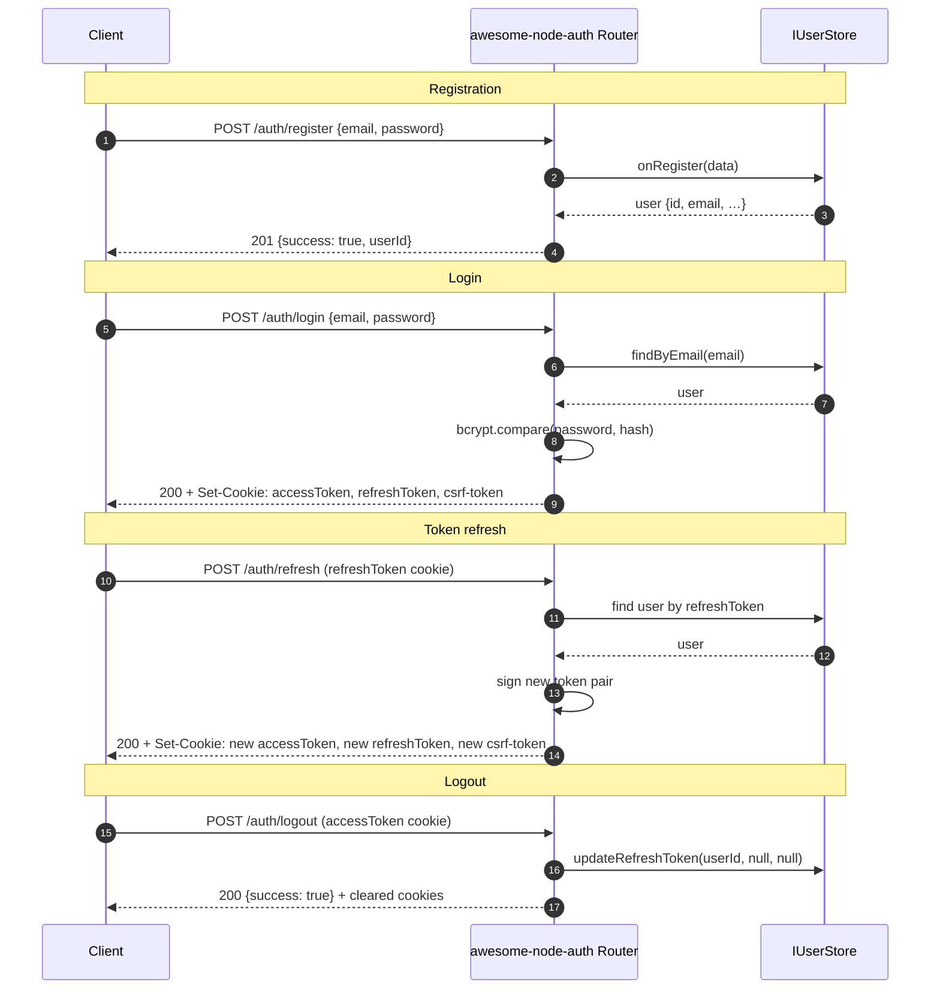
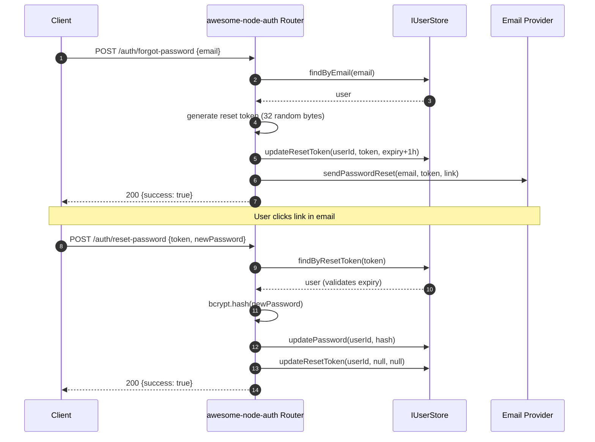

import Tabs from '@theme/Tabs';
import TabItem from '@theme/TabItem';

# Email / Password Recipe

The local strategy provides classic email and password authentication with bcrypt hashing and a full password reset flow.

:::caution Password strength
node-auth does not enforce password complexity by default. Validate password strength in your `onRegister` callback before creating the user.
:::

---

## Register → Login → Refresh → Logout flow



---

## Password Reset flow



---

## **Step 1**: Enable LocalStrategy

The local strategy is active by default — no extra configuration needed. Just create your `AuthConfigurator`:

```typescript
import { AuthConfigurator } from 'awesome-node-auth';

const auth = new AuthConfigurator(config, userStore);
```

---

## **Step 2**: Implement IUserStore

Ensure your `IUserStore` implements the methods required for local auth:

```typescript
export class MyUserStore implements IUserStore {
  async findByEmail(email: string) { /* … */ }
  async findById(id: string) { /* … */ }
  async create(data: Partial<BaseUser>) { /* … */ }
  async updateRefreshToken(userId: string, token: string | null, expiry: Date | null) { /* … */ }
  async updatePassword(userId: string, hashedPassword: string) { /* … */ }
  async updateResetToken(userId: string, token: string | null, expiry: Date | null) { /* … */ }
  async findByResetToken(token: string) { /* … */ }
}
```

---

## **Step 3**: Mount the router

<Tabs>
  <TabItem value="express" label="Express" default>

```typescript
app.use('/auth', auth.router({
  onRegister: async (data, config) => {
    // Validate, then persist
    return userStore.create(data);
  },
}));
```

  </TabItem>
  <TabItem value="nestjs" label="NestJS">

```typescript
// In AuthController constructor — see NestJS guide
this.router = auth.router({
  onRegister: async (data) => userStore.create(data),
});
```

  </TabItem>
  <TabItem value="nextjs" label="Next.js">

```typescript
// pages/api/auth/[...auth].ts
export default function handler(req, res) {
  const router = getAuth().router({
    onRegister: async (data) => userStore.create(data),
  });
  req.url = req.url!.replace(/^\/api\/auth/, '') || '/';
  router(req as any, res as any, () => res.status(404).end());
}
```

  </TabItem>
</Tabs>

---

## **Step 4**: Test the endpoints

```bash
# Register
curl -X POST http://localhost:3000/auth/register \
  -H 'Content-Type: application/json' \
  -d '{"email":"user@example.com","password":"secret123","firstName":"Jane"}'

# Login
curl -X POST http://localhost:3000/auth/login \
  -H 'Content-Type: application/json' \
  -d '{"email":"user@example.com","password":"secret123"}'
```

---

## Endpoint Reference

| Method | Path | Auth | Description |
|--------|------|:---:|-------------|
| `POST` | `/auth/login` | — | Login with email + password |
| `POST` | `/auth/register` | — | Register new user (requires `onRegister`) |
| `POST` | `/auth/logout` | ✅ | Invalidate refresh token + clear cookies |
| `POST` | `/auth/refresh` | — | Exchange refresh token for new access token |
| `GET`  | `/auth/me` | ✅ | Get current user profile |
| `POST` | `/auth/forgot-password` | — | Send password reset email |
| `POST` | `/auth/reset-password` | — | Reset password with token |
| `POST` | `/auth/change-password` | ✅ | Change password for authenticated user |

## Related

- [Passwordless magic link login](/docs/authentication/magic-link) — the same flow without a password
- [Email verification modes](/docs/advanced/email-verification) — decide how strictly unverified users are blocked
- [Session management and token revocation](/docs/advanced/sessions) — invalidate a login before the token expires
- [Database-agnostic auth with IUserStore](/docs/database) — where the password hash is actually stored
