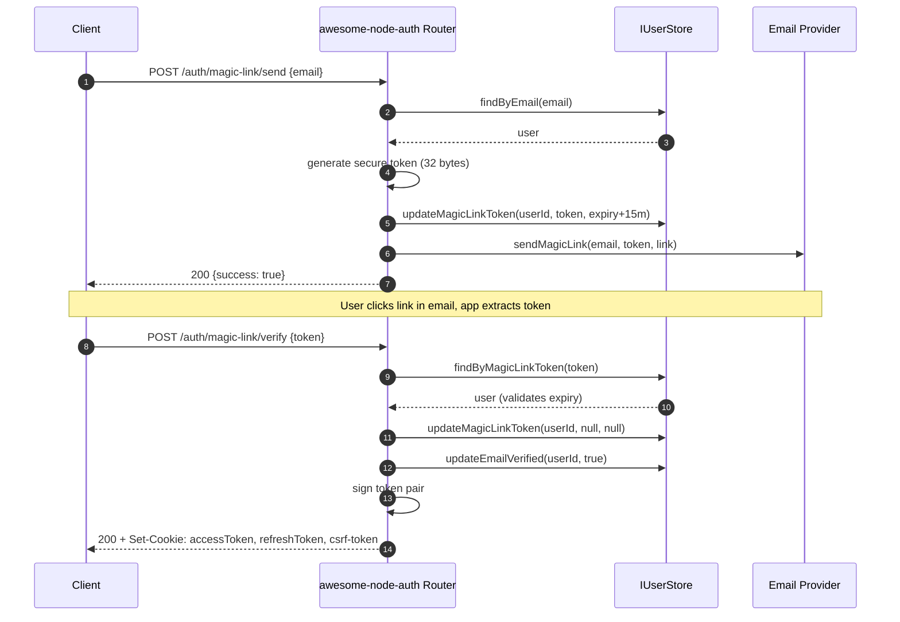

import Tabs from '@theme/Tabs';
import TabItem from '@theme/TabItem';

# Magic Link Recipe

Magic links provide passwordless authentication via email. No password required — users click a link to log in.

:::tip Email verification bonus
The first magic-link login automatically counts as email verification. No separate verification step needed.
:::

---

## Magic Link flow



:::info Bearer mode
For native/mobile clients, add `X-Auth-Strategy: bearer` to `/auth/magic-link/verify` to receive tokens in the response body instead of cookies.
:::

---

## Login mode and 2FA mode

Both endpoints take an optional `mode` in the request body:

| `mode` | `POST /auth/magic-link/send` body | `POST /auth/magic-link/verify` body | What the link does |
|--------|-----------------------------------|-------------------------------------|--------------------|
| `'login'` (default) | `{ email, emailLang? }` | `{ token }` | Passwordless login |
| `'2fa'` | `{ mode: '2fa', tempToken, emailLang? }` | `{ mode: '2fa', token, tempToken }` | Second factor after the password |

:::note Passwordless login and 2FA
In `mode: 'login'`, `POST /auth/magic-link/verify` issues a session directly and does not ask for the second factor, even for accounts with TOTP enabled.

The second-factor flow is `mode: '2fa'`, after the password: `POST /auth/login` answers `{ requiresTwoFactor: true, tempToken, available2faMethods }`, `POST /auth/magic-link/send` with `{ mode: '2fa', tempToken }` emails a link to that user, and `POST /auth/magic-link/verify` with `{ mode: '2fa', token, tempToken }` issues the session.
:::

---

## **Step 1**: Configure AuthConfig

Magic links are enabled by providing a `sendMagicLink` callback (or a `mailer` configuration) in your `AuthConfig`:

```typescript
const config: AuthConfig = {
  // ... secrets
  email: {
    // Option A: Use a custom callback
    sendMagicLink: async (email, token, link, lang) => {
      await mailer.send({
        to: email,
        subject: 'Your login link',
        html: `<a href="${link}">Click to log in</a>`,
      });
    },
    // Option B: Use the built-in HTTP mailer (see Mailer guide)
    // mailer: { endpoint: '...', apiKey: '...' }
  }
};
```

---

## **Step 2**: Mount the router

The magic-link endpoints are active as long as the email configuration is present. No additional strategy needs to be passed to the router:

<Tabs>
  <TabItem value="express" label="Express" default>

```typescript
app.use('/auth', auth.router());
```

  </TabItem>
  <TabItem value="nestjs" label="NestJS">

```typescript
this.router = auth.router();
```

  </TabItem>
</Tabs>

---

## **Step 3**: Implement IUserStore methods

Magic link requires these store methods:

```typescript
async updateMagicLinkToken(userId: string, token: string | null, expiry: Date | null): Promise<void>
async findByMagicLinkToken(token: string): Promise<BaseUser | null>
```

---

## **Step 4**: Test the flow

```bash
# Step 1: Request magic link
curl -X POST http://localhost:3000/auth/magic-link/send \
  -H 'Content-Type: application/json' \
  -d '{"email":"user@example.com"}'

# Step 2: Verify (token from email)
curl -X POST http://localhost:3000/auth/magic-link/verify \
  -H 'Content-Type: application/json' \
  -d '{"token":"<token-from-email>"}'
# Cookie mode: { "success": true } + HttpOnly cookies
# Bearer mode: add -H 'X-Auth-Strategy: bearer' → { "success": true, "accessToken": "…", "refreshToken": "…" }
```

---

## Endpoints

| Method | Path | Description |
|--------|------|-------------|
| `POST` | `/auth/magic-link/send` | Generate token + send magic-link email. Body: `{ email }` for login; `{ mode: '2fa', tempToken }` for the second factor |
| `POST` | `/auth/magic-link/verify` | Verify token → issue session tokens. Body: `{ token }` for login; `{ mode: '2fa', token, tempToken }` for the second factor |

## Related

- [Email and password authentication](/docs/authentication/local) — the classic alternative to magic links
- [Built-in HTTP mailer](/docs/advanced/mailer) — how the magic-link email is delivered
- [Email verification modes](/docs/advanced/email-verification) — why the first magic-link click verifies the address
- [TOTP two-factor authentication](/docs/authentication/totp) — the authenticator-app second factor after a password login
