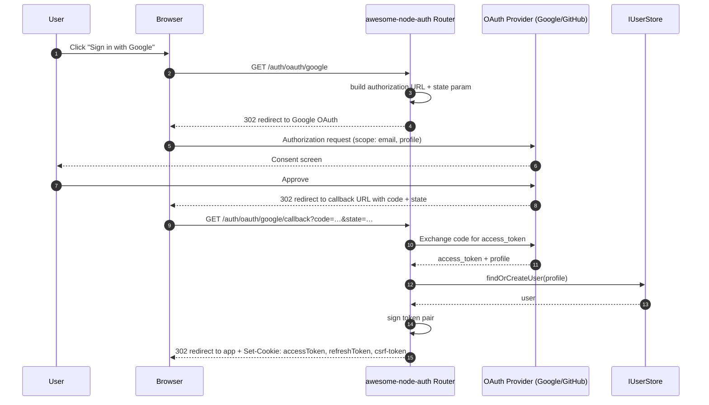

import Tabs from '@theme/Tabs';
import TabItem from '@theme/TabItem';

# OAuth / Social Recipe

node-auth supports Google, GitHub, and any custom OAuth 2.0 provider via `GenericOAuthStrategy`.

---

## OAuth flow



:::info Account conflicts
If the OAuth provider email matches an existing local account, awesome-node-auth returns a `409 Conflict`. Use `IPendingLinkStore` to resolve conflicts automatically. See [Account Linking](/docs/advanced/account-linking).
:::

---

## **Step 1**: Configure your OAuth app

Register your application in the provider's developer console and note the **Client ID** and **Client Secret**. Set the callback URL to:

```
https://yourapp.com/auth/oauth/<provider>/callback
```

---

## **Step 2**: Create a strategy

<Tabs>
  <TabItem value="google" label="Google" default>

```typescript
import { GoogleStrategy, AuthConfig } from '@awesome-lang-auth/node';

class MyGoogleStrategy extends GoogleStrategy {
  constructor(config: AuthConfig) {
    super(config);
  }

  async findOrCreateUser(profile: any) {
    // Always use providerAccountId + provider for lookup — never email alone
    // (prevents account-takeover via email spoofing)
    let user = await userStore.findByProviderAccount?.('google', profile.id);
    if (!user) {
      user = await userStore.create({
        email: profile.email,
        firstName: profile.name,
        providerAccountId: profile.id,
        loginProvider: 'google',
        isEmailVerified: true,
      });
    }
    return user;
  }
}

const googleStrategy = new MyGoogleStrategy(config);
```

  </TabItem>
  <TabItem value="github" label="GitHub">

```typescript
import { GithubStrategy, AuthConfig } from '@awesome-lang-auth/node';

class MyGithubStrategy extends GithubStrategy {
  constructor(config: AuthConfig) {
    super(config);
  }

  async findOrCreateUser(profile: any) {
    let user = await userStore.findByProviderAccount?.('github', profile.id);
    if (!user) {
      user = await userStore.create({
        email: profile.email,
        firstName: profile.name,
        providerAccountId: profile.id,
        loginProvider: 'github',
        isEmailVerified: true,
      });
    }
    return user;
  }
}

const githubStrategy = new MyGithubStrategy(config);
```

  </TabItem>
  <TabItem value="custom" label="Custom Provider">

```typescript
import { GenericOAuthStrategy } from '@awesome-lang-auth/node';

const discordStrategy = new GenericOAuthStrategy({
  name: 'discord',
  clientId: process.env.DISCORD_CLIENT_ID!,
  clientSecret: process.env.DISCORD_CLIENT_SECRET!,
  authorizationUrl: 'https://discord.com/api/oauth2/authorize',
  tokenUrl: 'https://discord.com/api/oauth2/token',
  userInfoUrl: 'https://discord.com/api/users/@me',
  callbackUrl: 'https://yourapp.com/auth/oauth/discord/callback',
  scope: ['identify', 'email'],
  mapProfile: (raw) => ({
    id: raw.id,
    email: raw.email,
    name: raw.username,
  }),
  findOrCreateUser: async (profile) => {
    return userStore.findOrCreate({ ...profile, loginProvider: 'discord' });
  },
});
```

  </TabItem>
</Tabs>

---

## **Step 3**: Mount the router

```typescript
app.use('/auth', auth.router({
  googleStrategy,
  githubStrategy,
  // or for custom providers:
  oauthStrategies: [discordStrategy],
}));
```

---

## **Step 4**: Implement `findByProviderAccount` (recommended)

Add this to your `IUserStore` to enable safe provider-based lookup (avoids email-based account takeover):

```typescript
async findByProviderAccount(provider: string, providerAccountId: string): Promise<BaseUser | null> {
  return db('users').where({ loginProvider: provider, providerAccountId }).first() ?? null;
}
```

---

## OAuth Endpoints

| Method | Path | Description |
|--------|------|-------------|
| `GET` | `/auth/oauth/google` | Redirect to Google OAuth |
| `GET` | `/auth/oauth/google/callback` | Google OAuth callback |
| `GET` | `/auth/oauth/github` | Redirect to GitHub OAuth |
| `GET` | `/auth/oauth/github/callback` | GitHub OAuth callback |
| `GET` | `/auth/oauth/:name` | Redirect to custom provider |
| `GET` | `/auth/oauth/:name/callback` | Custom provider callback |
