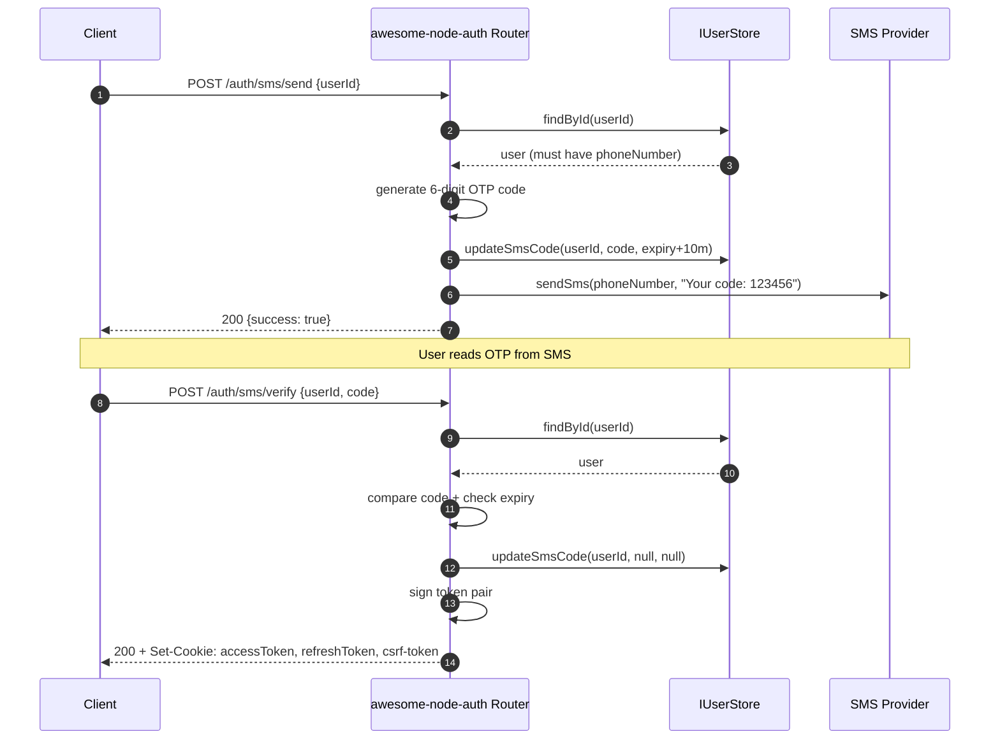

import Tabs from '@theme/Tabs';
import TabItem from '@theme/TabItem';

# SMS OTP Recipe

Send one-time passwords via SMS for phone number verification or two-factor authentication.

---

## SMS OTP flow



:::info Bearer mode
For native/mobile clients add `X-Auth-Strategy: bearer` to `/auth/sms/verify` to receive tokens in the JSON body.
:::

---

## Login mode and 2FA mode

Both endpoints take an optional `mode` in the request body:

| `mode` | `POST /auth/sms/send` body | `POST /auth/sms/verify` body | What the code does |
|--------|----------------------------|------------------------------|--------------------|
| `'login'` (default) | `{ userId }` or `{ email }` | `{ userId, code }` | Login with the SMS code alone |
| `'2fa'` | `{ mode: '2fa', tempToken }` | `{ mode: '2fa', tempToken, code }` | Second factor after the password |

:::note SMS login and 2FA
In `mode: 'login'`, `POST /auth/sms/verify` issues a session directly and does not ask for the second factor, even for accounts with TOTP enabled.

The second-factor flow is `mode: '2fa'`, after the password: `POST /auth/login` answers `{ requiresTwoFactor: true, tempToken, available2faMethods }`, `POST /auth/sms/send` with `{ mode: '2fa', tempToken }` texts a code to that user's `phoneNumber`, and `POST /auth/sms/verify` with `{ mode: '2fa', tempToken, code }` issues the session.
:::

---

## **Step 1**: Configure AuthConfig

SMS OTP is enabled by configuring the built-in HTTP SMS gateway in your `AuthConfig.sms` block:

```typescript
const config: AuthConfig = {
  // ... secrets
  sms: {
    endpoint:             'https://sms.yourprovider.com/send',
    apiKey:               process.env.SMS_API_KEY!,
    username:             process.env.SMS_USERNAME!,
    password:             process.env.SMS_PASSWORD!,
    codeExpiresInMinutes: 10,   // default: 10
  },
};
```

The built-in `SmsService` makes a `GET` request to `{endpoint}?username=…&password=…&phone=…&message=…` with an `X-API-Key` header. See [SmsService](#smsservice) below.

---

## **Step 2**: Mount the router

SMS endpoints are active as long as the SMS configuration is present in `AuthConfig`. No strategy needs to be passed to the router:

```typescript
app.use('/auth', auth.router());
```

---

## **Step 3**: Implement IUserStore methods

SMS OTP requires:

```typescript
async updateSmsCode(userId: string, code: string | null, expiry: Date | null): Promise<void>
```

The user record must also have `phoneNumber` set.

---

## **Step 4**: Test the flow

```bash
# Send OTP to user's phone
curl -X POST http://localhost:3000/auth/sms/send \
  -H 'Content-Type: application/json' \
  -d '{"userId":"123"}'

# Verify OTP code
curl -X POST http://localhost:3000/auth/sms/verify \
  -H 'Content-Type: application/json' \
  -d '{"userId":"123","code":"123456"}'
```

---

## SmsService

The `SmsService` is exported and can be used directly in your own code:

```typescript
import { SmsService } from '@awesome-lang-auth/node';

const smsService = new SmsService({
  endpoint:  'https://sms.yourprovider.com/send',
  apiKey:    process.env.SMS_API_KEY!,
  username:  process.env.SMS_USERNAME!,
  password:  process.env.SMS_PASSWORD!,
  codeExpiresInMinutes: 10,
});

// Send a custom SMS
await smsService.sendSms('+39123456789', 'Your verification code: 847261');

// Generate a random OTP code
const code = smsService.generateCode(6);  // '847261'
```

The service makes a `GET` request to `{endpoint}?username={u}&password={p}&phone={phone}&message={msg}` with an `X-API-Key` header.

---

## SMS Endpoints

| Method | Path | Description |
|--------|------|-------------|
| `POST` | `/auth/sms/send` | Generate OTP + send to user's `phoneNumber`. Body: `{ userId }` or `{ email }` for login; `{ mode: '2fa', tempToken }` for the second factor |
| `POST` | `/auth/sms/verify` | Verify OTP → issue session tokens. Body: `{ userId, code }` for login; `{ mode: '2fa', tempToken, code }` for the second factor |

## Related

- [TOTP two-factor authentication](/docs/authentication/totp) — an app-based second factor with no SMS costs
- [Email and password authentication](/docs/authentication/local) — the first factor SMS OTP protects
- [Bearer token mode for mobile apps](/docs/advanced/bearer-token) — phone verification from native clients
- [Flutter authentication client](/docs/frameworks/flutter) — SMS flows in a mobile app
