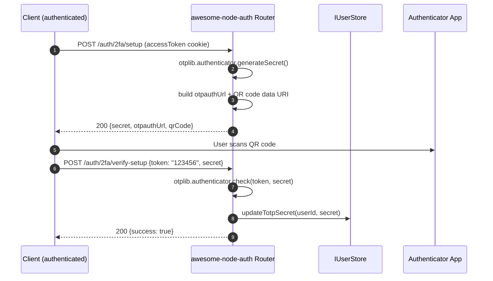
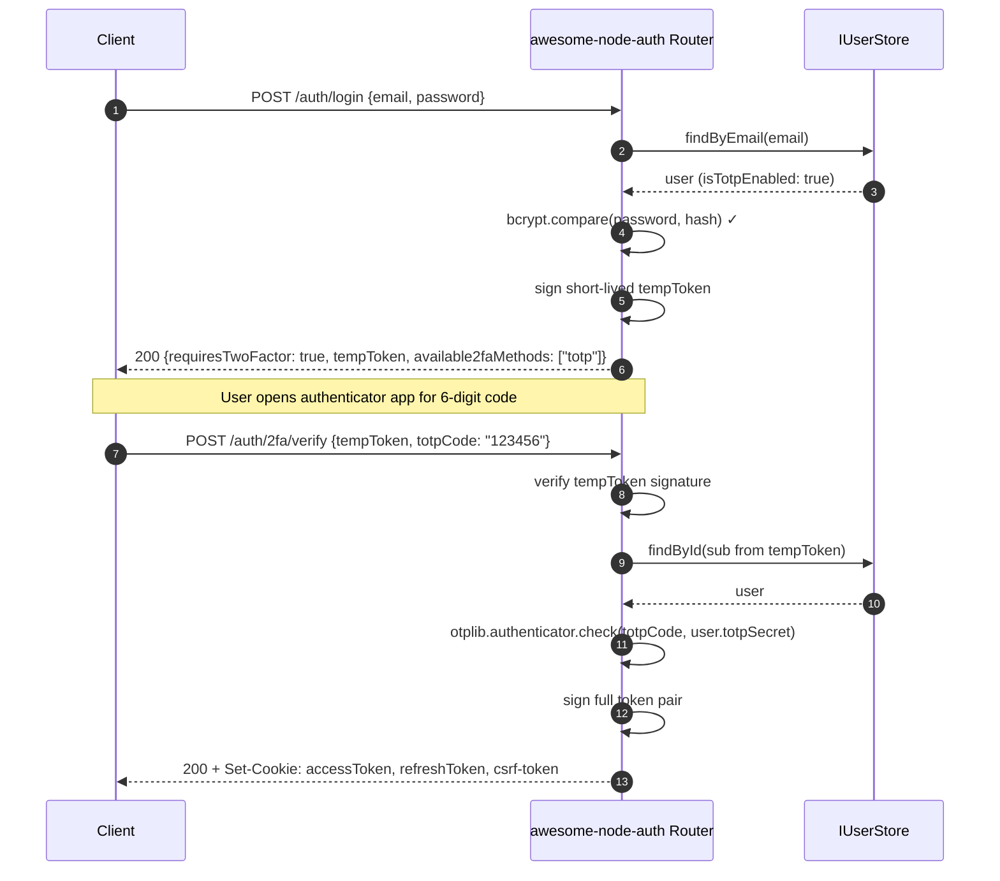

import Tabs from '@theme/Tabs';
import TabItem from '@theme/TabItem';

# TOTP 2FA Recipe

Time-based One-Time Passwords (TOTP) provide Google Authenticator-compatible two-factor authentication. TOTP is built into the auth router — no extra strategy configuration is needed.

:::caution Backup codes
TOTP does not provide built-in backup codes. Consider implementing your own backup code mechanism so users can recover access if they lose their authenticator app.
:::

---

## TOTP enrollment flow



---

## 2FA login flow



---

## **Step 1**: Mount the router

TOTP endpoints are always available. Just mount the standard auth router:

```typescript
app.use('/auth', auth.router());
```

---

## **Step 2**: User enrolls TOTP

### Generate secret and QR code

```typescript
// POST /auth/2fa/setup (authenticated)
const { secret, otpauthUrl, qrCode } = await fetch('/auth/2fa/setup', {
  method: 'POST',
  headers: { 'Content-Type': 'application/json' },
  credentials: 'include',
}).then(r => r.json());

// Display qrCode (a data: URI) in an  tag
// or show `secret` for manual entry in the authenticator app
```

### Confirm activation

```typescript
// POST /auth/2fa/verify-setup (authenticated)
await fetch('/auth/2fa/verify-setup', {
  method: 'POST',
  headers: { 'Content-Type': 'application/json' },
  credentials: 'include',
  body: JSON.stringify({ token: '123456', secret }),
});
```

---

## **Step 3**: Login with 2FA

```typescript
// Step 1: Initial login → 2FA challenge
const loginRes = await fetch('/auth/login', {
  method: 'POST',
  headers: { 'Content-Type': 'application/json' },
  credentials: 'include',
  body: JSON.stringify({ email, password }),
}).then(r => r.json());

if (loginRes.requiresTwoFactor) {
  const { tempToken, available2faMethods } = loginRes;
  // Show the TOTP input to the user
}

// Step 2: Submit TOTP code → full session
await fetch('/auth/2fa/verify', {
  method: 'POST',
  headers: { 'Content-Type': 'application/json' },
  credentials: 'include',
  body: JSON.stringify({ tempToken, totpCode: '123456' }),
});
```

:::info Bearer mode
For native/mobile clients add `X-Auth-Strategy: bearer` to `/auth/2fa/verify` to receive tokens in the JSON body.
:::

---

## TOTP Endpoints

| Method | Path | Auth | Description |
|--------|------|:----:|-------------|
| `POST` | `/auth/2fa/setup` | ✅ | Generate TOTP secret + QR code data URI |
| `POST` | `/auth/2fa/verify-setup` | ✅ | Confirm enrollment with a valid TOTP code |
| `POST` | `/auth/2fa/verify` | — (temp token) | Complete 2FA login |
| `POST` | `/auth/2fa/disable` | ✅ | Disable TOTP for the user |

## Related

- [SMS OTP verification and 2FA](/docs/authentication/sms) — the SMS-based second factor
- [Email and password authentication](/docs/authentication/local) — the first factor TOTP protects
- [Session management and token revocation](/docs/advanced/sessions) — revoke sessions when a device is lost
- [Bearer token mode for mobile apps](/docs/advanced/bearer-token) — 2FA from native clients
