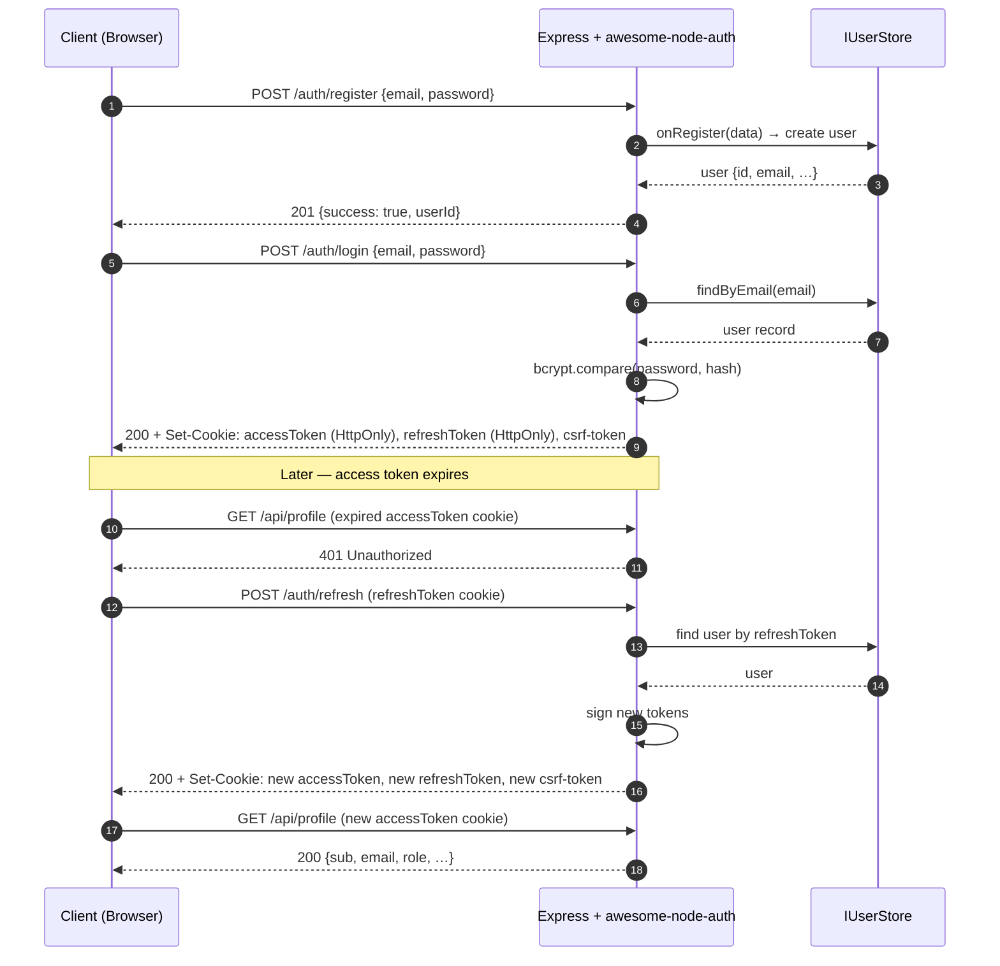

# Express authentication with awesome-node-auth

Express is the primary target framework for awesome-node-auth. The auth router is Express-compatible out of the box.

▶ **[Open live demo in StackBlitz](https://stackblitz.com/github/awesome-lang-auth/awesome-node-auth/tree/main/demo/express-vanilla?title=awesome-node-auth%20Express%20Demo&startScript=start)**  
Source: [`demo/express-vanilla/`](https://github.com/awesome-lang-auth/awesome-node-auth/tree/main/demo/express-vanilla)

---

## Register → Login → Refresh flow



---

## Basic Setup

```typescript
import express from 'express';
import cookieParser from 'cookie-parser';
import { AuthConfigurator } from '@awesome-lang-auth/node';
import { MyUserStore } from './stores/user-store';

const app = express();
app.use(express.json());
app.use(cookieParser());

const auth = new AuthConfigurator(
  {
    accessTokenSecret: process.env.ACCESS_TOKEN_SECRET!,
    refreshTokenSecret: process.env.REFRESH_TOKEN_SECRET!,
    accessTokenExpiresIn: '15m',
    refreshTokenExpiresIn: '7d',
  },
  new MyUserStore()
);

app.use('/auth', auth.router());

// Protected route
app.get('/api/profile', auth.middleware(), (req, res) => {
  res.json(req.user);
});

app.listen(3000);
```

## With Rate Limiting

```typescript
import rateLimit from 'express-rate-limit';

const limiter = rateLimit({ windowMs: 15 * 60 * 1000, max: 20 });

app.use('/auth', auth.router({ rateLimiter: limiter }));
```

## With All Optional Stores

```typescript
import { MySessionStore } from './stores/session-store';
import { MyRbacStore } from './stores/rbac-store';
import { MyMetadataStore } from './stores/metadata-store';

app.use('/auth', auth.router({
  sessionStore:  new MySessionStore(),
  rbacStore:     new MyRbacStore(),
  metadataStore: new MyMetadataStore(),
  onRegister: async (data) => userStore.create(data),
}));
```


## Related

- [NestJS authentication module](/docs/frameworks/nestjs) — the same library behind Nest's DI
- [Framework-agnostic auth for any Node server](/docs/frameworks/framework-agnostic) — Fastify, Koa, Hono or raw Node
- [Email and password authentication](/docs/authentication/local) — the first recipe to wire up
- [Built-in auth UI](/docs/advanced/built-in-ui) — login pages served by Express itself
- [Auth API endpoints reference](/docs/api-reference/endpoints) — every route the router mounts
