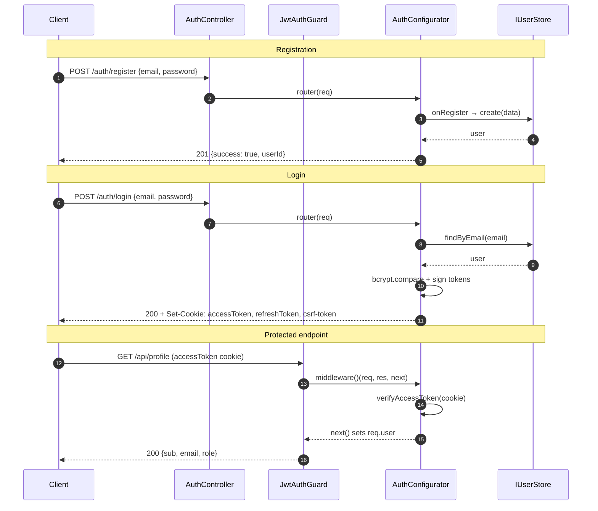

# NestJS Integration

A complete, production-ready NestJS integration with `AuthModule.forRoot()`, `JwtAuthGuard`, `@CurrentUser()` decorator, and an admin panel.

▶ **[Open live demo in StackBlitz](https://stackblitz.com/github/nik2208/awesome-node-auth/tree/main/demo/nestjs-fullstack?title=awesome-node-auth%20NestJS%20Demo&startScript=start)**  
Source: [`demo/nestjs-fullstack/`](https://github.com/nik2208/awesome-node-auth/tree/main/demo/nestjs-fullstack)

---

## Auth flow



---

## Step 1 — AuthModule (`forRoot` pattern)

```typescript
import 'reflect-metadata';
import { Module, Global, DynamicModule, Provider } from '@nestjs/common';
import { AuthConfigurator, AuthConfig, IUserStore } from 'awesome-node-auth';

export const AUTH_CONFIGURATOR = 'AUTH_CONFIGURATOR';

@Global()
@Module({})
export class AuthModule {
  static forRoot(options: { config: AuthConfig; userStore: IUserStore }): DynamicModule {
    const configuratorProvider: Provider = {
      provide: AUTH_CONFIGURATOR,
      useFactory: () => new AuthConfigurator(options.config, options.userStore),
    };
    return {
      module: AuthModule,
      providers: [configuratorProvider],
      exports: [AUTH_CONFIGURATOR],
    };
  }
}
```

---

## Step 2 — JwtAuthGuard

```typescript
import { Injectable, CanActivate, ExecutionContext, Inject } from '@nestjs/common';
import { AuthConfigurator } from 'awesome-node-auth';
import { Request, Response } from 'express';

@Injectable()
export class JwtAuthGuard implements CanActivate {
  constructor(@Inject(AUTH_CONFIGURATOR) private readonly auth: AuthConfigurator) {}

  canActivate(context: ExecutionContext): Promise<boolean> {
    const req = context.switchToHttp().getRequest<Request>();
    const res = context.switchToHttp().getResponse<Response>();
    return new Promise<boolean>((resolve, reject) => {
      // NestJS req/res are Express-compatible; bridge via `as any`
      this.auth.middleware()(req as any, res as any, (err?: unknown) => {
        if (err) return reject(err);
        resolve(true);
      });
    });
  }
}
```

---

## Step 3 — @CurrentUser() decorator

```typescript
import { createParamDecorator, ExecutionContext } from '@nestjs/common';
import { Request } from 'express';

export const CurrentUser = createParamDecorator(
  (_data: unknown, ctx: ExecutionContext) =>
    ctx.switchToHttp().getRequest<Request & { user?: any }>().user,
);
```

---

## Step 4 — AuthController

```typescript
import { Controller, All, Req, Res, Next, Inject } from '@nestjs/common';
import { AuthConfigurator, AuthError, PasswordService } from 'awesome-node-auth';
import { Request, Response, NextFunction } from 'express';

@Controller('auth')
export class AuthController {
  private readonly router: ReturnType<AuthConfigurator['router']>;

  constructor(@Inject(AUTH_CONFIGURATOR) auth: AuthConfigurator) {
    this.router = auth.router({
      onRegister: async (data) => {
        const email    = typeof data.email    === 'string' ? data.email.trim()    : '';
        const password = typeof data.password === 'string' ? data.password.trim() : '';
        if (!email || !password)
          throw new AuthError('email and password are required', 'VALIDATION_ERROR', 400);
        const existing = await userStore.findByEmail(email);
        if (existing) throw new AuthError('Email already registered', 'EMAIL_EXISTS', 409);
        const hash = await new PasswordService().hash(password);
        return userStore.create({ email, password: hash, role: 'user' });
      },
    });
  }

  @All('*')
  handle(@Req() req: Request, @Res() res: Response, @Next() next: NextFunction): void {
    // Strip the /auth prefix so the inner router sees paths from /
    req.url = req.url.replace(/^\/auth/, '') || '/';
    // NestJS req/res are Express-compatible; bridge via `as any`
    this.router(req as any, res as any, next);
  }
}
```

---

## Step 5 — Protected route with @CurrentUser()

```typescript
import { Controller, Get, UseGuards } from '@nestjs/common';

@Controller('api')
export class ProfileController {
  @Get('profile')
  @UseGuards(JwtAuthGuard)
  getProfile(@CurrentUser() user: any) {
    return user;   // {sub, email, role, …}
  }
}
```

---

## Step 6 — AppModule & bootstrap

```typescript
import { Module } from '@nestjs/common';
import { NestFactory } from '@nestjs/core';
import { NestExpressApplication } from '@nestjs/platform-express';
import { createAdminRouter } from 'awesome-node-auth';
import * as path from 'path';

const userStore = new MyUserStore();   // your IUserStore implementation

const authConfig = {
  accessTokenSecret:  process.env.ACCESS_TOKEN_SECRET  ?? 'change-me',
  refreshTokenSecret: process.env.REFRESH_TOKEN_SECRET ?? 'change-me',
  accessTokenExpiresIn:  '15m',
  refreshTokenExpiresIn: '7d',
  cookieOptions: {
    secure:   process.env.NODE_ENV === 'production',
    sameSite: 'lax' as const,
  },
};

@Module({
  imports:     [AuthModule.forRoot({ config: authConfig, userStore })],
  providers:   [JwtAuthGuard],
  controllers: [AuthController, ProfileController],
})
class AppModule {}

async function bootstrap() {
  const app = await NestFactory.create<NestExpressApplication>(AppModule);

  app.use(require('cookie-parser')());
  app.enableCors({ origin: true, credentials: true });

  // Admin panel (HTML UI + REST API) at /admin
  app.use('/admin', createAdminRouter(userStore, {
    accessPolicy: 'first-user',
    jwtSecret: process.env.ACCESS_TOKEN_SECRET ?? 'change-me-access-secret',
  }) as any);

  // Serve your frontend static files
  app.useStaticAssets(path.join(__dirname, '..', 'public'));

  await app.listen(Number(process.env.PORT) || 3000);
}

bootstrap();
```

---

## Summary

| Piece | Role |
|-------|------|
| `AuthModule.forRoot()` | Creates `AuthConfigurator` singleton, exports it globally via `AUTH_CONFIGURATOR` token |
| `JwtAuthGuard` | Calls `auth.middleware()` as NestJS `CanActivate` — sets `req.user` on success |
| `@CurrentUser()` | Parameter decorator that extracts `req.user` from the guard |
| `AuthController @All('*')` | Delegates every `/auth/*` request to the awesome-node-auth router |
| `createAdminRouter` | Express router mounted at `/admin` — provides HTML UI and REST API |

## Related

- [Express authentication](/docs/frameworks/express) — the underlying router NestJS wraps
- [Next.js authentication](/docs/frameworks/nextjs) — the same backend behind a Next frontend
- [Custom JWT claims](/docs/advanced/custom-claims) — feed your own claims into Nest guards
- [Auth API endpoints reference](/docs/api-reference/endpoints) — every route the module exposes
