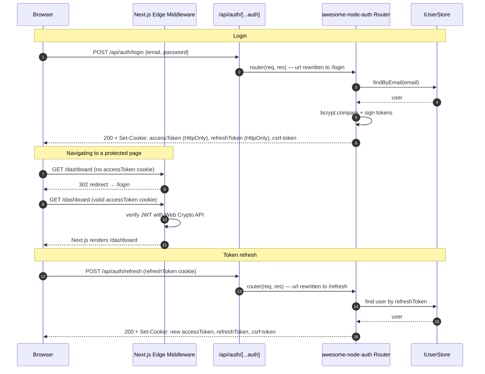

# Next.js Integration (Pages Router)

A complete working demo is available in the repository — install it and run `npm start` in under a minute.

▶ **[Open live demo in StackBlitz](https://stackblitz.com/github/awesome-lang-auth/awesome-node-auth/tree/main/demo/nextjs-fullstack?title=awesome-node-auth%20Next.js%20Demo&startScript=start)**  
Source: [`demo/nextjs-fullstack/`](https://github.com/awesome-lang-auth/awesome-node-auth/tree/main/demo/nextjs-fullstack)

---

## Auth flow (Pages Router + Edge Middleware)



---

## Step 1 — Auth singleton (`lib/auth.ts`)

```typescript
import { AuthConfigurator, AuthConfig, IUserStore } from '@awesome-lang-auth/node';
import { MyUserStore } from './user-store';   // your IUserStore implementation

export const authConfig: AuthConfig = {
  accessTokenSecret:  process.env.ACCESS_TOKEN_SECRET!,
  refreshTokenSecret: process.env.REFRESH_TOKEN_SECRET!,
  accessTokenExpiresIn:  '15m',
  refreshTokenExpiresIn: '7d',
  cookieOptions: {
    secure:   process.env.NODE_ENV === 'production',
    sameSite: 'lax',
  },
};

export const userStore: IUserStore = new MyUserStore();

let _auth: AuthConfigurator | undefined;
export function getAuth(): AuthConfigurator {
  if (!_auth) _auth = new AuthConfigurator(authConfig, userStore);
  return _auth;
}
```

---

## Step 2 — Catch-all API route

### Pages Router (recommended)

The Pages Router is the simplest integration. `bodyParser: false` lets awesome-node-auth's Express middleware parse the body itself:

```typescript
// pages/api/auth/[...auth].ts
import type { NextApiRequest, NextApiResponse } from 'next';
import { getAuth, userStore } from '@/lib/auth';

export const config = { api: { bodyParser: false } };

export default function handler(req: NextApiRequest, res: NextApiResponse) {
  const router = getAuth().router({
    onRegister: async (data) => userStore.create(data),
  });
  // Strip /api/auth prefix so the inner router sees paths starting from /
  req.url = req.url!.replace(/^\/api\/auth/, '') || '/';
  // Next.js req/res are Express-compatible; bridge via `as any`
  router(req as any, res as any, () => res.status(404).end());
}
```

### Pages Router (admin panel — optional)

```typescript
// pages/api/admin/[...admin].ts
import type { NextApiRequest, NextApiResponse } from 'next';
import { createAdminRouter } from '@awesome-lang-auth/node';
import { userStore } from '@/lib/auth';

const adminRouter = createAdminRouter(userStore, {
  accessPolicy: 'first-user',
  jwtSecret: process.env.ACCESS_TOKEN_SECRET!,
});

export const config = { api: { bodyParser: false } };

export default function handler(req: NextApiRequest, res: NextApiResponse) {
  req.url = req.url!.replace(/^\/api\/admin/, '') || '/';
  // Next.js req/res are Express-compatible; bridge via `as any`
  adminRouter(req as any, res as any, () => res.status(404).end());
}
```

---

## Step 3 — Middleware (route protection)

Next.js Edge Middleware cannot use `jsonwebtoken` (Node.js crypto). Verify the JWT using the Web Crypto API:

```typescript
// middleware.ts  (project root)
import { NextRequest, NextResponse } from 'next/server';

export const config = {
  matcher: ['/dashboard/:path*', '/api/protected/:path*'],
};

export async function middleware(request: NextRequest): Promise<NextResponse> {
  const token = request.cookies.get('accessToken')?.value;

  if (!token) {
    return NextResponse.redirect(new URL('/login', request.url));
  }

  try {
    const [headerB64, payloadB64, signatureB64] = token.split('.');
    const enc  = new TextEncoder();
    const key  = await crypto.subtle.importKey(
      'raw', enc.encode(process.env.ACCESS_TOKEN_SECRET!),
      { name: 'HMAC', hash: 'SHA-256' }, false, ['verify'],
    );
    const sig  = Uint8Array.from(
      atob(signatureB64.replace(/-/g, '+').replace(/_/g, '/')),
      c => c.charCodeAt(0),
    );
    const valid = await crypto.subtle.verify(
      'HMAC', key, sig, enc.encode(`${headerB64}.${payloadB64}`),
    );
    if (!valid) throw new Error('Invalid signature');
    return NextResponse.next();
  } catch {
    return NextResponse.redirect(new URL('/login', request.url));
  }
}
```

---

## Step 4 — Protected API routes (Pages Router)

```typescript
// pages/api/profile.ts
import type { NextApiRequest, NextApiResponse } from 'next';
import { getAuth } from '@/lib/auth';

export default function handler(req: NextApiRequest, res: NextApiResponse) {
  const middleware = getAuth().middleware();
  middleware(req as any, res as any, (err?: unknown) => {
    if (err) return res.status(401).json({ error: 'Unauthorized' });
    res.json({ user: (req as any).user });
  });
}
```

---

## Step 5 — Client-side calls (browser)

node-auth sets tokens as HttpOnly cookies on login. The browser attaches them automatically. Use `credentials: 'include'` on every fetch:

```typescript
// Login
const res = await fetch('/api/auth/login', {
  method: 'POST',
  headers: { 'Content-Type': 'application/json' },
  credentials: 'include',   // ← sends/receives cookies
  body: JSON.stringify({ email, password }),
});
// { success: true } — tokens are in cookies, not in the body

// Authenticated request (cookie sent automatically)
const profile = await fetch('/api/auth/me', {
  credentials: 'include',
}).then(r => r.json());

// Logout
await fetch('/api/auth/logout', {
  method: 'POST',
  credentials: 'include',
});
```

:::tip CSRF protection
If `csrf.enabled: true` is set in `AuthConfig`, read the `csrf-token` cookie and send it as `X-CSRF-Token` on every `POST`/`PUT`/`PATCH`/`DELETE` request:

```typescript
function getCsrfToken() {
  return document.cookie.match(/(?:^|;\s*)csrf-token=([^;]+)/)?.[1] ?? '';
}

await fetch('/api/auth/logout', {
  method: 'POST',
  headers: { 'X-CSRF-Token': getCsrfToken() },
  credentials: 'include',
});
```
:::


```typescript
import { AuthConfigurator, AuthConfig, IUserStore } from '@awesome-lang-auth/node';
import { MyUserStore } from './user-store';   // your IUserStore implementation

export const authConfig: AuthConfig = {
  accessTokenSecret:  process.env.ACCESS_TOKEN_SECRET!,
  refreshTokenSecret: process.env.REFRESH_TOKEN_SECRET!,
  accessTokenExpiresIn:  '15m',
  refreshTokenExpiresIn: '7d',
  cookieOptions: {
    secure:   process.env.NODE_ENV === 'production',
    sameSite: 'lax',
  },
};

export const userStore: IUserStore = new MyUserStore();

let _auth: AuthConfigurator | undefined;
export function getAuth(): AuthConfigurator {
  if (!_auth) _auth = new AuthConfigurator(authConfig, userStore);
  return _auth;
}
```

---

## Step 2 — Catch-all API route

### Pages Router (recommended)

The Pages Router is the simplest integration. `bodyParser: false` lets awesome-node-auth's Express middleware parse the body itself:

```typescript
// pages/api/auth/[...auth].ts
import type { NextApiRequest, NextApiResponse } from 'next';
import { getAuth, userStore } from '@/lib/auth';

export const config = { api: { bodyParser: false } };

export default function handler(req: NextApiRequest, res: NextApiResponse) {
  const router = getAuth().router({ onRegister: async (data) => userStore.create(data) });
  // Strip /api/auth prefix so the inner router sees paths starting from /
  req.url = req.url!.replace(/^\/api\/auth/, '') || '/';
  router(req as any, res as any, () => res.status(404).end());
}
```

### App Router

The App Router request/response model differs from Node.js `http`. Bridging it to an Express router requires a non-trivial adapter. A complete, production-ready implementation is available in:

[`examples/nextjs-integration.example.ts`](https://github.com/awesome-lang-auth/awesome-node-auth/blob/main/examples/nextjs-integration.example.ts)

Copy the `runNodeAuthRouter` function and the `GET`/`POST`/`DELETE` exports from that file into `app/api/auth/[...auth]/route.ts`.

### Pages Router (admin panel — optional)

```typescript
// pages/api/admin/[...admin].ts
import type { NextApiRequest, NextApiResponse } from 'next';
import { createAdminRouter } from '@awesome-lang-auth/node';
import { userStore, linkedAccountsStore, settingsStore } from '@/lib/auth';

const adminRouter = createAdminRouter(userStore, {
  accessPolicy: 'first-user',
  jwtSecret: process.env.ACCESS_TOKEN_SECRET!,
  linkedAccountsStore,
  settingsStore,
});

export const config = { api: { bodyParser: false } };

export default function handler(req: NextApiRequest, res: NextApiResponse) {
  req.url = req.url!.replace(/^\/api\/admin/, '') || '/';
  adminRouter(req as any, res as any, () => res.status(404).end());
}
```

---

## Step 3 — Middleware (route protection)

Next.js Edge Middleware cannot use `jsonwebtoken` (Node.js crypto). Verify the JWT using the Web Crypto API:

```typescript
// middleware.ts  (project root)
import { NextRequest, NextResponse } from 'next/server';

export const config = {
  matcher: ['/dashboard/:path*', '/api/protected/:path*'],
};

export async function middleware(request: NextRequest): Promise<NextResponse> {
  const token = request.cookies.get('accessToken')?.value;

  if (!token) {
    return NextResponse.redirect(new URL('/login', request.url));
  }

  try {
    const [headerB64, payloadB64, signatureB64] = token.split('.');
    const enc  = new TextEncoder();
    const key  = await crypto.subtle.importKey(
      'raw', enc.encode(process.env.ACCESS_TOKEN_SECRET!),
      { name: 'HMAC', hash: 'SHA-256' }, false, ['verify'],
    );
    const sig  = Uint8Array.from(atob(signatureB64.replace(/-/g, '+').replace(/_/g, '/')), c => c.charCodeAt(0));
    const valid = await crypto.subtle.verify('HMAC', key, sig, enc.encode(`${headerB64}.${payloadB64}`));
    if (!valid) throw new Error('Invalid signature');
    return NextResponse.next();
  } catch {
    return NextResponse.redirect(new URL('/login', request.url));
  }
}
```

---

## Step 4 — Protected Server Component

```typescript
// app/dashboard/page.tsx
import { cookies } from 'next/headers';
import { redirect } from 'next/navigation';
import { TokenService } from '@awesome-lang-auth/node';
import { authConfig } from '@/lib/auth';

export default async function DashboardPage() {
  const cookieStore = cookies();
  const token = cookieStore.get('accessToken')?.value;

  if (!token) redirect('/login');

  const tokenService = new TokenService();
  const payload = tokenService.verifyAccessToken(token, authConfig);

  return <div>Welcome, {payload.email}!</div>;
}
```

---

## Step 5 — Protected API routes (Pages Router)

```typescript
// pages/api/profile.ts
import type { NextApiRequest, NextApiResponse } from 'next';
import { getAuth } from '@/lib/auth';

export default function handler(req: NextApiRequest, res: NextApiResponse) {
  const middleware = getAuth().middleware();
  middleware(req as any, res as any, (err?: unknown) => {
    if (err) return res.status(401).json({ error: 'Unauthorized' });
    res.json({ user: (req as any).user });
  });
}
```

---

## Step 6 — Client-side calls (browser)

node-auth sets tokens as HttpOnly cookies on login. The browser attaches them automatically. Use `credentials: 'include'` on every fetch:

```typescript
// Login
const res = await fetch('/api/auth/login', {
  method: 'POST',
  headers: { 'Content-Type': 'application/json' },
  credentials: 'include',   // ← sends/receives cookies
  body: JSON.stringify({ email, password }),
});
const data = await res.json();
// data = { success: true } — tokens are in cookies, not in the body

// Authenticated request (cookie is sent automatically)
const profile = await fetch('/api/auth/me', {
  credentials: 'include',
}).then(r => r.json());

// Logout
await fetch('/api/auth/logout', {
  method: 'POST',
  credentials: 'include',
});
```

:::tip CSRF protection
If `csrf.enabled: true` is set in `AuthConfig`, read the `csrf-token` cookie and send it as `X-CSRF-Token` on every `POST`/`PUT`/`PATCH`/`DELETE` request:

```typescript
function getCsrfToken() {
  return document.cookie.match(/(?:^|;\s*)csrf-token=([^;]+)/)?.[1] ?? '';
}

await fetch('/api/auth/logout', {
  method: 'POST',
  headers: { 'X-CSRF-Token': getCsrfToken() },
  credentials: 'include',
});
```
:::

## Related

- [Express authentication](/docs/frameworks/express) — the router behind the API routes
- [NestJS authentication module](/docs/frameworks/nestjs) — a heavier backend for the same frontend
- [auth.js browser client](/docs/advanced/browser-client) — session handling in the browser
- [OAuth2 social login](/docs/authentication/oauth) — add Google and GitHub sign-in
